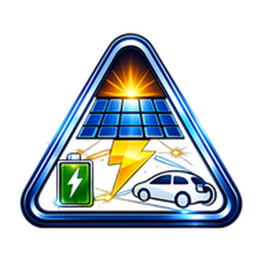
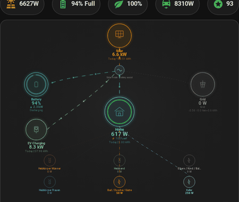
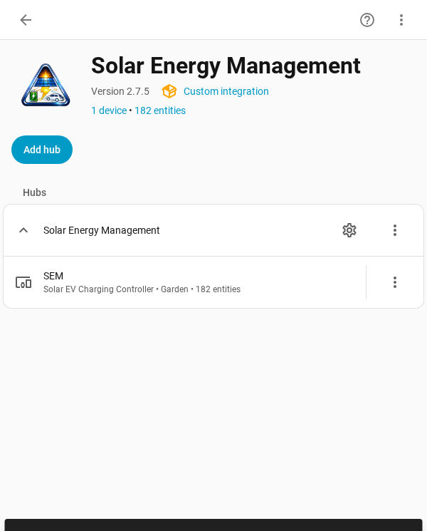
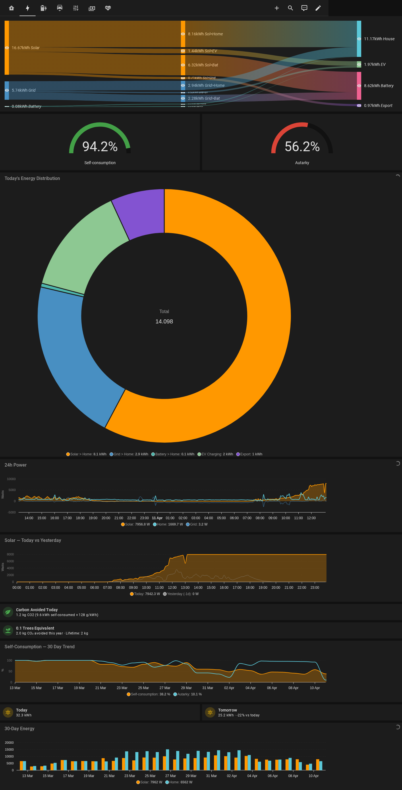
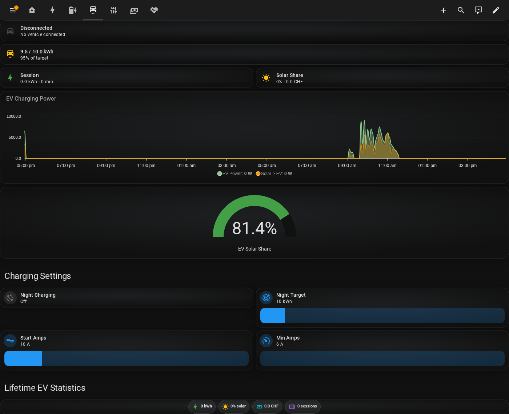
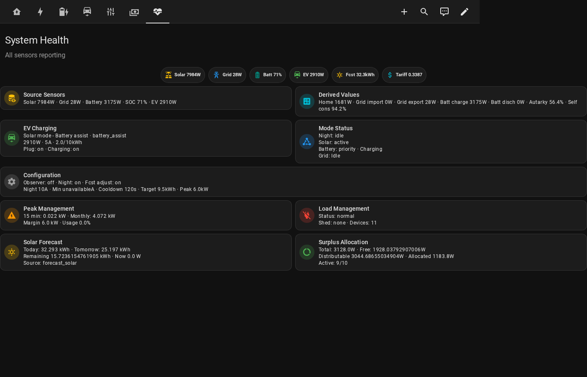

<p align="center">
  
</p>

# Solar Energy Management (SEM)

[![GitHub Release][releases-shield]][releases]
[](https://github.com/traktore-org/sem-community/actions/workflows/tests.yml)
[![GitHub Activity][commits-shield]][commits]
[![License][license-shield]](LICENSE)
[![hacs][hacsbadge]][hacs]
[](https://github.com/sponsors/traktore-org)

**Intelligent solar energy orchestration for Home Assistant** — maximize self-consumption, manage EV charging, and track energy costs automatically.

SEM monitors your solar production, battery, grid, and EV charger every 10 seconds and distributes surplus power across your devices by priority. No cloud, no subscription — everything runs locally inside Home Assistant.


<p align="center">
  
</p>

---

## Features

- **Smart EV charging** — dynamic 6-32A current control based on real-time solar surplus
- **Six charging modes** — Auto (forecast-aware), Solar+Battery, Self-Consumption, Min+PV, Maximum, Off
- **Auto mode** — automatically switches between self-consumption and fast charging based on solar forecast vs EV need
- **Battery-aware** — four-zone SOC strategy decides when battery helps the EV and when it charges first
- **Night charging with battery protection** — charges EV from grid overnight without draining home battery
- **Hot water solar boost** — SEM supplements your existing heating system with solar surplus (does not replace your boiler/heat pump), with mandatory Legionella prevention cycle (DVGW W 551, SIA 385/1, ÖNORM B 5019)
- **Multi-device surplus distribution** — EV, heat pump, hot water, appliances — each gets surplus by priority
- **Peak load management** — automatic device shedding to stay under your grid limit
- **Solar forecast integration** — Solcast or Forecast.Solar for smart charging decisions
- **Dynamic tariff support** — Tibber, Nordpool, aWATTar price-responsive charging
- **200+ sensors and entities** — power, energy, flows, costs, performance, forecasts, and more
- **Built-in dashboard** — glassmorphism dark theme with animated system diagram, Sankey, and native HA energy cards
- **PV performance analytics** — specific yield, forecast accuracy, degradation tracking
- **Smart recommendations** — forecast-aware tips ("Best window for appliances: 11:00-14:00", "Low solar tomorrow — charge EV tonight")
- **Consumption/solar predictor** — learns hourly patterns (weekday/weekend), predicts next-hour power and daily consumption
- **Push notifications** — battery full, daily summary, forecast alerts, EV charging events (with Android channels and action buttons)
- **Brand icons** — native HA 2026.3+ brand support (no submission to home-assistant/brands needed)
- **EV Intelligence** — detects BMS charge tapering, estimates SOC without car API, learns daily consumption per weekday, temperature-corrected predictions, smart night charge skip
- **Smart Night Charging** — automatically skips or reduces night charges when SOC is sufficient, with solar forecast credit, daily SOC decay, and 3-skip safety net
- **EV battery health** — tracks capacity degradation from partial charge sessions over months
- **Hardware compatibility test suite** — 150+ automated tests covering all supported hardware — every inverter + charger combination verified in CI

---

## Why SEM?

There are many solar/EV tools for Home Assistant — evcc, emhass, Predbat, PV Excess Control, and more. Each is great at one thing. SEM is the only **all-in-one HACS integration** that covers everything in a single install:

|  | SEM | evcc | emhass | Predbat | PV Excess Control |
|---|:---:|:---:|:---:|:---:|:---:|
| EV solar surplus charging | :white_check_mark: | :white_check_mark: | :x: | :x: | :white_check_mark: |
| Battery management | :white_check_mark: | :x: | :white_check_mark: | :white_check_mark: | partial |
| Multi-device surplus control | :white_check_mark: | :x: | :x: | :x: | :white_check_mark: |
| Auto-generated dashboard | :white_check_mark: | own UI | :x: | :x: | :x: |
| Cost tracking & savings | :white_check_mark: | :x: | :x: | :x: | :x: |
| Push notifications | :white_check_mark: | :x: | :x: | :x: | :x: |
| Smart recommendations | :white_check_mark: | :x: | :x: | :x: | :x: |
| Multi-language (15) | :white_check_mark: | :white_check_mark: | :x: | :x: | :x: |
| Pure HACS integration | :white_check_mark: | standalone Go | Docker/Add-on | AppDaemon | :white_check_mark: |
| Zero-config auto-detect | :white_check_mark: | config file | complex setup | config file | manual |

**SEM's approach:** Install one integration, get everything — EV charging, battery zones, cost analytics, 8-tab dashboard, and smart notifications. No separate services, no Docker containers, no YAML configuration files.

**When to use something else:**
- **evcc** if you need support for 100+ charger brands or vehicle SoC from car APIs
- **emhass** if you want mathematical optimization with linear programming
- **Predbat** if you only need battery charge/discharge scheduling with ML prediction
- **PV Excess Control** if you only need simple appliance on/off switching

---

## Installation

> **New to custom integrations?** See the [Step-by-Step Setup Guide](docs/SETUP_GUIDE.md) for a beginner-friendly walkthrough with checklist and FAQ.

### Via HACS (Recommended)

1. Open **HACS** > **Integrations** > **Custom repositories**
2. Add `https://github.com/traktore-org/sem-community` as an **Integration**
3. Search for **Solar Energy Management** and click **Download**
4. **Restart Home Assistant**

### Beta Releases

Want to help test new features before they go stable? Enable beta updates in HACS:

1. Open **HACS** > **Integrations** > find **Solar Energy Management**
2. Click the three-dot menu > **Redownload** > enable **Show beta versions**
3. Select the latest beta (e.g. `v1.5.0-beta.1`) and install

Beta releases are tested on real hardware before publishing but may contain rough edges. Your feedback helps us ship stable releases faster — report issues on [GitHub](https://github.com/traktore-org/sem-community/issues).

### Manual Installation

1. Download the [latest release](https://github.com/traktore-org/sem-community/releases)
2. Copy the `custom_components/solar_energy_management/` folder to your Home Assistant `config/custom_components/` directory
3. **Restart Home Assistant**

---

## Prerequisites

Before setting up SEM, make sure you have:

- **Home Assistant 2024.1.0** or newer
- **Energy Dashboard configured** — SEM reads your solar and grid sensors from the HA Energy Dashboard (Settings > Energy). You need at least:
  - A solar production sensor (W)
  - A grid consumption sensor (W)
- **Battery capacity** is auto-detected from your inverter (v1.2.1+)
- **Optional but recommended:**
  - Battery SOC (%) and power (W) sensors
  - An EV charger controllable via HA (KEBA, Wallbox, go-eCharger, Easee, Zaptec, ChargePoint, Heidelberg, etc.)
  - [Solcast PV Solar](https://github.com/oziee/ha-solcast-solar) or [Forecast.Solar](https://www.home-assistant.io/integrations/forecast_solar/) for solar forecasts
  - Tibber, Nordpool, or aWATTar integration for dynamic tariffs

---

## Setup

### Step 1: Add the Integration

1. Go to **Settings** > **Devices & Services** > **Add Integration**
2. Search for **Solar Energy Management**
3. Follow the setup wizard

### Step 2: Energy Dashboard Verification

SEM auto-detects your solar, grid, and battery sensors from the HA Energy Dashboard. If they are not configured yet, the wizard will ask you to set up the Energy Dashboard first.

SEM also uses the Energy Dashboard's import/export energy counters to automatically detect your grid and battery power sensor sign conventions — no manual configuration needed. This works with all inverter brands regardless of whether they use positive-for-export or positive-for-import conventions.

### Step 3: EV Charger Configuration

Select the sensors for your EV charger:

| Setting | Description |
|---------|-------------|
| Connected sensor | Binary sensor showing if the EV is plugged in |
| Charging sensor | Binary sensor showing if charging is active |
| Charging power sensor | Power sensor (W) for current charging power |
| Charger service | Service to set charging current (e.g., `keba.set_current`) |
| Total energy sensor | Cumulative energy sensor (kWh) — optional |

SEM auto-detects chargers from the entity registry: **KEBA**, **Wallbox Pulsar**, **go-eCharger** (HTTP + MQTT), **Easee**, **Zaptec**, **ChargePoint**, **Heidelberg**, **OpenWB 2.x**, **OCPP-compatible**, **Ohme**, **Peblar**, **V2C Trydan**, **Alfen Eve**, **Blue Current**, **OpenEVSE**. Any other charger that exposes power/connected/charging sensors in HA can be configured manually.

### Step 4: Notifications (Optional)

- **Charger display messages** — show charging status on the charger's built-in display (KEBA, Easee, Wallbox, etc.)
- **Notifications** — push notifications via HA Companion App (`notify.mobile_app_*`), REST webhooks (`rest_command.*`), or any `notify.*` service (Matrix, Slack, Telegram, etc.)

### Step 5: Optimization Settings

Key settings you can adjust (all have sensible defaults):

| Setting | Default | Description |
|---------|---------|-------------|
| Update interval | 10s | How often SEM reads sensors and adjusts |
| Daily EV target | 10 kWh | How much energy to charge overnight |
| Battery priority SOC | 30% | Below this, all solar goes to battery first |
| Battery buffer SOC | 70% | Above this, battery can help charge the EV |
| Battery auto-start SOC | 90% | Above this, EV starts even without solar surplus |
| Min solar power | 500W | Minimum surplus before solar EV charging starts |
| Observer mode | Off | Read-only mode for test systems (no hardware control) |

For detailed explanations of all settings, see the [User Guide](USER_GUIDE.md).

### Step 6: Load Management (Optional)

Enable peak load management if your utility bills based on peak demand:

| Setting | Default | Description |
|---------|---------|-------------|
| Target peak limit | 5 kW | SEM sheds loads above this threshold |
| Warning level | — | Early warning threshold |
| Emergency level | — | All non-critical loads shed |



---

## User Controls

SEM is designed to be mostly automatic. There are only 3 switches to manage:

| Switch | Default | What it does |
|--------|---------|-------------|
| `switch.sem_night_charging` | ON | Enable/disable overnight grid charging |
| `switch.sem_observer_mode` | OFF | Read-only mode — SEM monitors but doesn't control hardware |
| `switch.sem_smart_night_charging` | OFF | Intelligently skip or reduce night charges based on EV SOC, solar forecast, temperature, and learned driving patterns |

Everything else — solar charging, surplus distribution, battery protection, peak management — is fully automatic.

---

## Charging Modes

### Solar Charging (default)

During the day, SEM dynamically adjusts the EV charging current (6-32A) to match real-time solar surplus. If surplus drops below the minimum threshold, charging pauses until surplus returns. The battery's SOC determines how aggressively SEM uses stored energy to help the EV (see [User Guide — SOC Zones](USER_GUIDE.md#soc-zone-strategy)).

### Min+PV (Minimum + Solar)

Guarantees a minimum charging current (6A) from the grid and adds solar surplus on top. Use this when you need the car charged by a deadline but still want to maximize solar usage.

Set via integration options: `ev_charging_mode = "minpv"`.

### Night Charging

Overnight grid charging starts automatically after sunset. SEM charges at a peak-managed rate to avoid demand spikes and stops when the daily EV target is reached. Battery discharge protection prevents the home battery from powering the EV overnight.

Enable/disable with `switch.sem_night_charging`.

### Battery-Assisted Charging

When the battery SOC is above the buffer threshold (default 70%), SEM supplements solar with battery power to maintain EV charging during cloudy moments. This is automatic — no switch needed.

---

## Dashboard

SEM includes a built-in dashboard with 7 views and a unified glassmorphism dark theme:

| View | Description |
|------|-------------|
| **Home** | Animated system diagram with device nodes, solar summary card, 7-day chart, weather, smart recommendations |
| **Energy** | Sankey diagram, self-consumption/autarky gauges, donut chart, 24h power, CO2 avoided, trees saved |
| **Battery** | SOC radial gauge, 24h charge/discharge chart, zone configuration |
| **EV** | Charging status, session stats, solar share gauge, lifetime totals, EV Intelligence (taper trend, virtual SOC, charge skip reasoning, battery health) |
| **Control** | Load priority drag-and-drop, surplus allocation, battery/EV/tariff settings |
| **Costs** | Today/month/year KPIs, period selector, cost & savings charts, demand charge, tariff rates |
| **System** | Health diagnostics, sensor status, charging state, peak management |

| | |
|---|---|
|  |  |
|  |  |
|  |  |

### Dashboard Features
- **Glassmorphism styling** — frosted glass cards with dot grid backgrounds, radial gradients, hover effects
- **Animated energy flow** — sem-flow-card with real-time power flows, daily energy totals, autarky gauge, config editor, tap/hold/double-tap actions
- **Custom SEM cards** — flow card, solar summary (glow ring), weather (clock + forecast), chart card (Chart.js), period selector
- **Drag-and-drop load priority** — reorder device shedding priorities visually
- **Environmental impact** — CO2 avoided and trees-equivalent with growing icon (sprout/tree/pine/forest)
- **Yearly KPIs** — year-to-date costs, savings, revenue on the Costs tab (auto-seeded from HA recorder on mid-year install)

For dashboard setup instructions, see the [Dashboard Guide](docs/DASHBOARD_GUIDE.md).

---

## Sensors

SEM creates 70+ sensors organized by category:

| Category | Examples |
|----------|---------|
| **Power** | Solar, grid, battery, EV, home consumption (W) |
| **Energy** | Daily/monthly totals for all sources (kWh) |
| **Flows** | Solar-to-home, solar-to-EV, grid-to-EV, battery-to-home (W and kWh) |
| **Costs** | Daily/monthly import costs, export revenue, savings |
| **Performance** | Self-consumption rate, autarky rate, solar efficiency (%) |
| **Charging** | State, strategy, available power, calculated current |
| **Surplus** | Total, distributable, allocated, active devices |
| **Forecast** | Today/tomorrow kWh, remaining today, peak time, next hour, surplus window |
| **Tariff** | Current import/export rate, price level, next cheap window |
| **PV Analytics** | Specific yield, forecast accuracy, degradation trend |
| **Smart Tips** | Optimization score, forecast-aware recommendations, best surplus window |
| **Load Mgmt** | Peak margin, 15-min average, devices shed, trend |
| **EV Intelligence** | Taper trend/ratio, virtual SOC, minutes to full, charge needed, skip reason, battery health, predicted consumption |
| **Notifications** | Battery full, high grid import, daily summary, forecast alerts |

---

## Supported Hardware

**Solar Inverters:** Huawei Solar, SolaX, DEYE/Sunsynk, Growatt, Sofar, Solis, Fronius, SMA, SolarEdge, Enphase, GoodWe, Tesla Powerwall, Kostal Plenticore, Sungrow, Victron, Sonnenbatterie — or any inverter with HA sensors. SEM reads from the HA Energy Dashboard and auto-detects both grid and battery sign conventions.

**Battery discharge control auto-detected for:** Huawei Solar, SolaX (solax-modbus), DEYE/Sunsynk (ha-solarman), Growatt, Sofar, Solis, GoodWe, SolarEdge (solaredge-modbus-multi), Enphase (IQ Battery), Tesla Powerwall, Victron, Kostal Plenticore, Sungrow

**Batteries:** Any battery exposed through a supported inverter integration. Huawei LUNA2000, Tesla Powerwall, Sonnen, BYD, Pylontech, and others work automatically via their paired inverter. Battery capacity is auto-detected from the inverter.

**EV Chargers (auto-detected):** KEBA P30, Wallbox Pulsar, go-eCharger (HTTP + MQTT), Easee, Zaptec, ChargePoint, Heidelberg Energy Control, OpenWB 2.x, OCPP-compatible (ABB Terra, Vestel, Grizzl-E, etc.), Ohme, Peblar Rocksolid, V2C Trydan, Alfen Eve, Blue Current, OpenEVSE

**EV Chargers (manual config):** Any charger exposing power/connected/charging sensors in HA.

> **Note:** KSTAR inverters are supported via the [ha-solarman](https://github.com/davidrapan/ha-solarman) integration with KSTAR YAML profiles, not via a dedicated KSTAR integration.

> **Note:** Fronius and SMA core integrations are read-only for battery control. Battery discharge protection requires the Modbus variant (e.g., `fronius_modbus`) or works without discharge limiting.

**Hot Water:** Any hot water system exposed as a `water_heater`, `climate`, or `switch` entity in HA. Includes automatic Legionella prevention cycling per DVGW W 551 / SIA 385/1 / ÖNORM B 5019.

**Heat Pumps:** Any SG-Ready compatible heat pump controllable via HA

**Smart Meters:** Shelly EM/Pro, Discovergy, or any HA-compatible meter

---

## EV Intelligence

SEM learns your EV's charging behavior and makes smart decisions about when to charge. Enable via `switch.sem_smart_night_charging`.

**How it works:**

1. **Taper detection** — SEM detects the characteristic power staircase when your car's BMS reduces current near full charge (CC→CV transition). This is the most accurate SOC anchor (100% confirmed).

2. **Virtual SOC** — Tracks estimated battery level without a car API by monitoring energy in (charging) and out (predicted daily consumption). Calibrates from real `vehicle_soc_entity` when available.

3. **Daily consumption learning** — EWMA predictor learns per-weekday patterns: "Monday 8 kWh, Wednesday 0 kWh (WFH), Saturday 15 kWh". Adapts over 7 days.

4. **Temperature correction** — Adjusts consumption predictions for seasonal variation: winter (-5°C) = +72% consumption, summer (30°C) = +9%. Based on Recurrent Auto fleet data (30,000+ vehicles).

5. **Smart night charge skip** — If estimated SOC is sufficient for tomorrow's predicted consumption (with 30% safety margin and solar forecast credit), SEM skips the night charge. Max 3 consecutive skips as safety net.

6. **Session-based anchoring** — Works from day one without needing a full charge. First charge session bootstraps the SOC estimate. Taper detection and car API override with more accurate values when available.

**Sensors:** `ev_estimated_soc`, `ev_taper_trend`, `ev_nights_until_charge`, `ev_charge_needed`, `ev_predicted_daily_consumption`, `ev_battery_health`, and more.

---

## Automation Examples

### Notify when daily solar exceeds target

```yaml
automation:
  - alias: "SEM: Daily solar target reached"
    trigger:
      - platform: numeric_state
        entity_id: sensor.sem_daily_solar_energy
        above: 30  # kWh
    action:
      - service: notify.mobile_app
        data:
          title: "Solar Target Reached"
          message: >
            Daily solar production exceeded 30 kWh
            ({{ states('sensor.sem_daily_solar_energy') }} kWh)
```

### Force charge EV when electricity is cheap

```yaml
automation:
  - alias: "SEM: Cheap price EV charging"
    trigger:
      - platform: state
        entity_id: sensor.sem_tariff_price_level
        to: "cheap"
    condition:
      - condition: state
        entity_id: binary_sensor.sem_ev_connected
        state: "on"
    action:
      - service: switch.turn_on
        target:
          entity_id: switch.sem_night_charging
```

### Alert when grid peak approaches limit

```yaml
automation:
  - alias: "SEM: Peak alert"
    trigger:
      - platform: numeric_state
        entity_id: sensor.sem_peak_margin
        below: 0.5  # kW remaining before target
    action:
      - service: notify.mobile_app
        data:
          title: "Peak Protection"
          message: >
            Grid peak approaching limit
            ({{ states('sensor.sem_peak_margin') }} kW margin)
```

---

## Use Cases

**Maximize solar self-consumption for EV charging** — Plug in during the day and SEM adjusts current to match surplus. Battery priority ensures the home battery charges first, then the EV gets the rest.

**Reduce peak load charges** — SEM monitors rolling 15-minute averages and sheds non-critical loads to stay under your target peak limit.

**Battery-assisted EV charging on cloudy days** — When forecast shows insufficient production but battery SOC is above the buffer, SEM supplements solar with battery discharge.

**Price-optimized night charging** — With dynamic tariff integration, SEM charges the EV during the cheapest overnight hours while protecting the home battery.

---

## Documentation

| Guide | Description |
|-------|-------------|
| [Quick Start](docs/QUICK_START.md) | 5-minute setup guide |
| [User Guide](USER_GUIDE.md) | Complete feature reference |
| [Dashboard Guide](docs/DASHBOARD_GUIDE.md) | Dashboard setup & customization |
| [Architecture](docs/ARCHITECTURE.md) | Developer documentation |
| [Troubleshooting](TROUBLESHOOTING.md) | Common issues & fixes |
| [Known Limitations](KNOWN_LIMITATIONS.md) | Platform constraints |

---

## Removal

1. Go to **Settings** > **Devices & Services** > **Solar Energy Management**
2. Click the three-dot menu and select **Delete**
3. Restart Home Assistant
4. If installed via HACS: open HACS > Integrations, find SEM, click **Remove**
5. If installed manually: delete the `custom_components/solar_energy_management/` directory

All SEM entities are removed automatically. Your Energy Dashboard and hardware sensors are not affected.

---

## Recent Improvements (v1.4.0)

### Multi-EV Charger Control (#112)
- **N charger support** — configure and control multiple EV chargers with priority-based surplus distribution
- **Priority cascade** — highest-priority charger gets power first, remainder flows to next if above minimum threshold
- **Per-charger state** — independent stall detection, enable/disable delays, session tracking, taper detection
- **Night target split** — overnight charging target distributed equally across connected chargers
- **Config flow** — add/remove chargers via options flow, auto-discovery of all charger brands
- **Dashboard** — per-charger status table when >1 charger, "(N chargers)" subtitle on flow diagram
- **Backward compatible** — single-charger configs auto-migrate with zero user effort

### EV Intelligence Notifications (#106)
- **"EV nearly full"** — push notification when taper detection shows < 5 minutes to full
- **"Night charge skipped"** — notification when SOC is sufficient, showing estimated range
- **"Charge recommended"** — notification when SOC drops below 30% during night window
- All three use deduplication (fire once per event, reset automatically)

### Heat Pump SG-Ready (#112)
- **SG-Ready 4-state control** — BLOCKED (00), NORMAL (01), BOOST (10), FORCE_ON (11) via two relay entities
- **Surplus-driven** — BOOST mode activates on solar surplus, FORCE_ON on high surplus (configurable threshold)
- **Temperature boost** — optionally raises climate entity setpoint during surplus periods
- **Config flow** — new Heat Pump step in options flow (relay1, relay2, climate, power sensor, priority)

### Dynamic Currency (#119)
- **All costs now use HA-configured currency** — no more hardcoded CHF
- Dashboard JS cards, YAML templates, chart presets, and sensor definitions all read from `Settings > General > Currency`

### Tariff Mode Selector (#120)
- **Three tariff modes** exposed in options flow: Static (fixed HT/NT), Dynamic (Tibber/Nordpool/aWATTar), Calendar (time-based schedule)
- **Auto-detection** — SEM scans for Tibber/Nordpool/aWATTar entities when dynamic mode is selected
- **Price-responsive surplus** — dynamic mode enables price-aware device activation during cheap/negative price windows

### GoodWe Support (#68)
- **Troubleshooting guide** for GoodWe + Easee setup (Energy Dashboard configuration, sign convention auto-detection)
- **Setup guide** note for GoodWe inverters

### 15 Languages
- Added: Portuguese (pt), Polish (pl), Swedish (sv), Czech (cs), Danish (da), Finnish (fi), Hungarian (hu), Romanian (ro), Norwegian (no)
- Was 6 (de, en, es, fr, it, nl), now 15

### Previous (v1.3.0)
- EV Intelligence: taper detection, virtual SOC, consumption learning, smart night charge skip, battery health
- Multi-device read aggregation: sum inverters, batteries, grid tariffs from Energy Dashboard
- Smart Night Charging rename, 1,000+ tests

### Previous (v1.1.0)
- Dashboard Lumina redesign — glassmorphism theme, SVG glow icons, battery hero card, EV status card
- Auto card installation — JS files auto-installed to `/config/www/` on restart
- Device control modes — `off`, `peak_only`, `surplus` per device
- Tariff calendar — user-defined HT/NT time windows with Swiss provider presets
- Performance, stability, usability, accessibility, and code quality improvements (see v1.0.4 changelog)

---

## Support SEM

SEM is free and open-source. If it saves you money on your energy bill, consider buying the developer a coffee:

[](https://github.com/sponsors/traktore-org)

Your support helps keep SEM maintained, tested on real hardware, and free for everyone.

---

## Contributing

Contributions are welcome! Please fork the repository, create a feature branch, and submit a pull request.

## License

MIT License — see [LICENSE](LICENSE) for details.

---

[releases-shield]: https://img.shields.io/github/release/traktore-org/sem-community.svg?style=for-the-badge
[releases]: https://github.com/traktore-org/sem-community/releases
[commits-shield]: https://img.shields.io/github/commit-activity/y/traktore-org/sem-community.svg?style=for-the-badge
[commits]: https://github.com/traktore-org/sem-community/commits/main
[license-shield]: https://img.shields.io/github/license/traktore-org/sem-community.svg?style=for-the-badge
[hacsbadge]: https://img.shields.io/badge/HACS-Custom-orange.svg?style=for-the-badge
[hacs]: https://github.com/custom-components/hacs
