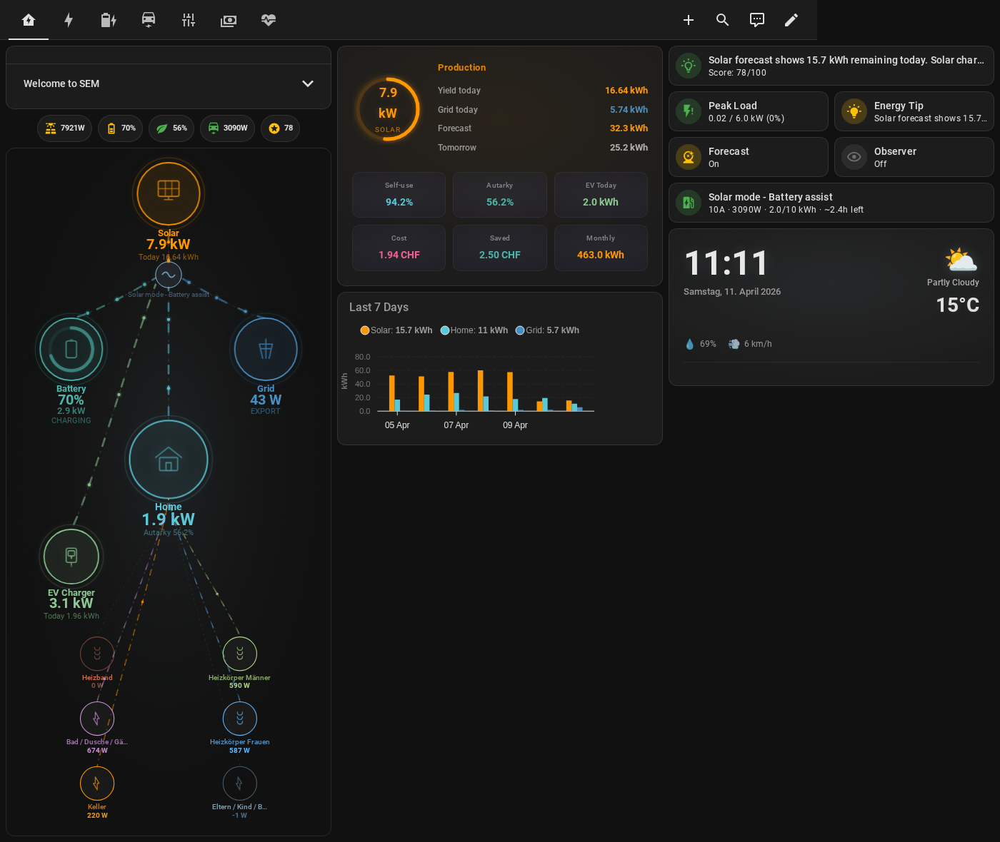
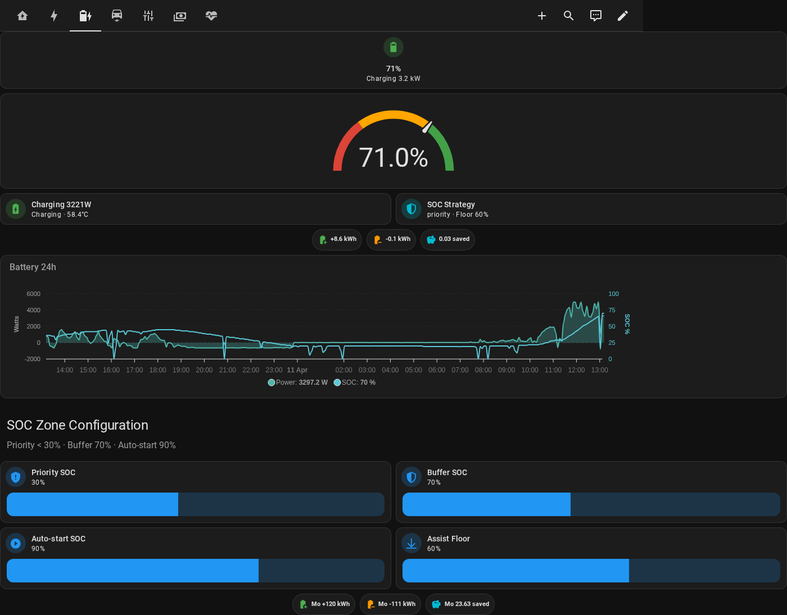
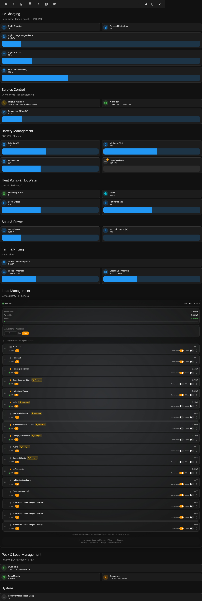
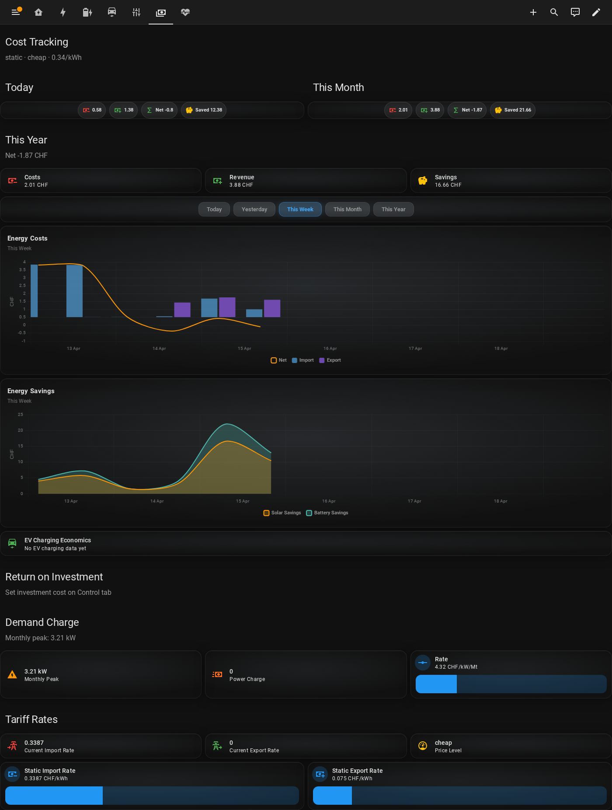

<p align="center">
  
</p>

# User Guide

Complete reference for Solar Energy Management (SEM).



---

## Table of Contents

- [Configuration Options](#configuration-options)
- [Charging Modes](#charging-modes)
- [SOC Zone Strategy](#soc-zone-strategy)
- [Night Charging](#night-charging)
- [Battery Discharge Protection](#battery-discharge-protection)
- [Surplus Distribution](#surplus-distribution)
- [Peak Load Management](#peak-load-management)
- [Tariff Integration](#tariff-integration)
- [Solar Forecast](#solar-forecast)
- [Observer Mode](#observer-mode)
- [Sensors Reference](#sensors-reference)
- [Daily Energy Reset](#daily-energy-reset)

---

## Configuration Options

All settings are accessible via **Settings** > **Devices & Services** > **Solar Energy Management** > **Configure**.

### EV Charger Settings

| Setting | Description |
|---------|-------------|
| `ev_connected_sensor` | Binary sensor — is the EV plugged in? |
| `ev_charging_sensor` | Binary sensor — is charging active? |
| `ev_charging_power_sensor` | Power sensor (W) — current charging power |
| `ev_charger_service` | HA service to set current (e.g., `keba.set_current`) |
| `ev_charger_service_entity_id` | Entity ID passed to the charger service |
| `ev_current_sensor` | Current sensor (A) — optional, for actual amperage |
| `ev_session_energy_sensor` | Session energy (kWh) — optional |
| `ev_total_energy_sensor` | Cumulative energy (kWh) — optional |

### Optimization Settings

| Setting | Default | Description |
|---------|---------|-------------|
| `update_interval` | 10s | Control loop frequency (10-300s) |
| `power_delta` | — | Minimum power change to trigger update (50-3000W) |
| `current_delta` | — | Minimum current change threshold (1-10A) |
| `soc_delta` | — | Battery SOC change sensitivity (1-20%) |
| `daily_ev_target` | 10 kWh | Target daily EV energy from night charging (5-100 kWh) |
| `min_solar_power` | 500W | **Config floor** below which SEM won't even attempt to start the charger. Keep well below the **hardware minimum** of your charger (~4140 W on 3-phase, ~1380 W on 1-phase). Slider range 0–5000 W. |
| `max_grid_import` | — | Maximum grid import power during solar charging (0-2000W) |
| `ev_charging_mode` | `pv` | Charging mode: `pv` (solar only), `minpv` (Min+PV), `off` (disabled) |
| `ev_ramp_rate_amps` | 2 | Max current change per 10s cycle during solar charging |

### Battery Settings

| Setting | Default | Description |
|---------|---------|-------------|
| `battery_priority_soc` | 30% | Below: all solar to battery, EV blocked |
| `battery_minimum_soc` | — | Absolute minimum discharge floor |
| `battery_resume_soc` | — | Hysteresis resume threshold |
| `battery_buffer_soc` | 70% | Above: battery can discharge for EV |
| `battery_auto_start_soc` | 90% | Above: start EV even without surplus |
| `battery_assist_max_power` | 4500W | Maximum battery discharge for EV (1000-10000W) |
| `battery_capacity_kwh` | — | Total battery capacity (5-100 kWh) |
| `battery_discharge_protection_enabled` | true | Protect battery during night charging |
| `battery_max_discharge_power` | 5000W | Maximum battery discharge rate (500-10000W) |
| `battery_discharge_control_entity` | — | Number entity to control inverter discharge limit |

### Notification Settings

| Setting | Default | Description |
|---------|---------|-------------|
| `enable_keba_notifications` | true | Show status on KEBA display |
| `enable_mobile_notifications` | false | Send push notifications |
| `mobile_notification_service` | — | Which notify service to use |

### Load Management Settings

| Setting | Default | Description |
|---------|---------|-------------|
| `load_management_enabled` | false | Enable peak load management |
| `target_peak_limit` | 5 kW | Target peak power limit (1-15 kW) |
| `warning_peak_level` | — | Warning threshold (1-15 kW) |
| `emergency_peak_level` | — | Emergency shedding threshold (1-20 kW) |
| `critical_device_protection` | — | Protect critical loads from shedding |

### Other Settings

| Setting | Default | Description |
|---------|---------|-------------|
| `observer_mode` | false | Read-only mode — no hardware control |
| `forecast_night_reduction` | false | Reduce night target based on solar forecast |
| `daily_home_consumption_estimate` | 18 kWh | Fallback for first 7 days of month |

---

## Charging Modes

SEM supports four EV charging modes, selectable from the **Control tab** on the dashboard:

### Auto (`auto`) — Default

The smart mode. SEM automatically decides the best strategy based on solar forecast and how much charging the EV still needs:

| Situation | What SEM does | Grid import? |
|---|---|:---:|
| **Plenty of sun** (forecast >> EV need) | Charge slowly from pure surplus | No |
| **Enough sun** (forecast ≈ EV need) | Charge with SOC zone strategy + battery assist | Small amount |
| **Not enough sun** (forecast < EV need) | Charge aggressively with full battery assist | Yes |

The decision recalculates every 10 seconds. On a long summer day, the EV charges slowly from pure surplus (zero import). On a short autumn day, it charges fast to capture all available solar before sunset.

When battery SOC ≥ 90%: battery charge power is redirected to EV (the battery is full enough).

### Min+PV (`minpv`)

Guarantees a minimum charging current (6A ≈ 4.1kW) from the grid and adds any solar surplus on top. The EV always charges, even without sun.

Best for: you need the car ready by a specific time.

### Maximum (`now`)

Charges at maximum current immediately, regardless of solar.

### Off (`off`)

EV charging is disabled. SEM continues monitoring but does not control the charger.

---

## SOC Zone Strategy



SEM uses a four-zone model to decide how the battery and EV share solar energy. The battery's state of charge (SOC) determines which zone is active:

```
SOC 100% ─────────────────────────────
         │  Zone 4: FULL ASSIST       │  Battery always helps EV
SOC 90%  ─── battery_auto_start_soc ──
         │  Zone 3: DISCHARGE ASSIST  │  Battery gradually helps EV
SOC 70%  ─── battery_buffer_soc ──────
         │  Zone 2: SURPLUS ONLY      │  EV gets solar surplus only
SOC 30%  ─── battery_priority_soc ────
         │  Zone 1: BATTERY PRIORITY  │  All solar → battery, EV waits
SOC  0%  ─────────────────────────────
```

### Zone 1 — Battery Priority (SOC < 30%)

All solar production goes to the battery. The EV is blocked entirely — the battery needs to reach a usable level first.

### Zone 2 — Surplus Only (SOC 30-70%)

The EV receives only pure solar surplus — power that would otherwise be exported. The battery continues charging normally and is never discharged to help the EV. If surplus is below the charger's minimum (~4140W on 3-phase), the EV waits.

### Zone 3 — Discharge Assist (SOC 70-90%)

The battery begins discharging to supplement solar for the EV. The assist power scales linearly: 50% of max at SOC 70%, up to 100% at SOC 90%. Combined with solar surplus, this often pushes the EV above its minimum charging threshold.

### Zone 4 — Full Assist (SOC >= 90%)

Full battery assist (default 4500W). The EV starts charging even without solar surplus — the battery alone can push the EV above its minimum threshold.

### Hysteresis

Once battery-assist mode activates (Zone 3 or 4), it stays active even if SOC drops back into Zone 2, all the way down to `battery_assist_floor_soc` (default 60%). This prevents on/off cycling when the SOC hovers near a zone boundary.

### Example: Sunny Day, Battery at 30%, EV Connected

1. **SOC 30-69%** — Battery charges from solar. EV waits (surplus usually below 4140W minimum)
2. **SOC hits 70%** — Battery assist kicks in (~2250W). Combined with surplus, EV may start charging
3. **SOC hits 90%** — Full 4500W battery assist. EV charges near maximum
4. **SOC drops below 70%** — Hysteresis keeps assist active (EV still charging)
5. **SOC drops below 60%** — Assist stops. EV falls back to solar-only surplus

### Tuning Tips

- **Conservative setup** — Set `battery_priority_soc` to 70% to ensure the battery is nearly full before the EV gets anything. Good if you have high evening self-consumption.
- **Aggressive EV charging** — Lower `battery_priority_soc` to 20% and `battery_buffer_soc` to 50% to start EV charging earlier.
- **Small battery** — Reduce `battery_assist_max_power` to avoid draining a small battery too quickly.

---

## Night Charging

Night charging starts automatically when night mode activates (after sunset + 10 minutes, or 20:30, whichever comes first).

### How it works

1. SEM starts the charger at 10A
2. Each 10s cycle, SEM adjusts current (+-2A ramp, minimum 8A floor) based on peak load management
3. SEM tracks remaining energy via the daily EV counter
4. Charging stops when the daily EV target is reached (default 10 kWh)

### Daily target tracking

The daily EV target uses **sunrise-based reset** — the counter resets at sunrise, not midnight. This means a night charging session from 22:00 to 06:00 stays in a single daily bucket.

### Forecast night reduction (optional)

When `switch.sem_forecast_night_reduction` is ON, SEM reduces the night target based on expected solar production the next day:

- **Weekday**: conservative reduction (car leaves ~17:00, only 20% of surplus expected)
- **Weekend**: aggressive reduction (car connected all day, 70% of surplus expected)
- **Summer**: can reduce night target to 0 if solar covers everything

---

## Battery Discharge Protection

During night charging, the home battery should only power home consumption — not the EV. SEM enforces this by setting the inverter's discharge limit to match real-time home consumption.

- Updated every 10 seconds to track actual home load
- 100W hysteresis to avoid frequent changes
- Full discharge capability restored when night charging ends or EV disconnects
- Requires a Huawei Solar inverter (or compatible) with a `number` entity for discharge limit control

---

## Device Control Modes

Every device registered in SEM has a **control mode** that determines how SEM is allowed to interact with it. This is the most important setting for each device — it defines the boundary between what SEM controls and what the user controls.

| Mode | SEM turns ON? | SEM turns OFF (peak)? | Use case |
|------|--------------|----------------------|----------|
| **off** | Never | Never | Monitoring only (coffee machine, lights you don't want managed) |
| **peak_only** | Never | Yes, when peak limit reached | Devices that should stay under user control, but SEM can shed to protect the grid limit (towel heaters, general appliances) |
| **surplus** | Yes, when solar surplus available | Yes, when surplus drops or peak limit reached | Devices you want SEM to actively control based on solar (hot water heater, pool pump) |

**Default for all devices: `peak_only`** — SEM will never proactively turn on a device unless you explicitly set it to `surplus` mode.

### Changing the mode

Use the `solar_energy_management.update_device_config` service:

```yaml
service: solar_energy_management.update_device_config
data:
  device_id: energy_dashboard_heizband
  property: control_mode
  value: surplus
```

The mode is persisted across restarts.

### EV charging

EV charging is managed separately by the coordinator's dedicated EV control system (not by the surplus controller). The EV charger's control mode setting does not affect EV charging behavior.

---

## Surplus Distribution

SEM distributes solar surplus across devices that are in **`surplus` mode** by priority (1 = highest, 10 = lowest):

1. Read available surplus (solar - home - battery charge)
2. Subtract regulation offset (default 50W export buffer)
3. Iterate **surplus-mode devices** by priority
4. Activate if surplus >= device minimum power
5. Variable-power devices get proportional allocation
6. When surplus drops: LIFO (lowest priority first) deactivation

Devices in `peak_only` or `off` mode are **never activated** by the surplus controller. They can only be shed by peak load management.

### Price-responsive mode

When using dynamic tariffs (Tibber, Nordpool, aWATTar), surplus distribution becomes price-aware: during cheap or negative price periods, SEM adds virtual surplus to encourage activation of **surplus-mode devices**.

---

## Peak Load Management



SEM monitors rolling 15-minute average power and progressively sheds loads to stay under your target peak limit. Only devices in `peak_only` or `surplus` mode can be shed. Devices in `off` mode are never touched.

| State | Behavior |
|-------|----------|
| **Normal** | No action — all devices run freely |
| **Warning** | Alert — approaching peak limit |
| **Shedding** | Automatic device shedding by reverse priority |
| **Emergency** | All non-critical loads shed immediately |

When the peak drops back below the target, SEM restores devices **only if they were ON before shedding**. Devices that were already off are not turned on.

Enable via integration options. Requires controllable devices with switch entities.

---

## Tariff Integration



### Static tariffs

Configure a single fixed import/export rate. SEM uses this for cost tracking.

### Dynamic tariffs

Connect Tibber, Nordpool, or aWATTar for real-time pricing. SEM automatically:

- Enables price-responsive surplus distribution
- Identifies cheap/expensive price windows
- Creates `sensor.sem_tariff_price_level` (cheap / normal / expensive)
- Creates `sensor.sem_tariff_next_cheap_start` for automation triggers

---

## Solar Forecast

Install [Solcast PV Solar](https://github.com/oziee/ha-solcast-solar) or [Forecast.Solar](https://www.home-assistant.io/integrations/forecast_solar/) for forecast-based features:

- `sensor.sem_forecast_today_kwh` — expected total production today (kWh)
- `sensor.sem_forecast_tomorrow_kwh` — expected total production tomorrow (kWh)
- `sensor.sem_forecast_remaining_today_kwh` — expected remaining production today (kWh)
- `sensor.sem_charging_recommendation` — suggested charging strategy
- Forecast-based night target reduction
- Smart battery redirect decisions in the flow calculator

---

## Observer Mode

When running two HA instances against the same hardware (e.g., prod + test), enable Observer Mode on the test instance.

SEM continues to:
- Read all sensors
- Calculate energy, flows, costs
- Update all sensor entities

SEM skips:
- All charger service calls
- Battery discharge limit changes
- Device shedding commands

Enable via **Settings** > **Devices & Services** > **Solar Energy Management** > **Configure** > **Observer Mode**, or via `switch.sem_observer_mode`.

---

## Sensors Reference

### Power Sensors (W)
- `sensor.sem_solar_power` — current solar production
- `sensor.sem_grid_power` — grid **export (positive)** / **import (negative)**. Same convention SEM uses internally and reads from Huawei `power_meter_wirkleistung`. NOT the HA Energy Dashboard convention.
- `sensor.sem_battery_power` — battery **charge (positive)** / **discharge (negative)**. Pass-through from the source inverter sensor.
- `sensor.sem_grid_import_power` — always ≥ 0, derived from `grid_power`
- `sensor.sem_grid_export_power` — always ≥ 0, derived from `grid_power`
- `sensor.sem_ev_power` — current EV charging power
- `sensor.sem_home_consumption_power` — total home power draw (excludes EV)

### Energy Sensors (kWh)
- `sensor.sem_daily_solar_energy` — today's solar production
- `sensor.sem_daily_grid_import_energy` — today's grid import
- `sensor.sem_daily_grid_export_energy` — today's grid export
- `sensor.sem_daily_ev_energy` — today's EV charging energy
- `sensor.sem_monthly_*` — monthly equivalents

### Flow Sensors (W and kWh)
- `sensor.sem_flow_solar_to_home_power` — solar power used by home
- `sensor.sem_flow_solar_to_ev_power` — solar power to EV
- `sensor.sem_flow_solar_to_battery_power` — solar power to battery
- `sensor.sem_flow_grid_to_ev_power` — grid power to EV
- `sensor.sem_flow_battery_to_home_power` — battery power to home

### Cost Sensors
- `sensor.sem_daily_costs` — today's grid import cost
- `sensor.sem_daily_export_revenue` — today's feed-in revenue
- `sensor.sem_daily_savings` — today's solar savings
- `sensor.sem_monthly_*` — monthly equivalents

### Performance Sensors (%)
- `sensor.sem_self_consumption_rate` — % of solar used locally
- `sensor.sem_autarky_rate` — % of consumption from solar+battery
- `sensor.sem_pv_performance_vs_forecast` — actual yield vs Solcast/Forecast.Solar prediction
- `sensor.sem_pv_daily_specific_yield` — kWh per kWp installed
- `sensor.sem_pv_estimated_annual_degradation` — long-term PV health

### Charging Sensors
- `sensor.sem_charging_state` — current charging state
- `sensor.sem_charging_strategy` — active strategy (solar_only, battery_assist, etc.)
- `sensor.sem_available_power` — power available for EV (W)
- `sensor.sem_calculated_current` — target charging current (A)
- `sensor.sem_session_energy` — current/last session energy (kWh)
- `sensor.sem_session_solar_share` — % of session energy from solar
- `sensor.sem_session_cost` — current/last session cost
- `sensor.sem_session_duration` — session duration (min)

### Forecast Sensors
- `sensor.sem_forecast_today_kwh` — today's forecast (kWh)
- `sensor.sem_forecast_tomorrow_kwh` — tomorrow's forecast (kWh)
- `sensor.sem_forecast_remaining_today_kwh` — remaining today (kWh)
- `sensor.sem_charging_recommendation` — suggested strategy

### Load Management Sensors
- `sensor.sem_peak_margin` — headroom before peak limit (kW)
- `sensor.sem_consecutive_peak_15min` — rolling 15-min average power (kW)
- `sensor.sem_loads_currently_shed` — number of devices currently shed

---

## Charger Compatibility Notes

Not all EV chargers support full SEM control. Here are the key differences:

| Charger | Status | Notes |
|---------|--------|-------|
| **Tesla Wall Connector** | Monitoring-only | No power sensor or current control available in HA. SEM can read voltage/current but cannot control charging. |
| **Myenergi Zappi** | Monitoring-only | Manages solar surplus internally via built-in diversion logic. SEM can monitor but cannot control current — the Zappi handles surplus charging on its own. |
| **KSTAR** | Supported via ha-solarman | No dedicated HA integration. Use [ha-solarman](https://github.com/davidrapan/ha-solarman) with KSTAR YAML profiles. |
| **Easee** | Fully supported | Easee's power sensor is disabled by default in HA. Enable it in **Settings > Devices > Easee** before configuring SEM. |

---

## Daily Energy Reset

SEM resets daily energy counters at **sunrise**, not midnight. This is intentional:

- Night charging sessions (22:00-06:00) stay in a single daily bucket
- Monthly totals derive from sunrise-based dates
- This may not align with utility billing periods that reset at midnight

The sunrise time comes from HA's `sun.sun` entity (fallback: 06:00 if unavailable).
