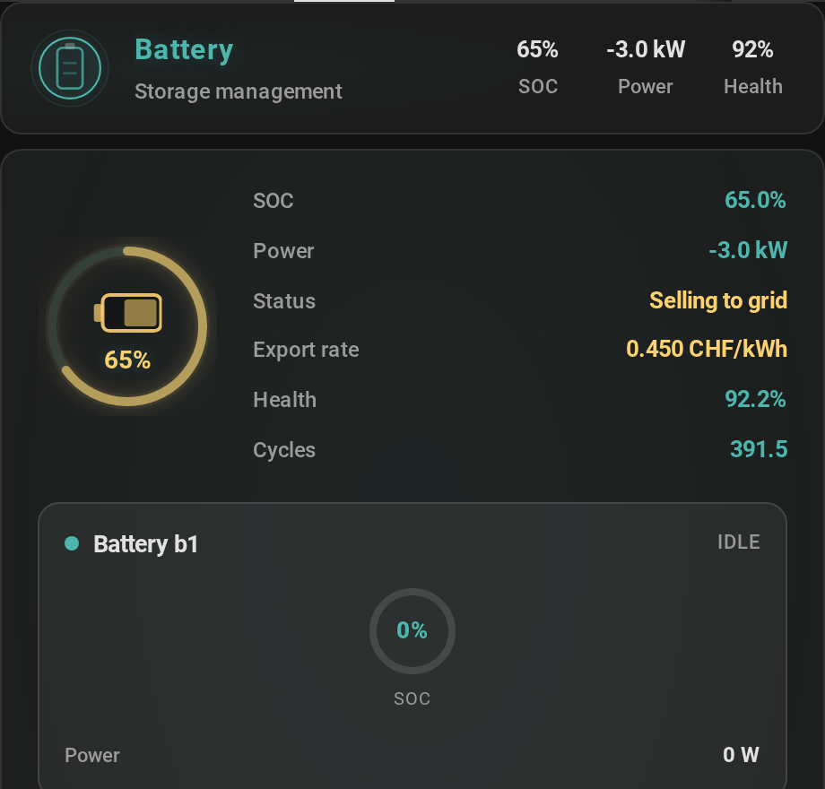
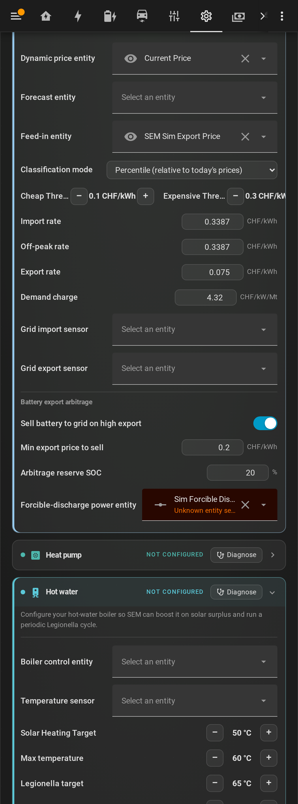

# Battery export arbitrage — selling stored energy when export is high

> ## ⏸️ Deactivated in v1.7.3 — returns in v1.7.4
>
> Automatic battery→grid arbitrage is **turned off in the stable 1.7.3
> release** while it gets more review and soak time. The global toggle is
> forced off, its config section is hidden, and the **`Allow arbitrage`
> battery mode is removed from the selector**. All other battery control
> (Auto, Self-consumption, Force charge, Force discharge, Off) is unaffected.
> Arbitrage returns in **v1.7.4** — tracking issue **#533**. The rest of this
> page describes the feature as it works once re-enabled.

On a dynamic / spot tariff (EPEX, Tibber, Nord Pool, aWATTar, …) the price you
are paid to export swings hard — often **negative** (you pay to export) and
sometimes **far above** the cost of charging. SEM's battery charge scheduler
already buys low (it charges in the cheapest hours). **Export arbitrage** adds
the other half of *buy low, sell high*: it discharges the home battery **to the
grid** when the export price beats the cost of recharging it later.

> **Opt-in. Default OFF.** SEM never force-discharges your battery unless you
> turn this on.



*The Battery card shows a distinct gold **“Selling to grid”** state with the live
export price while SEM is exporting the battery.*

---

## When SEM decides to sell

It is the mirror of the scheduler's charge-on-cheap decision, using the **same
economics**, so it can never sell at a loss. Every cycle, while arbitrage is on
and no charge is planned, SEM sells only when **all** of these hold:

1. **Export price ≥ your “min export price to sell”** — worth cycling the
   battery for.
2. **SOC > your reserve floor** — your backup capacity is never sold.
3. **The sale beats recharging it later:**

   ```
   export_now  >  cheapest_upcoming_import ÷ round-trip_efficiency  +  battery_cycle_cost
   ```

   i.e. selling now must out-earn buying the same kWh back later, after
   round-trip losses (~10 %) and battery wear.

If any condition fails, the battery stays in its normal mode.

## The economics

At the same moment a dynamic tariff can pay €0.45/kWh to export while the
cheapest overnight refill is €0.10/kWh:

| | €/kWh |
|---|---|
| Export price (evening peak) | 0.45 |
| Recharge cost (spot 0.10 ÷ 0.90 efficiency) | 0.111 |
| Battery wear (≈ €8k / 10 kWh / 6000 cycles) | 0.067 |
| **Net profit per kWh sold** | **≈ 0.27** |

Selling a few kWh down to the reserve on such an evening captures roughly
**€1–2 per event**, on the order of **€100–300/year** on a typical home battery —
*on top of* the self-consumption savings the battery already provides. The win
grows with how volatile your tariff is, and matters more as net-metering
(e.g. the Dutch *salderingsregeling*) is phased out.

It is structurally safe: the break-even gate (including `battery_cycle_cost`)
stops it from cycling the battery for a spread that doesn't cover the wear, and
it never touches your reserve SOC.

## Enabling it

Configuration tab → **Tariff & pricing** (visible only on a *dynamic* tariff):



| Setting | What it does |
|---|---|
| **Sell battery to grid on high export** | Master on/off. Default off. |
| **Min export price to sell** | Floor price (per kWh) worth cycling the battery for. |
| **Arbitrage reserve SOC** | Never discharge to grid below this SOC — your backup reserve. |
| **Forcible-discharge power entity** | The `number.*` entity that sets your battery's forced discharge-to-grid power (see below). |

### Battery brand support

- **Huawei SUN2000 + LUNA2000** — SEM uses the *huawei_solar*
  **`forcible_discharge_soc` service** (Huawei has **no** forcible-discharge
  *number* entity). It discharges to your **reserve SOC**, which the inverter
  self-terminates at — so the reserve is a true floor even if a stop is delayed.
  Requires the *huawei_solar* integration; SEM auto-detects it and uses the
  battery device. Verified live on a real LUNA2000.
- **GoodWe, Victron, SolaX, Growatt, Sessy, Powerwall, …** — the **generic**
  path writes the discharge power to a **number entity you configure** (the
  integration's discharge-power setpoint, or a small `template`/`script`-backed
  `number` / `input_number` — SEM drives whichever domain you point it at).

If no forcible-discharge path is available (no Huawei service and no number
entity), the decision is **safely dropped** — SEM logs that it *would* sell but
takes no action.

> **Huawei note (anti-block):** the LUNA2000 locks up if it gets a stop plus a
> second Modbus write in the same ~10 s cycle. SEM issues **one** command per
> transition and defers the rest to the next cycle, and re-issues a dropped stop
> automatically. Because mode decisions are stable (a mode stays until you change
> it), normal operation never toggles faster than the inverter can keep up.

### Per-battery control (multi-battery installs)

On installs with **two or more batteries** (e.g. Growatt + Sessy, or two
LUNA2000s) each battery is controlled independently from the **Battery card**:

| Mode | What it does |
|---|---|
| **Auto** | Today's behaviour — scheduler / arbitrage / protection decide. |
| **Self-consumption only** | Charge + power the house, but **never** sell to grid. |
| **Allow arbitrage** | Sell to grid when profitable, even with the global toggle off. |
| **Force charge** | Charge to full now. |
| **Force discharge** | Sell to grid now, down to the **Reserve SOC**. |

Each battery also has its own **Reserve SOC** floor (never discharged below it),
and — for multi-battery installs — its own **forcible-discharge entity picker**
in Configuration → Tariff. One battery can sell while a sibling holds.

## Turning it off

- **Toggle off** in Configuration → Tariff & pricing. The entire path is gated
  on it; nothing is force-discharged when off.
- Flip it off **mid-sale** and the next ~10 s cycle stops cleanly — the next
  battery command zeroes the forcible-discharge (the modes are mutually
  exclusive), so the battery never silently keeps selling.
- **Softer dials** short of off: raise the **reserve SOC** (sell only a thin
  slice), raise the **min export price** (sell only at genuine peaks), or simply
  leave the discharge entity unset.

## Notes & limits

- **Negative export is a cost.** SEM reads the *signed* export price, so a
  negative spot price is correctly treated as a cost (not a credit) for revenue,
  ROI, and the never-sell-at-a-loss gate.
- **Market-dependent.** In a flat / low-volatility market the break-even gate
  simply won't fire — there's nothing to gain, so SEM does nothing.
- **Hardware-dependent.** Your battery must accept a forced discharge-to-grid
  command via a controllable number entity.
- **Curtailment on negative export** (turning down solar when export is negative)
  needs inverter export-limit control and is a separate, future enhancement.
