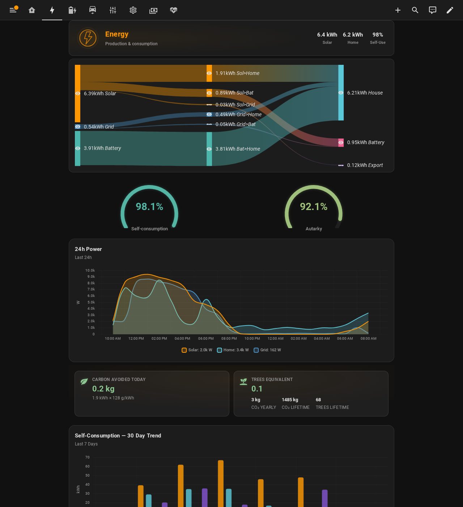
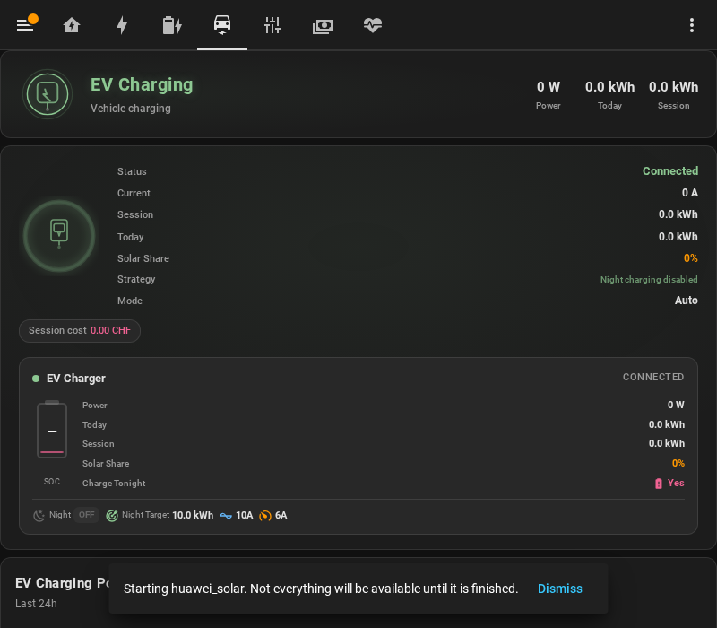
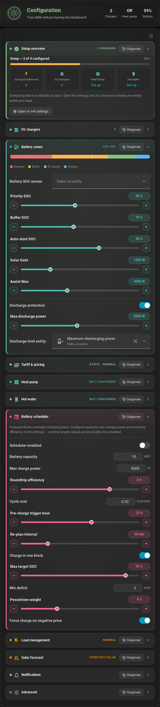
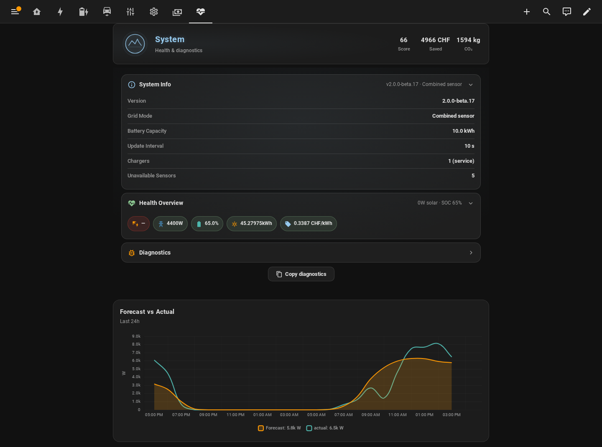

<p align="center">
  
</p>

# Solar Energy Management - Dashboard Guide

Complete guide for the SEM dashboard — a 7-tab glassmorphism interface with animated system diagram, real-time energy flows, cost tracking, and environmental impact.


---

## Table of Contents
1. [Quick Start](#quick-start)
2. [Dashboard Tabs](#dashboard-tabs)
3. [Required HACS Cards](#required-hacs-cards)
4. [Bundled SEM Cards](#bundled-sem-cards)
5. [Visual Style](#visual-style)
6. [Multi-Language Support](#multi-language-support)
7. [Troubleshooting](#troubleshooting)

---

## Quick Start

The dashboard is generated automatically on first install. If you need to regenerate it:

1. Go to **Developer Tools** > **Services**
2. Search for `solar_energy_management.generate_dashboard`
3. Click **Call Service**
4. The dashboard appears in the sidebar — hard-refresh your browser (Ctrl+Shift+R)

---

## Dashboard Tabs

### Home

The main at-a-glance view with real-time power flows.


| Card | Description |
|------|-------------|
| **Status Chips** | Solar power, battery SOC, autarky rate, EV status, optimization score |
| **Today's Plan** | Forward-looking timeline of today's solar, tariff, night-window, and EV events — see [Today's Plan rows](#todays-plan-rows) for the row-by-row breakdown |
| **System Diagram** | Illustrated SVG with detailed component drawings (solar panels, house, battery, grid pole, EV charger), K-Flow-inspired spark flow animations, time-based sun arc, clickable nodes, individual device list (desktop) |
| **Solar Summary** | Production metrics with animated glow ring, yield, forecast, self-use, costs, savings |
| **7-Day Chart** | Bar chart showing daily solar, home, and grid import over the last week |
| **Smart Recommendation** | AI-powered energy tip based on forecast, pricing, and current conditions |
| **Peak Load + Energy Tip** | Current 15-min peak vs limit, actionable energy tip |
| **Quick Controls** | Observer mode toggle. (`Smart Night Charging` and `Night Charging` switches were removed in v1.6.3 — their intent now lives in the per-charger [Charge mode selector](#charging-mode-selector-v163) on the EV tab.) |
| **EV Status** | Conditional — shows charging state, current, power, session progress when EV is connected |
| **Weather** | Live clock, temperature, weather conditions, 5-day forecast with temperature bars |

#### Today's Plan rows

Today's Plan is the forward-looking timeline at the top of the Home tab. It collapses solar, tariff, night-window, EV-session, and home-battery events into one chronological list so you can see at a glance what SEM is planning between now and tomorrow morning. Rows appear conditionally based on what's active — an empty plan is normal during the day for a configuration without dynamic tariff or active EV session.

| Row | Meaning | When it appears |
|---|---|---|
| **Now** | Anchor row for the current moment. Everything below this is "from here." | Always |
| **Solar peak — X kWh expected today** | Forecast solar peak time + total kWh expected | When a solar forecast is available (Solcast or HA's Energy dashboard) |
| **Cheap hours open** / **Cheap hours end** | Boundaries of the cheapest contiguous price window | Dynamic tariff configured |
| **Expensive hours start** / **end** | Boundaries of the price-peak window | Dynamic tariff configured, peak window is in the future |
| **Night charging window opens** | Time SEM enters night mode (your `Night earliest start` or the dynamic dusk window). Until this opens, EV night charging stays gated off regardless of mode. | Always — even when no EV is connected, so you can see the window |
| **EV charging starts** with subtitle `gentle peak-managed ramp` *or* `tariff-optimized, waiting for cheap window` | Time SEM expects the EV to start pulling. Subtitle = how: gentle ramp within peak limit, or wait for cheap-tariff window before starting. | EV connected, mode allows night/grid charging |
| **Min reached (X kWh)** | Predicted ETA for hitting the Min target on the charger — derived from planned ramp rate, your Min current, peak headroom, and home-load forecast. If later than your `Charge by` deadline, SEM forces the rate up automatically and this row turns red. | EV session is planned or in progress |
| **EV reaches target at HH:MM** | Live ETA for hitting the Max target during an active session (v1.6.3, #298) | EV is actively charging |
| **Battery full at HH:MM** | Live ETA for the home battery reaching 100% SOC (v1.6.3, #298) | Home battery is charging at a meaningful rate (\|power\| > 200 W) |
| **Battery reaches floor at HH:MM** | Live ETA for the home battery reaching its floor SOC (v1.6.3, #298) | Home battery is discharging at a meaningful rate |
| **Charge-by deadline** | Your configured `Charge by` time. Hard end of the night plan — earlier than the window's natural end means SEM forces the ramp to guarantee Min by then (even if it briefly exceeds the peak limit). | EV has a deadline set |
| **Night charging window ends** | End of the night-mode window | Always (paired with `opens`) |

### Energy

Deep dive into energy production, consumption, and environmental impact.



| Card | Description |
|------|-------------|
| **Sankey Diagram** | Energy flow visualization from sources to destinations |
| **Self-Consumption + Autarky** | Gauge cards showing percentage rates |
| **Energy Distribution** | Donut chart breaking down today's energy by category |
| **24h Power Curves** | Detailed power graph with solar, home, grid, battery over 24 hours |
| **Solar Today vs Yesterday** | Side-by-side comparison chart |
| **Carbon Avoided** | Daily CO2 savings from self-consumed solar (128g/kWh Swiss grid) |
| **Trees Saved** | Yearly trees equivalent with growing icon (sprout > tree > pine > forest) |
| **Self-Consumption Trend** | 30-day line chart of self-consumption and autarky rates |
| **Solar Forecast** | Today + tomorrow forecast with percentage comparison |
| **30-Day Energy** | Monthly bar chart of daily solar and consumption |

### Battery

Battery state and configuration.


| Card | Description |
|------|-------------|
| **SOC Gauge** | Radial gauge showing current battery state of charge. Turns **gold with a "Selling to grid" status + live export price** when SEM is exporting the battery for arbitrage (see [Battery export arbitrage](BATTERY_EXPORT_ARBITRAGE.md) — note: arbitrage is **off by default in v1.7.3 stable**, so this state only appears once it is re-enabled) |
| **Power Status** | Current charge/discharge power and daily energy totals |
| **24h Battery Chart** | Charge/discharge power + SOC line over 24 hours |
| **SOC Zone Config** | Steppers for priority, buffer, auto-start, and assist-floor SOC levels, plus **Solar Gate** (`battery_assist_min_surplus`) and **Assist Max** — the solar surplus required before the battery helps charge the EV, and the cap on that assist |
| **Per-battery mode** | For multi-battery setups: a mode selector per battery (auto / self-consumption / force-charge / force-discharge / off) |

### EV

EV charging session tracking and statistics.



| Card | Description |
|------|-------------|
| **Charging Status** | Current mode, power, session energy, solar share |
| **Session Gauges** | Daily energy vs target, solar share percentage |
| **Charging Power Chart** | 24h EV power curve |
| **Charging Settings** | Charge target range (Min ↔ Max), [Charge mode selector](#charging-mode-selector-v163), Charge by deadline picker, Set as default |
| **EV Intelligence** | Taper trend visualization, virtual SOC estimate, charge skip status & reasoning, battery health indicator |
| **Lifetime Statistics** | Total energy, cost, sessions, solar share over all time |

#### Charging mode selector (v1.6.3)

The per-charger `Charge mode` selector replaces the v1.6.x toggle-soup (`Overnight grid charging`, `Smart night charging`, `Cheapest hours`) with one named intent control. Five modes:

| Mode | Behaviour | Typical user |
|---|---|---|
| **Solar only** | Surplus only — never imports from grid | Solar maximalist |
| **Solar + cheapest hours** | Surplus by day, grid only in the cheapest contiguous tariff window at night (hidden if no dynamic tariff is configured) | Dynamic-tariff users |
| **Min + Solar** (default) | Guarantee Min by deadline (from night top-up), solar adds up to Max. Zone-adaptive during the day. | Daily commuter |
| **Always (max)** | Charge at max regardless of source | "Just charge the car" / strict legacy `minpv` |
| **Off** | No charging — SEM monitors but issues no commands | Disabled |

A help line under the selector explains what the currently-selected mode does. For the full decision matrix (mode × time-of-day × outcomes) and the v4 → v7 migration mapping, see **[EV_CHARGING_LOGIC.md](EV_CHARGING_LOGIC.md)**.

### Control

Live operations and device management. Since #492 this tab is a
**monitoring view** — every writable setting lives on the
[Configuration](#configuration) tab instead (both tabs read the same HA
entities, so changes made there are reflected here immediately). The
EV section moved to per-charger cards on the EV tab in v1.6.3.


| Card | Description |
|------|-------------|
| **Surplus Control** | Live surplus: available/distributable and allocated/free watts |
| **Battery Management** | SOC + status (subtitle), capacity |
| **Hot Water** | Legionella disinfection target + regulatory info (the solar-boost target is set on Configuration) |
| **Heat Pump** | Active mode and SG-Ready state (auto-hidden when no heat pump is configured) |
| **Tariff & Pricing** | Provider, price level, current import rate |
| **Peak & Load Management** | Live % of peak limit, peak margin, sheddable devices |
| **Load Priority** | Drag-and-drop device ordering with real-time power, controllable/critical toggles, per-device control mode (Off / Peak Only / Surplus), and a per-device **Configure** button (see below). EV chargers have no mode dropdown here — their charge target is set in the **Charge Target** block on the EV card |

A red observer-mode banner appears at the top whenever Observer Mode
(read-only monitoring) is enabled on the Configuration tab.

#### Configure a device's control (manual mapping)

When SEM can't auto-detect how to control a load (e.g. a Shelly Pro3EM meter whose relay lives on a separate device), use the **Configure** button on the Load Priority card to map it manually. The dialog pre-fills with the current mapping and supports all four control methods SEM can shed/restore:

| Control type | Use for | What you pick |
|---|---|---|
| **Switch** | on/off appliances, smart plugs | the `switch.*` entity |
| **Number entity** | chargers with a current/amperage number (Wallbox, go-eCharger, …) | the `number.*` / `input_number.*` entity (set to 0 to reduce) |
| **Input boolean** | automation-triggered loads | the `input_boolean.*` entity |
| **Service call** | service-driven chargers (KEBA, Easee) | the service (e.g. `keba.set_current`), parameter, and reduce/restore values |

Entity types use a searchable entity picker filtered to the right domain. **Reset to auto-detect** removes a manual mapping and reverts the device to auto-discovery (for an auto-discoverable device this re-populates the same entity; to stop SEM controlling a device entirely, set its control mode to **Off**).

### Configuration



The single home for **every changeable setting** (`sem-config-card`),
organized in collapsible sections: Setup overview, EV chargers, Battery
zones, Tariff & pricing, Heat pump, Hot water, Battery scheduler, Load
management, Solar forecast, Notifications, and Advanced (update
interval, deltas, min solar power, regulation offset, Observer Mode).
Each section header has a **Diagnose** button that dumps that section's
live config + state via the `solar_energy_management.diagnose` action —
attach its output to bug reports. Settings written here apply
immediately; structural changes (e.g. tariff mode) reload the
integration automatically.

### Costs

Financial tracking with daily, monthly, and yearly KPIs.


| Card | Description |
|------|-------------|
| **Today / This Month** | Side-by-side cost, revenue, net cost, savings chips |
| **This Year** | Yearly costs, revenue, savings cards |
| **Period Selector** | Today, yesterday, this week, this month, this year buttons |
| **Cost Chart** | Import costs, export revenue, net cost over selected period |
| **Savings Chart** | Solar savings + battery savings over selected period |
| **EV Economics** | Cost per kWh, cost per 100km, solar share |
| **Demand Charge** | Monthly peak, power charge cost, demand rate |
| **Tariff Rates** | Current import/export rates, price level |

### System

Diagnostics and health monitoring.



| Card | Description |
|------|-------------|
| **Sensor Status** | Availability of solar, grid, battery, EV sensors |
| **Charging State** | Current charging mode and strategy |
| **Mode Status** | Night/solar/battery priority status |
| **Configuration** | All current settings at a glance |
| **Peak Management** | Current peak, monthly peak, trend |
| **Load Management** | Active devices, switchable device count (only counts currently ON devices), shedding status |
| **System Info** | Version, grid mode (translated), battery capacity, update interval, configured charger count, unavailable sensors |

---

## Required HACS Cards

Install these via HACS > Frontend before the dashboard will render:

| Card | HACS Repository | Purpose |
|------|-----------------|---------|
| `card-mod` | `thomasloven/lovelace-card-mod` | Glass card styling via `*glass_card` anchor. **Missing = blank tabs.** |
| `mushroom` | `piitaya/lovelace-mushroom` | Chips, entity, template, number, and title sub-cards used inside SEM cards |
| `apexcharts-card` | `RomRider/apexcharts-card` | All trend, power, and cost charts |
| `sankey-chart` | `MindFreeze/sankey-chart` | Energy flow diagram on the Energy tab |

**4 required HACS cards** (card-mod, mushroom, apexcharts-card, sankey-chart). Everything else on the dashboard is a bundled `sem-*` card or a native HA type. Optional: `k-flow-card` for the animated flow diagram on the Home tab (SEM falls back to its built-in system diagram if absent).

---

## Bundled SEM Cards

These ship with the integration — no HACS installation needed:

| Card | Purpose |
|------|---------|
| `sem-flow-card` | Animated SVG power flow with daily energy, autarky gauge, visual config editor, tap actions, up to 6 individual devices |
| `sem-system-diagram-card` | Illustrated SVG energy system diagram with detailed component drawings, animated spark flows, time-based sun arc, clickable nodes, responsive layouts |
| `sem-solar-summary-card` | Solar production metrics with animated glow ring and forecast |
| `sem-weather-card` | Live clock, weather conditions, colored temperature forecast bars |
| `sem-chart-card` | Chart.js-powered charts with 6 presets (costs, savings, energy, power, battery, EV) |
| `sem-period-selector-card` | Date range picker controlling all chart cards |
| `sem-load-priority-card` | Drag-and-drop device priority with real-time power display, touch support |

Resource URLs include `?v={version}` for automatic cache busting.

### System Diagram Style

SEM includes a built-in illustrated system diagram on the Home tab. Users who prefer the K-Flow card can switch via config options:

| Option | `diagram_style` value | Description |
|--------|----------------------|-------------|
| SEM Diagram (default) | `sem` | Illustrated SVG with solar panels, house, battery, grid pole, EV charger, animated flows, sun arc |
| K-Flow Card | `kflow` | Third-party K-Flow card (must be installed via HACS) with PV string details, cell temps, BMS data |

To switch: Settings → Integrations → SEM → Configure → set `diagram_style` to `kflow`. The dashboard will regenerate with the K-Flow card on the Home tab.

### Pointing the flow / diagram cards at non-SEM entities

Both `sem-flow-card` and `sem-system-diagram-card` (#455) accept an explicit `entities:` map instead of the default `entity_prefix: sensor.sem_`, so they can visualize any Home Assistant install:

```yaml
type: custom:sem-system-diagram-card
entities:
  solar:
    entity: sensor.inverter_pv_power        # W; reverse: true to flip sign
    daily_energy: sensor.daily_yield
    forecast_remaining: sensor.solcast_remaining_today   # diagram card only
  battery:
    entity: sensor.battery_power            # +charge / −discharge (SEM convention)
    # OR split sensors instead of a combined one:
    # charge: sensor.batt_charge_w
    # discharge: sensor.batt_discharge_w
    state_of_charge: sensor.battery_soc
    daily_charge_energy: sensor.batt_in_today     # diagram card only
    daily_discharge_energy: sensor.batt_out_today # diagram card only
  grid:
    consumption: sensor.grid_import_w       # split sensors…
    production: sensor.grid_export_w
    # …or a single signed sensor (+import / −export; reverse: true flips):
    # entity: sensor.grid_power
    daily_import_energy: sensor.grid_in_today
    daily_export_energy: sensor.grid_out_today
  ev:
    entity: sensor.wallbox_charging_power   # invert: true to flip sign
    daily_energy: sensor.ev_today
  home:
    entity: sensor.home_consumption         # optional — derived from the balance when omitted
    daily_energy: sensor.home_today
    autarky: sensor.autarky_rate
    self_consumption: sensor.self_consumption_rate       # diagram card only
```

Keys you omit simply render as 0 / empty — an install without an EV just leaves `ev:` out (no "sensor unavailable" warning in entities mode). `entity_prefix` remains the default and takes precedence if both are set.

### Cards Removed in v1.2.0+ (replaced by SEM cards)

These HACS cards are no longer required:

| Removed | Replaced by |
|---------|-------------|
| `power-flow-card-plus` | `sem-flow-card` (was `sem-system-diagram-card`) |
| `mini-graph-card` | `apexcharts-card` |
| `solar-card` | `sem-solar-summary-card` |
| `clock-weather-card` | `sem-weather-card` |
| `bar-card` | Native HA gauge card |
| `bubble-card` | Removed |
| `button-card` | Replaced by mushroom |

---

## Visual Style

The dashboard uses a unified glassmorphism dark theme with dot grid backgrounds, radial gradients, and glow effects:

```css
ha-card {
  background:
    radial-gradient(ellipse 70% 60% at 50% 40%, rgba(200,220,240,0.07) 0%, transparent 100%),
    radial-gradient(circle at 2px 2px, rgba(128,128,128,0.06) 0.7px, transparent 0.7px);
  background-size: 100% 100%, 50px 50px;
  backdrop-filter: blur(18px) saturate(160%);
  border: 1px solid rgba(255,255,255,0.08);
  border-radius: 16px;
  box-shadow: 0 4px 24px rgba(0,0,0,0.35), inset 0 1px 0 rgba(255,255,255,0.06);
  font-family: 'Segoe UI','Roboto',sans-serif;
}
```

### Color Palette

| Entity | Color | Hex |
|--------|-------|-----|
| Solar | Orange | `#ff9800` |
| Grid Import | Steel Blue | `#488fc2` |
| Grid Export | Purple | `#8353d1` |
| Battery Charge | Pink | `#f06292` |
| Battery Discharge | Teal | `#4db6ac` |
| Home | Cyan | `#5BC8D8` |
| EV | Soft Green | `#8DC892` |

---

## Multi-Language Support

SEM supports 16 languages: Czech, Danish, German, English, Spanish, Finnish, French, Hungarian, Italian, Dutch, Norwegian, Polish, Portuguese, Romanian, Swedish, and Simplified Chinese (`zh` — also used when Home Assistant reports `zh-Hans`).

### How Translation Works — Two Language Settings

Home Assistant has two independent language settings. SEM uses both:

| Setting | Where to change | What it affects in the dashboard |
|---------|----------------|----------------------------------|
| **System language** | Settings → General → Language | Mushroom card titles and labels, section headers, chart titles from ApexCharts/Sankey, all static YAML-based text |
| **User profile language** | Your profile → Language | SEM custom cards: flow card, chart card, battery card, EV status, period selector, solar summary, weather card |

#### What this means in practice

- **Same language for everyone:** If the system language is German, all mushroom cards, chart labels, and static text appear in German for every user.
- **Per-user SEM cards:** If one user sets their profile to English and another to French, the SEM flow card, chart card, and other SEM cards will show each user's chosen language.
- **Mixed-language scenario:** System = German, user profile = English → mushroom cards show German, SEM cards show English. This is by design, not a bug.

#### How to ensure consistent language

For all text to appear in the same language:

1. Set the **system language** to your desired language (Settings → General)
2. Set every **user's profile language** to the same language
3. Call `solar_energy_management.generate_dashboard` to regenerate the dashboard with the new system language
4. Hard-refresh the browser (Ctrl+Shift+R)

> **No HA restart needed.** As of v1.5.16, `generate_dashboard` pushes the new config through Home Assistant's own Lovelace store — the running dashboard reloads live as soon as the service call returns. Older muscle memory ("regenerate, then restart HA") no longer applies; a hard-refresh is enough.

### Which parts translate when?

| Action | What changes |
|--------|-------------|
| Change **system language** + regenerate dashboard | Mushroom cards, chart labels, section headers, tab names (reloads live, no HA restart) |
| Change **user profile language** | SEM custom cards update immediately (no regeneration needed) |
| Add new translations to `translations.json` | Must regenerate `sem-localize.js` + redeploy + regenerate dashboard (hard-refresh after — browser-cached `sem-localize.js`) |

---

## Troubleshooting

### Dashboard not appearing
1. Call `solar_energy_management.generate_dashboard` from Developer Tools > Services
2. Hard-refresh your browser (Ctrl+Shift+R)

### Cards showing "Custom element doesn't exist"
A required HACS card is missing. Check the browser console for the card name, install it via HACS, and hard-refresh.

### Blank Home tab
Missing `card-mod` — the `*glass_card` styling anchor requires it. Install via HACS.

### Entity not found errors
The dashboard references SEM sensors that may not exist yet. Wait for the first coordinator cycle (10 seconds after restart) and refresh.

### Cards not updating after SEM update
SEM includes `?v={version}` cache busting on all card URLs. If cards still show old behavior, hard-refresh (Ctrl+Shift+R) to force reload.

### Some cards in wrong language / mixed languages
This is expected if your system language and user profile language differ. See [Multi-Language Support](#multi-language-support) above. To fix: set both to the same language and regenerate the dashboard.

### Changed system language but dashboard still in old language
You must regenerate the dashboard after changing the system language. Go to Developer Tools > Services > `solar_energy_management.generate_dashboard` and call the service, then hard-refresh. The regenerated dashboard takes effect immediately — no HA restart needed (v1.5.16+).
