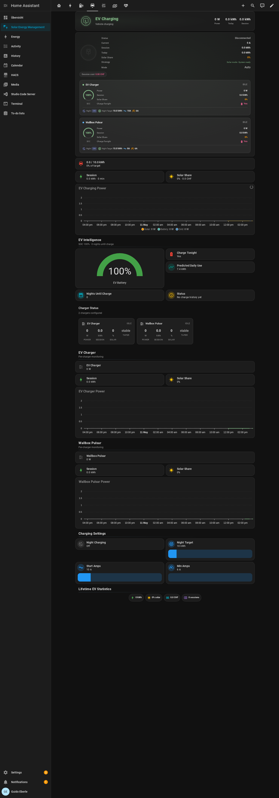

# Multi-Device Setup Guide

This guide covers setting up SEM with different hardware combinations. SEM auto-detects most configuration from the HA Energy Dashboard, but some setups need extra attention.

---

## Supported Combinations

| Inverter | EV Charger | Battery | Status |
|----------|-----------|---------|--------|
| Huawei SUN2000 | KEBA P30 | Huawei LUNA | Fully tested (reference setup) |
| Growatt (SPH/TLX/MIX) | Wallbox Pulsar | Growatt battery | Tested by community |
| SolarEdge | Easee | BYD | Expected to work |
| Fronius | go-eCharger | Fronius battery | Expected to work |
| GoodWe | Zaptec | Any | Expected to work |
| Enphase | Any OCPP | Tesla Powerwall | Expected to work |
| SMA | Any | Sonnen | Expected to work |
| Victron | OpenEVSE | Victron battery | Expected to work |

> **Your combination not listed?** SEM works with any inverter/charger/battery that has sensors in Home Assistant. Open an issue if you need help.

---

## Per-Brand Setup Notes

### Huawei SUN2000 + LUNA (Reference)

- **Grid sensor**: Combined `sensor.power_meter_wirkleistung` (negative=import, positive=export) — matches SEM convention
- **Battery**: `sensor.battery_1_lade_entladeleistung` (positive=charge, negative=discharge) — matches SEM convention
- **Charger control**: `keba.set_current` service
- **Auto-detection**: Fully automatic via Energy Dashboard
- **Sign correction**: None needed

### Growatt (SPH / TLX / MIX)

- **Grid sensor**: Growatt provides **separate** import and export power sensors (both always positive):
  - `sensor.*_import_from_grid` (import power in W)
  - `sensor.*_export_to_grid` (export power in W)
- **SEM handling**: Auto-discovers split sensors and calculates `grid_power = export - import`
- **Charger control**: Wallbox uses a `number.*` entity — select it as "Current Control Entity" in the charger config
- **Important**: Ensure both grid import AND export energy sensors are configured in the Energy Dashboard

### SolarEdge

- **Grid sensor**: Combined sensor, usually positive=import (HA convention)
- **SEM handling**: Auto-detects sign from Energy Dashboard counters and negates if needed
- **Battery**: BYD batteries typically use positive=charge, negative=discharge

### Fronius

- **Grid sensor**: Combined sensor, varies by model
- **SEM handling**: Auto-detects sign convention
- **Note**: Some Fronius models report grid power in kW — SEM auto-converts

### GoodWe

- **Grid sensor**: Combined or split depending on model
- **SEM handling**: Auto-detection via Energy Dashboard
- **Troubleshooting**: Check the System tab on the SEM dashboard for sensor diagnostics

---

## Multi-Charger Setup

### Adding a Second Charger

1. Go to **Settings → Devices & Services → Solar Energy Management → Configure**
2. Select **EV Chargers** → **Add another EV charger**
3. Configure the sensors for your second charger

### Current Control Methods

| Method | Chargers | Config Field |
|--------|----------|-------------|
| **Number entity** | Wallbox, go-eCharger, OpenEVSE | "Current Control Entity" — select the `number.*` entity |
| **Service call** | KEBA, Easee | "Set-Current Service" — enter the service name (e.g. `keba.set_current`) |

> **Important**: Use EITHER the number entity OR the service. Leave the other blank.

### Per-Charger Settings (v1.5.2+; consolidated in v1.6.3)

Each charger gets its own EV charging configuration:

| Entity | Description |
|--------|-------------|
| `number.sem_charger_{id}_daily_ev_target` | Night charging target (kWh) per charger |
| `number.sem_charger_{id}_daily_ev_target_max` | Solar-surplus ceiling (kWh) per charger |
| `number.sem_charger_{id}_minimum_current` | Minimum charging current (A) |
| `select.sem_charger_{id}_charge_mode` | Per-charger Charge mode (Solar only / Solar + cheapest hours / Min + Solar / Always (max) / Off). v1.6.3 replacement for the legacy `night_charging`, `smart_night_charging`, `tariff_optimized` switches. |

You can set different modes and targets per car — e.g., *Min + Solar* with 15 kWh Min for a daily commuter, *Solar only* with 8 kWh Max for a plug-in hybrid. These settings are also editable in the config flow (Settings → Integrations → SEM → Configure → Edit charger).

### Per-Charger Sensors

Each configured charger creates its own sensor entities:

| Entity | Description |
|--------|-------------|
| `sensor.sem_charger_{id}_power` | Real-time charging power (W) |
| `sensor.sem_charger_{id}_session_energy` | Current session energy (kWh) |
| `sensor.sem_charger_{id}_session_solar_share` | Solar percentage of session (%) |
| `sensor.sem_charger_{id}_taper_trend` | BMS taper detection (stable/declining) |
| `sensor.sem_charger_{id}_taper_ratio` | Taper ratio (%) |
| `sensor.sem_charger_{id}_estimated_soc` | EV battery SOC estimate (%) |
| `sensor.sem_charger_{id}_taper_minutes_to_full` | Estimated minutes to full charge |
| `sensor.sem_charger_{id}_daily_energy` | Energy delivered today by this charger (kWh) |

### Surplus Priority

Each charger's surplus priority is its position in the **unified priority list** on the Control tab — drag its row up or down relative to loads and the battery (#576). The highest-priority charger gets surplus first; when it's full or at minimum power, the remainder flows down the list.

### Night Charging

Each charger charges independently at night:
- Each charger uses its own `daily_ev_target` — no equal splitting
- Night charging can be toggled on/off per charger
- Start amps and minimum current are configurable per charger
- If both chargers are connected and have capacity, both charge simultaneously

### Dashboard

The `sem-ev-status-card` on the EV tab automatically shows per-charger sections when chargers are configured:
- **Connected status** — per-charger CONNECTED/DISCONNECTED indicator (reads each charger's plug sensor independently)
- **Battery SOC gauge** — shows real vehicle SOC when `vehicle_soc_entity` is configured per charger, otherwise estimated SOC from taper detection
- **Per-charger metrics** — power, session energy, solar share
- **Charge Tonight** — per-charger indicator (Yes/No)
- **Nights Until Charge** — per-charger estimate using the charger's own vehicle SOC
- **Inline settings** — night charging toggle, target kWh, start/min amps (tap to edit)

When multiple chargers are configured, the global status row is hidden to avoid redundancy with per-charger sections.

Regenerate the dashboard after adding a charger: **Developer Tools → Services → solar_energy_management.generate_dashboard**. The new per-charger sections show up immediately — no HA restart needed (v1.5.16+); hard-refresh the browser if cards look stale.



---

## Grid Sign Convention

SEM uses this convention:
- **Grid power**: negative = import, positive = export
- **Battery power**: positive = charge, negative = discharge

### How SEM Auto-Detects

1. **Combined sensor** (Huawei, SolarEdge, Fronius): SEM correlates the power sensor sign against Energy Dashboard import/export energy counter changes
2. **Split sensors** (Growatt): SEM discovers `*_import_from_grid` and `*_export_to_grid` entities automatically — no sign correction needed
3. **Self-healing**: If the energy balance is consistently negative (wrong sign), SEM auto-corrects

### Checking Your Setup

On the **System tab** of the dashboard, the Diagnostics section shows:
- **Grid mode**: `combined` or `split`
- **Grid sign**: `normal` or `negated`
- **Sensors unavailable**: Number of sensors currently offline

---

## Troubleshooting

### Import/export values seem swapped
- Check the **System tab → Diagnostics** for grid mode and sign
- Verify your Energy Dashboard has BOTH import and export energy sensors configured
- For Growatt: ensure `*_import_from_grid` and `*_export_to_grid` power sensors exist

### Home consumption shows 0 or very high
- This usually means the grid sign is wrong
- SEM should auto-correct within 3 minutes
- If it persists, check the HA logs for "grid sign" messages

### Charger not responding to current changes
- Verify the control method: number entity vs service
- Check Developer Tools → Services → test the service/number manually
- For Wallbox: use the "Current Control Entity" field, not the service field

### Second charger shows no data
- Update to latest beta, then regenerate dashboard
- Check that per-charger entities appear: `sensor.sem_charger_{id}_*`
- Verify the charger's power sensor is configured correctly

---

## Generic Surplus Loads (switches, sockets, pumps)

Any switchable load — pool pump, heater rod, a dumb EV socket — can be
driven by SEM. One service call is enough; the registration **persists
across restarts** and returns a summary response:

```yaml
service: solar_energy_management.register_surplus_device
data:
  device_id: kia_socket
  entity_id: switch.kia_socket
  name: Kia Socket
  rated_power: 2300        # W the load draws when on
  priority: 5              # lower = gets surplus first
```

SEM then switches the load ON when the solar surplus covers its rated
power and OFF when the surplus is gone (anti-flicker: min 5 min on /
1 min off). Remove it again with
`solar_energy_management.unregister_surplus_device`.

The `priority` in the call is the device's **starting** slot. Once it is
in the one device list it is ordered like every other row: drag it on the
Load Priorities card (or call `update_device_priorities`) and the new slot
governs the surplus walk, the plan and the card — immediately, and across
restarts. Re-registering the device with a different `priority` does not
undo a drag; the drag is the slot, the call is only the seed. (Up to #890
the drag was stored and then ignored for service-registered devices —
the allocator kept the seed while the call reported success.)

### Air-conditioners / heat pumps via `climate.*` (#569)

A unit exposed only as a `climate.*` entity (no switch, no `number`) can be
managed too — set `device_type: climate`. On surplus SEM sets the unit's
`hvac_mode` (e.g. `cool`) and, optionally, a comfort target temperature; when
the surplus is gone it sets `hvac_mode: off`. Same priority / peak-shed /
daily-goal handling as any other surplus load, and the registration persists
across restarts (it re-owns a running unit after a reboot).

```yaml
service: solar_energy_management.register_surplus_device
data:
  device_id: living_ac
  entity_id: climate.living_room_ac
  name: Living Room AC
  device_type: climate
  hvac_mode: cool           # cool | heat | heat_cool | dry | fan_only | auto
  target_temperature: 22    # °C to set when SEM turns it on (optional)
  rated_power: 1800         # W the unit draws when running
  priority: 6
```

Pick `hvac_mode: heat` (or `heat_cool`) to drive a heat pump the same way in
winter. Leave `target_temperature` empty to keep the unit's own setpoint and
only switch the mode.

`device_type` also decides how the unit is drawn in the device list — a
thermostat glyph for `climate`, a heat-pump glyph for `heat_pump`, a plug for
a plain `switch`. Before #788 every service-registered device was labelled
`service_device` on its way to the card and drew the generic plug regardless,
which made a correctly registered second heat pump look like it had not been
added at all.

### The mode ladder — who is in charge

Every device row on the Control tab has **one mode picker** — a 3-step
ladder:

| Mode (UI) | Behavior |
|---|---|
| **Off** | SEM monitors only, never switches the device — it sees your ON and keeps counting the device's energy, but never records itself as the one who started it — and the daily runtime budget stops accruing, because that budget is SEM's own (#779) |
| **Peak only** | **Your own automations** run the device; SEM only sheds it to protect the grid peak and restores it afterwards (catch the surplus via the event interface below) |
| **Surplus** | SEM runs the device on solar surplus; **never grid power** — on a dark day the daily target is simply missed |

(Services and automations see `control_mode` = `off`/`peak_only`/`surplus`.
Surplus devices default to `top_up_policy: solar_only` — never grid. A
`cheap_hours` policy also exists for hot-water/heat-pump off-peak top-up
but is not surfaced on the generic device card.)

Devices auto-discovered from the Energy Dashboard default to
`peak_only`; devices you register via the service default to
`surplus` (solar-only) — that's what you register them for.

**Lights are not imported.** An Energy-Dashboard consumer whose only
on/off surface is a `light.*` entity is skipped: lighting is not
shiftable, not a surplus sink, and shedding a dimmer is hostility for
savings that round to zero. HA's own Energy Dashboard keeps monitoring
it — SEM just has no business managing it. A metering *plug* feeding a
lamp is kept (the plug is a real control surface), and a relay you
register explicitly with `register_surplus_device` is always kept, even
if it is exposed as a light: that is your decision, not a guess. The
skip is logged with the device name, so an absent row is an answer
rather than a mystery, and it is re-evaluated on every refresh — a light
imported by an older version disappears by itself after the upgrade.

**Settings are not devices.** A lot of hardware publishes its own knobs
as switches — a WLED strip's *reverse*, *freeze* and *night light*, a
washing machine's *child lock*, a router's *status LED*. Home Assistant
marks those entities **configuration** or **diagnostic**, and SEM reads
that mark: they are never discovered as loads, never chosen as a
device's control surface, and rows an older version created for them
retire themselves on the next refresh. Toggling one draws no watts, so
managing it can only ever be noise — a peak event flipping your stair
lights into reverse looking for power that was never there. Two things
are always kept: an entity your registry doesn't know (a template
switch, a YAML helper — no mark to read is not evidence against it), and
anything you registered yourself with `register_surplus_device`.

**A channel keeps its number.** On a multi-channel relay (a Shelly Pro,
an ESPHome board) the digit in the name *is* the channel, so control
matching never strips it and never accepts a bare substring:
`kanal_1` is not `kanal_2`, and it is not `kanal_10` either. A switch is
bound as a load's control only when it carries the exact same name, or
that name extended at a word boundary (`…_relay` names the channel, it
doesn't renumber it). When no such switch exists, SEM reports **no
control found** and manages the load as monitoring-only — deliberately
stricter than the power-sensor pairing, because a misbound meter merely
shows the wrong watts while a misbound relay switches the wrong circuit.

### Catching the surplus in your own automations (`peak_only`)

If you prefer to keep your own schedules (e.g. a 3×/day pump
automation) and just want them to land on solar surplus, subscribe to
SEM's surplus signal:

- **`binary_sensor.sem_surplus_available`** — ON once the unallocated
  surplus has stayed above the threshold
  (`number.sem_surplus_event_threshold`, default 1500 W) for 60 s; OFF
  once it has stayed below 80 % of the threshold for 120 s. The
  debounce means clouds can not flap your automations.
- **`solar_energy_management_surplus` event** — fired on every
  transition with `available`, `surplus_w`, `unallocated_w`,
  `threshold_w` in the payload.

```yaml
automation:
  - alias: Pump on solar surplus
    triggers:
      - trigger: state
        entity_id: binary_sensor.sem_surplus_available
        to: "on"
    actions:
      - action: switch.turn_on
        target: { entity_id: switch.pool_pump }
```

### Daily targets — the goal engine

A surplus-mode device can be given a **daily goal**. On the Control tab
each surplus device row has a target 🞋 button opening the **Daily Target**
panel — the same look as the EV charger's Charge Target:

- A single **"Run up to N h today"** slider (green handle; `0` = no
  target, up to 12 h). This is a **daily solar-runtime budget**: SEM runs
  the device on surplus until it has clocked N hours, then rests it for the
  day (pool pump: run up to 4 h on solar). Because a surplus device never
  draws grid, a dark day may not reach N — the budget is a ceiling, not a
  guarantee.
- **Stop when** — an optional external completion condition: a sensor and
  a value (e.g. the car's SOC sensor ≥ 80) that ends the device's day
  early once reached.
- A **progress bar** under the row (e.g. `2.1/4 h on solar today ✓`) —
  progress survives restarts.

The same goal can be set in the registration call or per field via
`update_device_config`:

```yaml
service: solar_energy_management.register_surplus_device
data:
  device_id: pool_pump
  entity_id: switch.pool_pump
  rated_power: 800
  daily_min_runtime_min: 240      # ≥ 4h/day, on solar
  stop_entity: sensor.car_soc     # optional…
  stop_at: 80                     # …stop at 80 %
```

| Field | Meaning |
|---|---|
| `daily_min_runtime_min` | Daily runtime *floor* in minutes (the green slider handle) — reaching it ends only the paid top-ups (overnight battery / cheap grid, where enabled); free solar surplus may carry the device on, up to the Max handle |
| `top_up_policy` | `solar_only` (default, never grid) or `cheap_hours` (HW/HP off-peak top-up) |
| `stop_entity` + `stop_at` | External completion condition |

> **Tip — `rated_power`:** give a real value at registration if you know one;
> it is then treated as fact and never overwritten downward. Leave it out and
> SEM shows a 1 kW placeholder until the load first runs, then
> **auto-calibrates** from its power sensor — the first real reading replaces
> the placeholder in either direction (a 8 W bulb becomes 8 W), and from then
> on the rating only ever climbs to the load's measured peak. A load with no
> power sensor at all keeps the placeholder: the 1 kW is what stops an
> unmeasurable socket from switching on at a tiny surplus and importing the
> rest from grid.

#### What happens when the budget is NOT reached?

**Surplus (solar only):** nothing is forced. On a dark day the device
simply runs less than its budget and progress resets at the day boundary —
this mode **never draws grid power**. The budget is a *ceiling*, not a
floor: SEM will not run the device from grid to "catch up." If you need a
*guaranteed* minimum runtime even on cloudy days, run the device from your
own automation triggered on `binary_sensor.sem_surplus_available` (see
above), where you control the grid-vs-solar trade-off.

**Cheap hours / "Finish overnight from" (#688):** the day's runtime target
can be completed from the paid source during **tonight's** cheap windows —
and "tonight" genuinely spans midnight: a load's runtime day is held
through the night and rolls over at **sunrise**, so a cheap window at
02:00 still fills *yesterday evening's* remaining minutes and books them
to that day. What never happens is carry-over **across the sunrise
boundary**: if the tariff offers no cheap window at all before sunrise,
the day simply ends short and the new day starts at zero. This is
deliberate — carried-over debt would compound across a cloudy or expensive
week and force ever-longer grid runs to "repay" it.

In every mode: **peak protection outranks the goal** (a device chasing
its target still sheds for a grid peak), the anti-flicker minimums (5 min
on / 1 min off) shape the switching, and once the daily **Max** cap or the
stop condition is reached the device is done for the day. The **Min** is a
floor, not a stop: reaching it ends the battery/grid top-ups, but free
solar surplus may run the device on up to the Max — and when the surplus
disappears, a load with its floor met stops instead of riding grid or
battery (#688). A restart never orphans a device SEM switched on — running
surplus devices are re-owned at boot.

## Appliance Dependencies

Devices can declare dependencies so they only activate when other devices are already running. This prevents wasted energy or equipment damage.

### Use Cases

| Dependent | Depends On | Why |
|---|---|---|
| Pool heater | Pool pump | Heater without pump = equipment damage |
| Circulation pump | Heat pump | Pump alone = wasted energy |
| Heating element 2 | Heating element 1 | Stage 2 only when stage 1 is saturated |
| Hot water boost | Battery SOC > 80% | Only boost when battery is sufficiently charged |

### Configuration

When registering a surplus device, set the `depends_on` field to the device ID(s) that must be active:

```yaml
# Via service call:
service: solar_energy_management.register_surplus_device
data:
  device_id: pool_heater
  entity_id: switch.pool_heater
  name: Pool Heater
  priority: 6
  depends_on:
    - pool_pump
```

### Dependency Modes

| Mode | Behavior |
|---|---|
| `must_active` (default) | Dependent only activates when dependency IS running |
| `must_inactive` | Dependent only activates when dependency is NOT running (backup/fallback) |

### Setting Dependencies from the Dashboard

1. Go to the **Control** tab on the SEM dashboard
2. Find the device you want to make dependent
3. In the **Requires** dropdown, select the parent device
4. The child device automatically indents under the parent
5. To release: set **Requires** back to **None** — the device becomes independent

### Dependency Patterns

**Chain (A → B → C):**
```
≡  Pool Pump                    Requires: None
  ↳  Pool Heater                Requires: Pool Pump
    ↳  Pool Lights              Requires: Pool Heater
```
- Pump must be on before heater can start
- Heater must be on before lights can start
- Shutting down pump → cascades to heater → cascades to lights

**Siblings (A with B and C):**
```
≡  Heat Pump                    Requires: None
  ↳  Circulation Pump           Requires: Heat Pump
  ↳  Buffer Valve               Requires: Heat Pump
```
- Heat pump must be on before either can start
- Circulation and valve are independent of each other
- Shutting down heat pump → both children shut down

### How It Works

1. **Activation gate**: when SEM has surplus and tries to activate a device, it first checks all `depends_on` devices are in the required state
2. **Deactivation cascade**: when a device is deactivated (surplus dropped), all devices that depend on it are also deactivated
3. **Surplus mode**: child only turns on when parent is already running AND surplus is available
4. **Peak mode**: when shedding load, shutting down the parent also shuts down all children
5. **Dashboard**: blocked devices show "⏳ Waiting for: {device}" and are visually indented
6. **Drag protection**: children can't be dragged — they stay locked under their parent. Only parents can be reordered
7. **Persistence**: dependency settings survive HA restarts
8. **Circular protection**: a link that would form a loop (A→B→A, or a longer chain) is **rejected when you set it** — from the dashboard, from `set_device_property` and from `register_surplus_device` alike. SEM keeps your existing link and logs a warning naming the rejected one; there is no separate validation report to run. A loop already sitting in storage from an older version is broken automatically on the next restart, again with a warning naming the dropped link.
