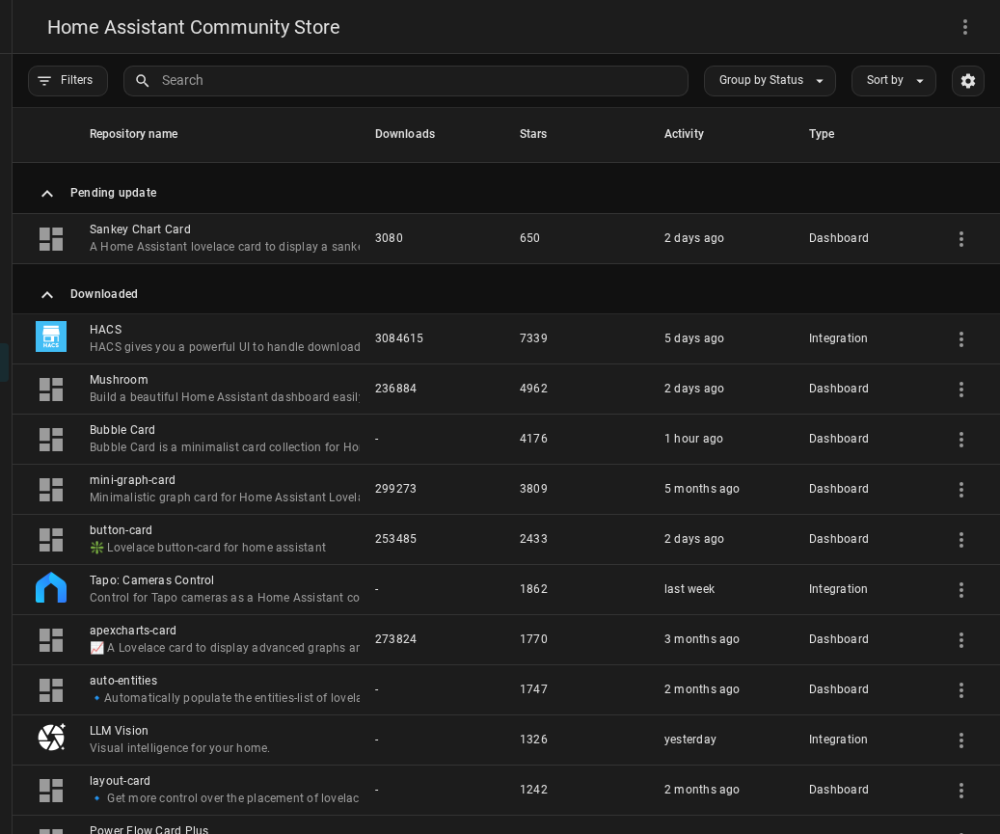

  

# Quick Start Guide

Get Solar Energy Management (SEM) running in your Home Assistant in about 10 minutes.

---

## Prerequisites

Complete these before installing SEM:

**1. Home Assistant Energy Dashboard configured**

Go to **Settings > Dashboards > Energy**. You must have at least a solar production sensor and a grid sensor set up. SEM reads all sensor configuration from here automatically.

**2. HACS installed**

SEM is distributed through HACS. If you have not installed HACS, follow the [HACS installation guide](https://hacs.xyz/docs/setup/download/) first.

**3. No EV charger? That is fine**

EV charger setup is optional. SEM works as a monitoring and battery management system without one.

---

## Step 1: Install SEM via HACS

1. Open **HACS** in the Home Assistant sidebar.
2. Go to **Integrations**.
3. Click the 3-dot menu in the top-right corner and select **Custom repositories**.
4. Enter the URL: `https://github.com/traktore-org/sem-community` and set the category to **Integration**. Click **Add**.
5. Search for **Solar Energy Management** and click **Download**.
6. When prompted, restart Home Assistant: **Settings > System > Restart**.

**What you should see:** After restart, "Solar Energy Management" appears as an available integration and HACS shows it as installed.

---

## Step 2: Run the Setup Wizard

1. Go to **Settings > Devices & Services**.
2. Click **+ Add Integration** and search for **Solar Energy Management**.
3. Select it to open the setup wizard.

The wizard has 3 steps.

### Step 2a: User (Observer Mode)

SEM displays a summary of the sensors it found in your Energy Dashboard — solar power, grid power, and battery power. Review them to confirm they look correct.

If you want SEM to monitor only and not control any hardware, enable **Observer Mode**. You can change this later.

Click **Submit**.

### Step 2b: EV Charger (optional)

If you have an EV charger, select its sensors here:

| Field | What to select |
|-------|----------------|
| Connected sensor | Binary sensor that shows when the car is plugged in |
| Charging sensor | Binary sensor that shows when charging is active |
| Power sensor | Sensor showing current charging power in watts |

Not sure which entities? Go to **Developer Tools > States** and type your charger brand name in the filter box.

If you have no EV charger, leave the fields empty and click **Submit**.

### Step 2c: Hardware

| Setting | Default | What it means |
|---------|---------|---------------|
| Battery capacity | 10 kWh | Your home battery size |
| Target peak limit | 5 kW | Maximum grid draw before SEM starts shedding load |
| Generate dashboard | ON | Auto-create the SEM dashboard — leave this on |

Click **Submit**.

**What you should see:** A success message and the integration listed under **Devices & Services**.

---

## Step 3: Install Required Dashboard Cards

The SEM dashboard requires these HACS frontend cards. Without them, tabs will appear blank or broken.

Go to **HACS > Frontend** and install each one:

| Card | Why it is required |
|------|--------------------|
| **mushroom** | Used for chips, entity cards, and template cards throughout the dashboard |
| **card-mod** | Applies the glass card styling -- without this, all tabs are blank |
| **apexcharts-card** | Renders all power and energy charts |
| **sankey-chart** | Energy flow diagram on the Energy tab |
| **fold-entity-row** | Collapsible welcome section on the Home tab (optional but recommended) |

After installing all cards, hard-refresh your browser: **Ctrl+Shift+R** (Windows/Linux) or **Cmd+Shift+R** (Mac).

**What you should see:** The SEM dashboard entry in the sidebar.

---

## Step 4: Open the Dashboard

Click **Solar Energy Management** in the Home Assistant sidebar.

The dashboard has 7 tabs:

| Tab | What it shows |
|-----|---------------|
| **Home** | Live power flow diagram, solar summary, status chips |
| **Energy** | Daily and historical energy flows and self-consumption |
| **Battery** | Battery state, charge/discharge charts, SOC trends |
| **EV** | EV charging session, daily progress, charging history |
| **Control** | All switches, sliders, and device priority settings |
| **Costs** | Financial breakdown — savings, feed-in revenue, costs |
| **System** | Integration health, sensor status, coordinator info |

**What you should see:** Live power values on the Home tab. The illustrated system diagram shows real-time energy flowing between solar panels, inverter, battery, grid, house, and EV charger with animated spark flow paths. The sun tracks its real position on the arc from sunrise to sunset, with golden energy particles flowing from sun to panels during production. Tap any component to open its HA statistics dialog.

---

## Step 5: Verify the Integration is Working

Go to **Developer Tools > States** and type `sem_` in the filter box.

**What you should see:** 200 or more entities with the `sensor.sem_*`, `switch.sem_*`, and `number.sem_*` prefix — all populated with values, not `unavailable`.

If sensors show `unavailable`, check the System tab on the SEM dashboard for diagnostic information.

---

## What SEM Does Automatically

Once installed, SEM runs without manual intervention:

- **Solar surplus appears** — EV charging current increases automatically to use it (6–32 A range)
- **Clouds roll in** — EV charging reduces or pauses, resumes when surplus returns
- **Battery reaches priority SOC** — surplus is redirected to EV charging
- **Evening** — solar charging stops; system monitors overnight
- **Night charging** — *opt-in (off by default)*; when enabled, grid-charges the EV to your daily-target floor
- **Smart forecast** — if tomorrow is sunny, tonight's grid charging is reduced or skipped

The controls that matter most (v1.7.3):

| Entity | Default | Purpose |
|--------|---------|---------|
| `select.sem_charger_<id>_charge_mode` | `Min + Solar` | Per-charger charging mode (v1.7.3): **Solar only** / **Solar + cheapest hours** / **Min + Solar** (grid minimum 6A + surplus) / **Always max** / **Off**. Pick based on your needs; see [Charging Modes](SETUP_GUIDE.md#8-ev-charging-modes) in the Setup Guide. |
| `number.sem_battery_assist_min_surplus` | 1200 W | **Solar Gate** (v1.7.3): minimum real solar surplus to enable battery assist for the EV. Set to 0 W to allow battery support everywhere (previous behaviour). Prevents battery drain into the car at night. |
| `switch.sem_observer_mode` | OFF | Monitor-only, no hardware control |

Everything else is automatic.

---

## Language Support

SEM supports 15 languages. The integration follows your Home Assistant language setting automatically. Each user sees the dashboard in their own profile language.

For details, see the [Dashboard Guide](DASHBOARD_GUIDE.md).

---

## Troubleshooting

**The dashboard is blank or shows white tabs**

The `card-mod` HACS card is not installed or not loaded. Install it from HACS > Frontend and hard-refresh your browser (Ctrl+Shift+R).

**Some tabs show an error card**

A required HACS frontend card from Step 3 is missing. Check each card in the list and install any that are absent.

**Sensors show `unavailable`**

SEM reads sensors from your Energy Dashboard. Go to **Settings > Dashboards > Energy** and confirm your solar and grid sensors are configured and currently reporting values. Then open the SEM **System tab** and look for any red indicators.

**The sidebar entry does not appear after install**

Restart Home Assistant again (**Settings > System > Restart**), then hard-refresh your browser. The sidebar entry is registered on startup.

**Energy Dashboard was not configured before installing SEM**

Go to **Settings > Dashboards > Energy** and add your solar and grid sensors. Then go to **Settings > Devices & Services > Solar Energy Management**, click the 3-dot menu, and select **Reconfigure** to re-run the setup wizard.

---

## Next Steps

- [Setup Guide](SETUP_GUIDE.md) — detailed configuration for EV charging strategy, tariffs, notifications, and multi-charger setups
- [Dashboard Guide](DASHBOARD_GUIDE.md) — all 7 tabs explained, language support, customization options
