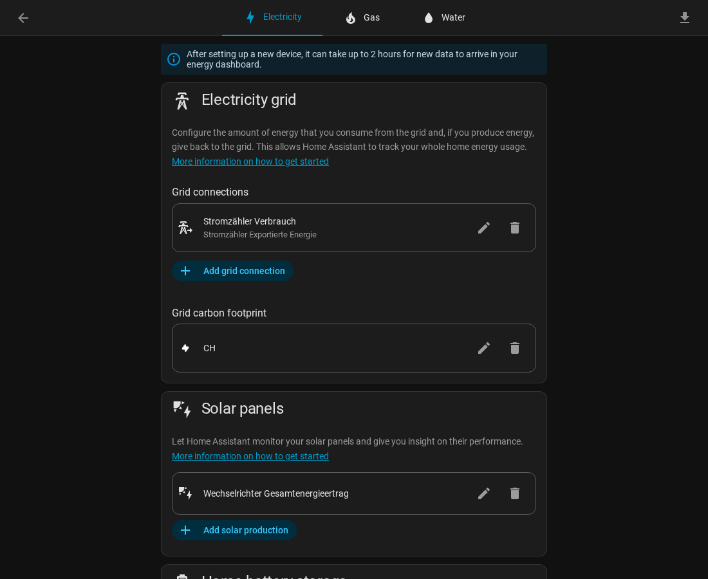
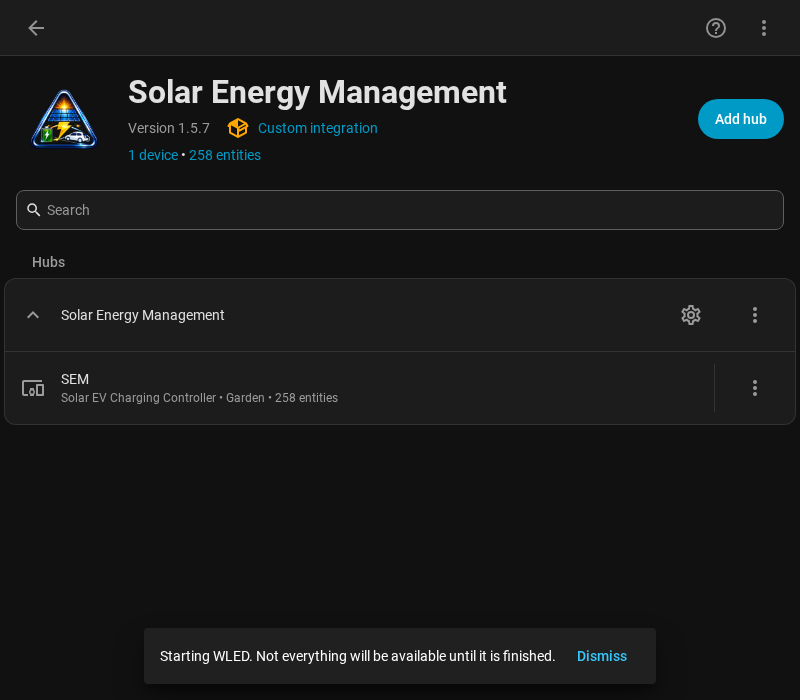
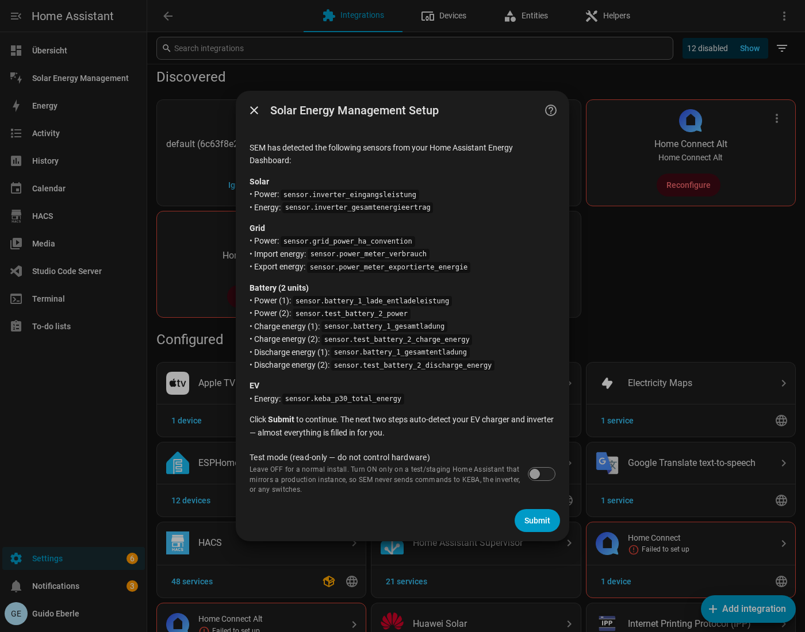
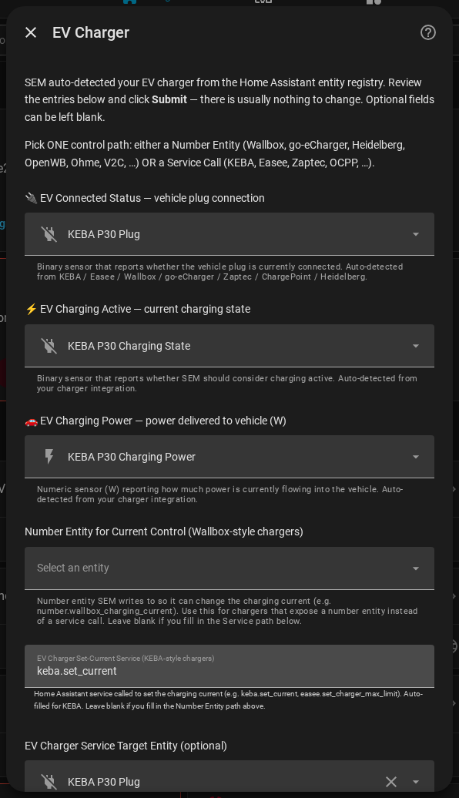
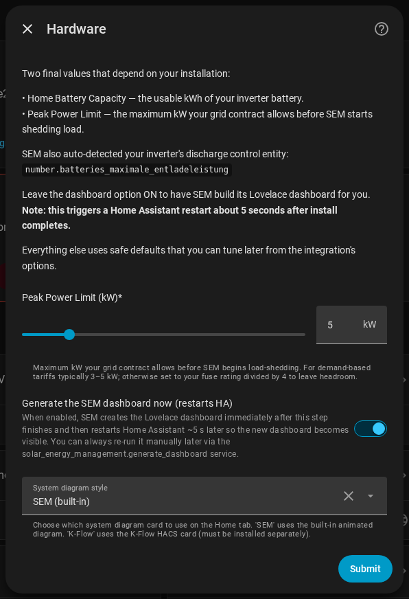
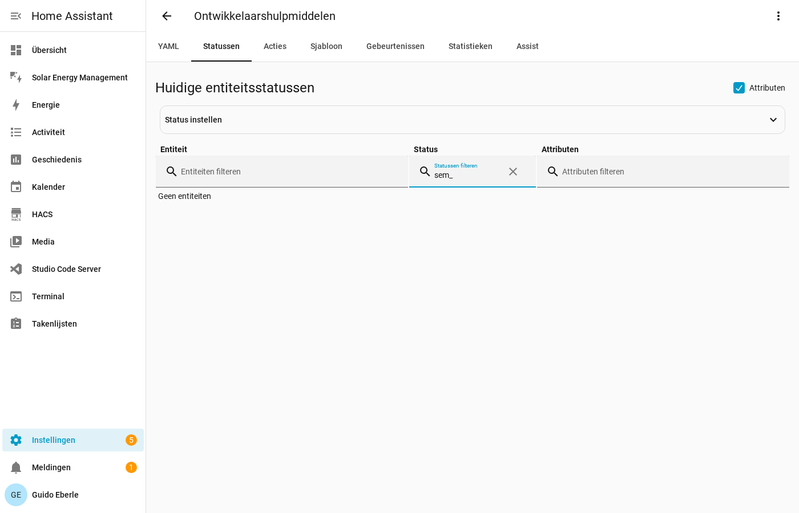

# SEM Setup Guide

Solar Energy Management (SEM) is a Home Assistant integration that reads your
solar, grid, battery, and EV charger data and makes intelligent decisions about
how to distribute energy across your home.

This guide is the detailed companion to the [Quick Start guide](QUICK_START.md).
If you want to be up and running in five minutes and figure out the details
later, start there. Come here when you want to understand what each setting
does and why it exists.

For dashboard customization, see [DASHBOARD_GUIDE.md](DASHBOARD_GUIDE.md).
For multi-inverter and multi-charger setups, see
[MULTI_DEVICE_GUIDE.md](MULTI_DEVICE_GUIDE.md).
For developer and architecture details, see [ARCHITECTURE.md](ARCHITECTURE.md).

---

## Table of Contents

1. [Prerequisites](#1-prerequisites)
2. [Installation via HACS](#2-installation-via-hacs)
3. [Config Flow](#3-config-flow)
4. [Verification](#4-verification)
5. [Options Flow](#5-options-flow)
6. [SOC Zone Strategy](#6-soc-zone-strategy)
7. [Load Management](#7-load-management)
8. [EV Charging Modes](#8-ev-charging-modes)
9. [Battery Charge Scheduler](#9-battery-charge-scheduler)
10. [Heat Pump and Hot Water](#10-heat-pump-and-hot-water)
11. [Language Support](#11-language-support)
12. [FAQ](#12-faq)

---

## 1. Prerequisites

### Home Assistant version

SEM requires **Home Assistant 2024.1.0 or newer**. Check your version at
**Settings > System > About**.

### HACS

SEM is distributed through HACS (Home Assistant Community Store). If you do
not have HACS installed, follow the official instructions at
<https://hacs.xyz/docs/use/> before continuing.

### The Energy Dashboard

SEM reads all its source sensors from the **HA Energy Dashboard**, not from a
manual sensor list you provide. This design means SEM works with any inverter
brand automatically — it just asks the Energy Dashboard what you have.

Before installing SEM, go to **Settings > Dashboards > Energy** and confirm:

- "Solar panels" section has at least one solar production sensor
- "Grid consumption" and "Grid return" sections have sensors assigned
- *(Optional)* "Home battery storage" has battery in/out sensors



If the Energy Dashboard is blank or partially configured, SEM detects fewer
sensors and may fail to calculate energy flows correctly. Configure it first,
then install SEM.

> **Why the Energy Dashboard?** HA's Energy Dashboard is already the canonical
> registry of energy sensors in your installation. SEM leverages this so you
> never have to map sensors manually — and so it automatically handles the sign
> conventions of different inverter brands. Fronius and SolarEdge report grid
> direction opposite to Huawei and SMA; SEM detects this automatically.

### Supported hardware

**Inverters (all auto-detected):** Huawei SUN2000, SMA, Victron, Sungrow,
Fronius, Enphase, Powerwall, Kostal, SolarEdge, GoodWe, Sonnen, SolaX,
Growatt, and any inverter that exposes watt-level sensors to HA.

**EV chargers:** KEBA P30 (service-based), Easee (service-based), Zaptec
(service-based), Wallbox, go-eCharger, ChargePoint, Heidelberg, OpenWB 2.x,
OCPP-compatible, Ohme, Peblar, V2C Trydan, Alfen Eve, Blue Current, OpenEVSE,
and any charger with a controllable number entity.

**Solar forecasts (optional):** Solcast, Forecast.Solar, Open-Meteo Solar Forecast. Required for smart
night charging and battery charge scheduling.

> **Easee note:** Easee's charging power sensor is disabled by default in HA.
> Go to **Settings > Devices > Easee** and enable the power sensor before
> installing SEM. Without it, SEM cannot read charger power.

> **GoodWe note:** Ensure your Energy Dashboard is configured with GoodWe
> sensors before installing SEM. SEM auto-detects GoodWe's sign conventions.

### Checklist

- [ ] HA 2024.1.0 or newer
- [ ] HACS installed
- [ ] Energy Dashboard configured (solar + grid sensors at minimum)
- [ ] Battery sensors visible in HA (optional)
- [ ] EV charger integration installed and power sensor enabled (optional)

---

## 2. Installation via HACS

1. Open Home Assistant and click **HACS** in the sidebar.
2. Search for **Solar Energy Management** — SEM is in the **default HACS
   store**, no custom repository needed.
3. Click the result, then **Download** at the bottom right.
4. When the download finishes, go to **Settings > System > Restart** and
   restart Home Assistant. Wait 30–60 seconds for it to come back.

After the restart, SEM is installed but not yet active. Complete the config
flow in the next step to start it.

### Dashboard frontend cards

**No HACS frontend cards are required.** Every card on the SEM dashboard is
either bundled with the integration or a native Home Assistant card, and the
charts render with a locally vendored Chart.js (no internet needed).

Two cards are **optional** and auto-detected — install them via
**HACS > Frontend** only if you want the richer variant:

| Card | What it adds when installed |
|------|-----------------------------|
| `sankey-chart` | A richer SEM-entity energy-flow sankey on the Energy tab (otherwise HA's native `energy-sankey` card is used) |
| `k-flow-card` | An animated flow visualization replacing the built-in system diagram (opt-in via the *Diagram style* setting) |

See [DASHBOARD_GUIDE.md](DASHBOARD_GUIDE.md) for the full card list and
troubleshooting steps when a card shows "Custom element doesn't exist".

---

## 3. Config Flow

Once SEM is installed, add it via **Settings > Devices & Services >
+ Add Integration**, search for **Solar Energy Management**, and select it.

The config flow has three steps. You can change any setting later via the
**Configure** button on the integration card.



### Step 1: Energy Dashboard Detection



SEM scans your Energy Dashboard and auto-detects all configured sensors:
solar production, grid import/export, battery charge/discharge, and EV charger.

| Field | Default | Description |
|-------|---------|-------------|
| **Observer mode** | Off | When ON, SEM only reads data and provides the dashboard — it will not send any commands to your hardware. Use this for testing, secondary HA instances, or monitoring-only setups. You can toggle it later via `switch.sem_observer_mode`. |

> **Tip:** If a sensor you expect is missing from the detection summary,
> check your Energy Dashboard (**Settings > Dashboards > Energy**) and ensure
> that sensor type is assigned there first.

### Step 2: EV Charger (optional)



If you have an EV charger, this step configures how SEM controls it. SEM
auto-detects your charger from the HA entity registry — review the pre-filled
values and correct anything that looks wrong.

Step 2 is intentionally minimal — only the 3 required sensors plus the one
control-path field your charger needs (number entity OR service call). All
per-charger tunables (daily target kWh, target SOC, surplus priority,
night-charging current, battery capacity) live in **Configure** after install,
with sensible defaults until you change them. See
[EV Charging settings](#ev-charging-settings) below.

| Field | Default | Description |
|-------|---------|-------------|
| **Connected sensor** | Auto-detected | Binary sensor that reports when the vehicle plug is inserted (e.g. `binary_sensor.keba_p30_plug`) |
| **Charging sensor** | Auto-detected | Binary sensor that reports when the EV is actively charging |
| **Charging power sensor** | Auto-detected | Numeric sensor (W) reporting current charging power |
| **Charger service** | Auto-detected | HA service called to set the charging current (e.g. `keba.set_current`). For number-entity-based chargers, this is the number entity instead |
| **Service entity ID** | Auto-detected | Entity ID passed as the target of the service call. Auto-filled when SEM detects the charger brand |
| **Current sensor** | None | Optional. Numeric sensor (A) reporting actual charging current. Enables SEM to verify commands are being applied |
| **Total energy sensor** | Auto-detected | Optional. Cumulative kWh counter for total energy delivered to the EV |

**Service-based control** (KEBA, Easee, Zaptec): SEM calls an HA service
like `keba.set_current` to change the charging current.

**Number entity control** (Wallbox, go-eCharger, Heidelberg, and most
others): SEM writes a value to a number entity that represents the current
limit. SEM auto-detects whether the entity expects amps or kilowatts.

If you have no EV charger, leave all fields empty and click Submit. You can
add a charger later via **Configure** without reinstalling. For multiple
chargers, see [MULTI_DEVICE_GUIDE.md](MULTI_DEVICE_GUIDE.md).

### Step 3: Hardware and Dashboard Settings



| Field | Default | Description |
|-------|---------|-------------|
| **Generate dashboard** | On | Creates the SEM Lovelace dashboard in your sidebar immediately after setup. Leave this on unless you want to build your own dashboard |
| **System diagram style** | SEM | Choose which system diagram card appears on the Home tab. **SEM** uses the built-in illustrated diagram with SVG animations. **K-Flow** uses the third-party K-Flow card (must be installed via HACS separately) |

> **Diagram style:** You can switch between SEM and K-Flow at any time via
> **Configure** without reinstalling. The dashboard regenerates automatically
> with the selected style.

Click **Submit**. SEM starts running immediately. The SEM dashboard appears
in your sidebar within a few seconds if dashboard generation is enabled.

Every install starts with a 5.0 kW target peak limit — SEM no longer asks for
your grid ceiling during setup. Tune it afterward from the **Control** tab's
Load Management card (drag the slider up to **80 kW**, or all the way to
**Uncapped** if the connection has no limit worth defending), or type an exact
kW value on the **Configuration** tab. See
[Load Management Settings](USER_GUIDE.md#load-management-settings) for the
full range, the warning/emergency ladder, and the **No grid limit** switch.

### First-run welcome notification

From v1.7.0-beta.15 onward, the very first install fires a one-shot
**persistent notification** with a deep link to the SEM dashboard and a
three-item starter checklist:

1. Confirm solar is reporting on the Energy tab
2. Pick an EV charge mode on the EV tab
3. Set your battery reserve on the Battery tab

The notification only fires once per install (gated by
`_welcome_notification_fired` in the entry options), survives HA restarts, and
is skipped on `observer_mode` test installs. Dismiss it from the notifications
panel any time.

---

## 4. Verification

After setup, spend two minutes confirming that SEM is reading your sensors
correctly.

### Check sensor values

Go to **Developer Tools > States** and search for `sem_`:



| Sensor | Expected value |
|--------|---------------|
| `sensor.sem_solar_power` | Watts, zero at night, positive during day |
| `sensor.sem_grid_power` | Watts, negative = importing, positive = exporting |
| `sensor.sem_home_consumption_power` | Watts, always zero or positive |
| `sensor.sem_battery_power` | Watts, positive = charging, negative = discharging |
| `sensor.sem_battery_soc` | Percent, 0–100 (if battery present) |

If any sensor shows `unavailable`, check that your Energy Dashboard has the
corresponding sensor type assigned and that your inverter integration is
online.

### Check the dashboard

Open the **SEM** dashboard from your sidebar.


The illustrated system diagram should show energy flows between your solar
panels, inverter, battery, grid, house, and EV charger with animated spark
effects. The sun tracks its real position on the arc during the day. Tap any
component to open its HA statistics dialog. A missing component means its
sensors were not detected — check the Energy Dashboard. Cards showing
"Custom element doesn't exist" mean a required HACS card is missing — see
[DASHBOARD_GUIDE.md](DASHBOARD_GUIDE.md).

### Check available services

Go to **Developer Tools > Actions** and search for `solar_energy_management`
to see all available SEM services. If none appear, the integration did not
load — check **Settings > System > Logs** (filter for
`solar_energy_management`).

### Sensor source overrides

SEM derives its grid, solar and battery power sources from HA's Energy
Dashboard — that stays the primary path, and fixing a wrong mapping there
(then reloading SEM) is the first thing to try. For the cases where that
isn't enough — a sensor the inverter stops feeding (e.g. CT clamps dark
when running off-grid), or you want SEM on a different meter than the
HA-wide Energy Dashboard uses — the **Sensor sources** section on the
dashboard's ⚙ Configuration tab lets you pin an explicit entity per source:

| Picker | Overrides | Blank means |
|---|---|---|
| **Grid power** | the combined grid power sensor | auto (Energy Dashboard) |
| **Solar power** | the solar production sensor | auto (Energy Dashboard) |
| **Battery power** | the battery power sensor | auto (Energy Dashboard) |

Notes:

- **Sign conventions are detected on the override.** A Shelly EM does not
  share the inverter's sign convention — SEM's import/export (and battery
  charge/discharge) sign detection runs against whatever entity you pick,
  so you don't need to match signs manually.
- **No silent fallback.** If an override entity goes unavailable, SEM keeps
  reading it and the Configuration card shows a warning on that row — it
  never silently reverts to the sensor you explicitly replaced. Fix the
  sensor or clear the override.
- Changes are staged and committed with **Apply**, which reloads the
  integration once for the whole batch.

---

## 5. Options Flow

**The dashboard Configuration tab is the primary place to change settings** —
open your SEM dashboard and switch to the ⚙ Configuration tab. Everything below
is editable there, organized in the same sections as this guide, with:

- **Staged changes with Apply/Revert per section** — nothing saves while you
  scroll or on an accidental tap; changed rows are highlighted and commit only
  when you press *Apply changes* (or *Revert* to undo).
- **ⓘ help on every setting** — tap the info icon for the explanation, the
  factory **default**, and a one-tap **↺ Reset to default**. The *Explain
  settings* toggle at the top opens all help texts at once.
- **📖 docs links** — each section header links straight to its chapter in
  this guide.
- **🩺 Diagnose per section** — copies a focused JSON snapshot (config + live
  state + recent related log lines, including your recent config changes) for
  sharing in an issue.

Changes take effect within one coordinator cycle (default 10 seconds);
settings that re-wire entities trigger a one-time reload on Apply.

*Fallback:* the classic HA options flow still exists under **Settings >
Devices & Services → SEM → Configure** — useful when the dashboard isn't
generated yet. It is organized into these pages:
1. **EV Charger** — charger sensors and control method
2. **Battery & SOC Zones** — battery capacity, SOC thresholds, discharge protection
3. **EV Charging & Solar** — daily targets, surplus settings, night charging
4. **Tariff & Advanced** — electricity rates, tariff mode, update interval
5. **Load Management** — peak limit, device shedding, critical device protection
6. **Notifications** — charger display, mobile push, notification types
7. **Dashboard** — diagram style (SEM/K-Flow), dashboard regeneration
8. **Heat Pump** *(if configured)* — SG-Ready relay entities, temperature targets
9. **EV Charger Management** — add/edit/remove individual chargers

### EV Charging settings

| Setting | Default | What it does and when to change it |
|---------|---------|-------------------------------------|
| Daily EV target (kWh) — **Min** | 10 kWh | The *guaranteed* overnight amount: night/grid charging tops up to at least this. The default covers roughly 50–60 km of range. Switch to **Vehicle SOC %** (v1.7.3) by configuring a `vehicle_soc_entity` for per-charger SOC-based targets. |
| EV solar max (kWh) — **Max** | 100 kWh | The *solar ceiling*: surplus charges up to this, then stops. Defaults to full (charge freely from sun); lower it to cap surplus. Must be ≥ Min. |
| Vehicle SOC entity (v1.7.3) | None | *(Per charger)* Binary sensor reporting the vehicle's battery SOC (e.g. `sensor.tesla_battery_soc`). When set, the **Charge Target** block on the EV card switches from kWh to SOC %, and SEM calculates remaining need from SOC gap. Optional. |
| EV target SOC (%) — **Min** | 80% | Guaranteed SOC (50–100%), reached via night/grid. Only used when a vehicle SOC sensor is configured. Per-charger configurable. |
| EV solar max SOC (%) — **Max** | 100% | Solar SOC ceiling. Defaults to 100% (charge to full from sun); set to e.g. 80% to cap solar charging for battery longevity while still guaranteeing the Min via grid. |
| EV battery capacity (kWh) | 40 kWh | Your EV's battery size (10–120 kWh). Used to convert SOC percentage to kWh remaining. Per-charger configurable. Also used for SOC→kWh calculation when a vehicle SOC sensor is configured. |
| Solar Gate (v1.7.3) | 1200 W | Battery assist threshold — battery only helps EV when real solar surplus ≥ this value (0–5000 W). Set to 0 W to allow battery support everywhere, including night. Prevents overnight battery drain. |
| Min solar power to start EV charging (W) | 500 W | How much surplus must appear before solar EV charging begins. The default prevents SEM from starting the charger for tiny, transient surplus spikes. Raise it if your surplus is noisy and the charger starts and stops too often. |
| Max grid import for Min+PV mode (W) | 1380 W | In Min+PV mode the EV runs at minimum current and uses grid to fill the gap. This cap limits how much grid power is used. Lower it to keep Min+PV fully solar; raise it if you want the charger to run continuously even when solar is weak. |
| Night charging | **Off** | **Opt-in** (#256). When on, SEM charges the EV from the grid overnight (during the cheap-rate window) to reach the daily-target floor. Off by default so a fresh install charges on **solar surplus only** — turn it on if you want grid-assisted overnight charging. Existing installs keep their previous setting on upgrade. |
| Smart night charging | Off | When on, SEM evaluates whether tonight's grid charge is actually needed. If tomorrow's solar forecast is strong and the battery is reasonably full, SEM reduces or skips the overnight charge. Enable after SEM has been running for a week and you have a calibrated forecast integration. |

### Battery SOC Zone settings

| Setting | Default | What it does and when to change it |
|---------|---------|-------------------------------------|
| Priority SOC (%) | 30% | Zone 1/2 boundary. Below this, all solar goes to the battery and the EV is blocked. Raise it (e.g. to 40%) if you want more aggressive battery protection. |
| Buffer SOC (%) | 70% | Zone 2/3 boundary. Above this, battery can supplement solar for EV charging. Lower it if you have limited solar and want battery assist to start earlier. |
| Auto-start SOC (%) | 90% | Zone 3/4 boundary. Above this, EV charging starts even without solar surplus. Lower it if your battery rarely reaches 90% and you still want battery-assisted charging. |
| Assist floor SOC (%) | 60% | Once battery assist starts, it stays on until SOC drops here. This prevents rapid on/off cycling. Raise it if the battery cycles too often. |
| Battery capacity (kWh) | 10 kWh | Your battery's usable capacity. Used for SOC target calculations and cost attribution. |
| Max assist power (W) | 4500 W | Maximum battery discharge power allowed for EV charging. Set it to the lower of your battery's rated discharge power and your charger's maximum input. |
| Assist gate / Solar Gate (v1.7.3) (W) | 1200 W | **Battery assist threshold** — battery only supplements EV charging when real solar surplus is at least this value (0–5000 W). Set to 0 to allow battery assist everywhere, including overnight. Prevents battery draining into the car at dusk/dawn. |
| Grid sign flip | Off | Manual override for grid power polarity (v1.7.3). SEM auto-detects at startup whether `positive = import` or `positive = export`. Flip this on only if import/export are inverted in your system diagram. Use the **Fix grid sign** button on the Control tab (simpler). When enabled, auto-detect is bypassed. |
| Battery sign flip | Off | Manual override for battery power polarity (v1.7.5, #588). SEM auto-detects whether `positive = charge` or `positive = discharge` — from your inverter's brand (deterministic for known brands) and from the Energy-Dashboard charge/discharge counters. Flip this on only if charge/discharge look inverted (battery shows charging when it's really discharging). Use the **Fix battery sign** button in Config → Advanced (simpler — it also copies a paste-ready report for the GitHub issue). `Reset` re-learns and clears both grid and battery flips. When enabled, auto-detect is bypassed. |

### Tariff and Pricing settings

| Setting | Default | What it does and when to change it |
|---------|---------|-------------------------------------|
| Tariff mode | Static | How SEM gets electricity prices. Static uses fixed import/export rates you enter. Dynamic reads prices from a HA sensor (e.g. Tibber, Octopus, Amber). Calendar uses HA's calendar to define cheap periods. |
| Import rate | 0.30 per kWh | What you pay to import from the grid (minimum: 0.00). Used for cost calculations and the break-even check in the battery charge scheduler. Set it to your actual electricity rate. Set to 0 if you have free electricity or net metering. |
| Export rate | 0.08 per kWh | What you receive for feeding into the grid (minimum: 0.00). Used in savings calculations. Set it to your actual feed-in tariff. Set to 0 if you have no feed-in compensation. |
| Dynamic price sensor | None | When tariff mode is Dynamic, point this at a sensor that reports the current price per kWh. SEM uses it to find the cheapest hours for overnight charging. |
| Demand charge (per kW) | 0 | Some utility contracts charge monthly for peak demand (your highest 15-minute average). If yours does, enter the rate here. SEM factors it into the peak management calculation. |

**Tariff mode details:**

- **Static**: You enter fixed import and export rates. Cost calculations use
  these rates throughout the day. Best for simple flat-rate tariffs.
- **Dynamic**: SEM reads the current rate from a HA sensor every cycle. Used
  with time-of-use tariffs (Tibber, Octopus Energy, Amber) where prices
  change hourly. The battery charge scheduler will pick the cheapest hours
  automatically.
- **Calendar**: You define cheap/expensive periods via a HA calendar entity.
  Useful for fixed time-of-use tariffs without a dynamic price API.

#### Price classification — how the dynamic-tariff "cheap" / "expensive" labels are computed

When tariff mode is **Dynamic**, SEM bucketises every price reading into one of
**very_cheap / cheap / normal / expensive / very_expensive / negative**. Two modes:

- **Percentile** (default since v1.7.0-beta.3): buckets are computed from
  today's 24-hour price array. Bottom 10% = `very_cheap`, bottom 25% = `cheap`,
  25–75% = `normal`, top 25% = `expensive`, top 10% = `very_expensive`. Works
  on any currency / any market — the breaks adapt to your tariff's actual range.
- **Static**: bucketises against fixed cutoffs (`< 0.075 = very_cheap`,
  `< 0.15 = cheap`, `> 0.35 = expensive`, `> 0.525 = very_expensive`).
  Calibrated for CHF — change to your currency only if you've explicitly opted
  in to this mode in Settings → Configure → Tariff settings.

**Tiered / Time-of-Use plans (#728)**: a plan with a handful of fixed rates —
US ToU, Spain's 2.0TD, UK Economy 7 — is bucketised by **where each tier's
hours sit in the day**, not by the tier's price alone. A three-rate plan
therefore gets three labels: the off-peak tier reads cheap, the mid tier
`normal`, the on-peak tier expensive — whatever the split between them.
(Before v1.7.6-beta.3 a tier covering less than about a quarter of the day
pulled its neighbour in with it, so a reporter's twelve mid-peak hours all
read `expensive` and `normal` never appeared.) Note that `very_cheap` vs
`cheap` — and `expensive` vs `very_expensive` — is a display distinction
only; every SEM control path treats each pair identically.

**Cold start / sparse data (#359)**: in percentile mode, if SEM has fewer than
4 price points for today (cold start before your dynamic-tariff integration
populates, or a perfectly flat day), the classifier returns `normal` as a safe
default. **It will not silently apply the static cutoffs**, which would
mis-classify any non-CHF tariff (RienduPre's Tibber NL install was reporting
€0.30 as `normal` for hours after restart before this was fixed in
v1.7.0-beta.16).

Switch modes from **Settings → Devices & Services → Solar Energy Management
→ Configure → Tariff settings → "Price classification mode"**.

#### Bring your own price sensor — the universal tariff contract (#612)

Dynamic mode does **not** require a supported provider integration. The
Dynamic price sensor can be **any entity whose state is the current import
price per kWh** — a community tariff integration, the Spanish PVPC core
integration, or a **template sensor you write yourself** encoding your
contract. SEM treats a user-configured entity as authoritative (provider
"custom") and reads it every cycle.

The contract, in full:

- **State** = the current price per kWh (plain number). This alone gives
  correct cost tracking and (via the observed price) level classification
  fallbacks.
- **Optional but recommended: a day-curve attribute** — expose today's
  hourly prices as `raw_today` (and ideally `raw_tomorrow`), each an array
  of `{start, end, value}` entries (Nordpool shape; several other shapes
  are auto-detected too). With a curve, the **entire** dynamic machinery
  lights up: percentile price levels, cheap-window detection, the
  overnight cheapest-hours planner and the battery charge scheduler.
  The `tariff_classifier_path` attribute on the price-level sensor shows
  which path/attribute SEM matched — check it if classification looks off.
- **Minimal variant without a curve**: set *Price classification mode* to
  `static` and enter your own cheap/expensive thresholds between your
  known plateau prices — deterministic levels with zero extra YAML (no
  window planning; use the normal night-window setting instead).

#### Spain — the 2.0TD three-period tariff, ready to paste

Spain's regulated 2.0TD structure (P1 *punta* / P2 *llano* / P3 *valle*,
weekends **and national holidays** all-valle) is a fixed national schedule,
so the whole tariff fits in one template sensor. Set your three prices at
the top; SEM's Dynamic mode does the rest (verified live: percentile
classification + the midnight valle window planned correctly).

- **On PVPC (regulated hourly prices)?** Skip the template — install the
  core [PVPC Hourly Pricing](https://www.home-assistant.io/integrations/pvpc_hourly_pricing/)
  integration and point the Dynamic price sensor at it.
- **Holidays**: for the ~10 weekday national holidays a year, add the core
  [Workday](https://www.home-assistant.io/integrations/workday/) integration
  and extend both `valle_day` lines to
  ``.
  Without it, holidays classify as normal weekdays (no safety impact).

```yaml
# /config/packages/es_tariff_20td.yaml  (or under `template:` in configuration.yaml)
template:
  - sensor:
      - name: "Electricity Price ES 2.0TD"
        unique_id: es_20td_price
        unit_of_measurement: "EUR/kWh"
        state: >-
          
          
          
          {{ p.p3 }}
          {{ p.p1 }}
          {{ p.p2 }}
        attributes:
          raw_today: >-
            
            
            
            
            
              
              
              
              
            
            {{ ns.out }}
          raw_tomorrow: >-
            
            
            
            
            
              
              
              
              
            
            {{ ns.out }}
```

Then: **Settings → Configure → Tariff** → mode **Dynamic** → Dynamic price
sensor = `sensor.electricity_price_es_2_0td`. On plateaued tariffs the
percentile buckets land on the extremes — expect *valle → very_cheap/cheap*
and *punta → expensive/very_expensive*; that's correct (punta IS the day's
most expensive period). What SEM deliberately does **not** model: the
contracted-power term, meter rental and taxes — SEM's costs are decision
estimates, not invoice replication (see #612).

### Notification settings

| Setting | Default | What it does and when to change it |
|---------|---------|-------------------------------------|
| Charger display | Off | Shows charging status messages on the KEBA charger's built-in screen. Only applies to KEBA chargers. Enable it if you want the charger display to reflect what SEM is doing. |
| Mobile push notifications | Off | Sends alerts to the HA Companion App on your phone. Enable it to get notified about important charging events (see list below). |
| Mobile service | Auto | Which HA notification service to use. SEM auto-detects the HA Companion App. Set manually if you want notifications on a specific device or through a different service. |

**Notifications sent when mobile push is enabled:**

- Battery nearly full (when SOC exceeds 95%)
- Daily energy summary (sent at configurable time)
- EV nearly full (taper detection — car's BMS is tapering current)
- Smart charge recommendation (when conditions favor charging)
- Forecast-based charge alert (solar tomorrow looks good/poor)

Notifications have a 10-minute cooldown per type to prevent alert fatigue.
Flap suppression prevents notifications for transient state changes (state
must be stable for 60 seconds before a notification fires).

### Forecast settings

SEM auto-detects a solar forecast integration (Solcast, Forecast.Solar,
[Open-Meteo Solar Forecast](https://github.com/rany2/ha-open-meteo-solar-forecast) or a
compatible sensor) and uses it for smart night charging, the battery
scheduler and the recommendation tips.

| Setting | Default | What it does and when to change it |
|---------|---------|-------------------------------------|
| Forecast entity | Auto | The forecast sensor SEM reads. Auto-detection prefers Solcast; set it manually if you run several forecast integrations or a custom one. |
| Weather entity | Auto | Feeds the weather card and forecast dampening. Auto-generated `weather.forecast_*` subentities are skipped (they lack the needed attributes) — any real `weather.*` entity is preferred. |

**Forecast dampening** (#168): SEM continuously compares the forecast against
actual production and applies a live correction factor, so an optimistic
forecast on a hazy day doesn't skip a night charge your morning commute
needed. The current factor is exposed on the forecast sensor's attributes.

### Advanced settings

| Setting | Default | What it does and when to change it |
|---------|---------|-------------------------------------|
| Update interval (s) | 10 | How often SEM reads sensors and adjusts devices. Lower values are more responsive but use more CPU. Values below 5 are not recommended. Raise it to 30 if you are on low-powered hardware and SEM is using too much CPU. |
| Power delta (W) | 50 | Minimum power change before SEM updates a device. Prevents constant small adjustments. Raise it if you see too many small current adjustments to the EV charger. |

### Controls for use in automations

| Entity | Purpose |
|--------|---------|
| `select.sem_charger_<id>_charge_mode` | Per-charger EV intent (v1.6.3) — Solar only / Solar + cheapest hours / Min + Solar / Always (max) / Off. Replaces the legacy `night_charging`, `smart_night_charging`, `tariff_optimized` switches and `ev_charging_mode` select. |
| `switch.sem_observer_mode` | Toggle read-only mode without reinstalling |

### Dashboard settings

| Setting | Default | What it does and when to change it |
|---------|---------|-------------------------------------|
| System diagram style | SEM | Choose the system diagram card on the Home tab. **SEM** uses the built-in illustrated SVG diagram with detailed component drawings, animated spark flows, time-based sun arc, and clickable nodes. **K-Flow** uses the third-party K-Flow HACS card with PV string details, cell temperatures, and BMS data. K-Flow must be installed separately via HACS. |
| Generate dashboard | — | Recreates the SEM Lovelace dashboard. Safe to run at any time — rebuilds all tabs with current settings and language. |
| Dashboard title | Solar Energy Management | Display name shown in the sidebar. |
| Dashboard path | sem-dashboard | URL path (lowercase, dashes). Change if you have a naming conflict. |

### Regenerating the dashboard

Run `solar_energy_management.generate_dashboard` via **Developer Tools >
Actions** any time you change hardware, switch diagram style, or want to
rebuild the dashboard after a language change. It is safe to run at any time.

---

## 6. SOC Zone Strategy

When a battery is present, SEM uses a four-zone model to decide how to share
solar energy between the battery and the EV. The zones are defined by three
SOC thresholds you set in the options flow.

```
SOC 100% ─────────────────────────────────────────────
         |  Zone 4: FULL ASSIST                       |
         |  Battery assist always on. EV charges even  |
         |  without solar surplus.                     |
SOC  90% ─── battery_auto_start_soc ─────────────────
         |  Zone 3: DISCHARGE ASSIST                  |
         |  Battery supplements solar for EV.         |
         |  Assist ramps from 50% at 70% SOC to       |
         |  100% at 90% SOC.                           |
SOC  70% ─── battery_buffer_soc ─────────────────────
         |  Zone 2: SURPLUS ONLY                      |
         |  EV gets pure solar surplus only.          |
         |  Battery does not discharge for EV.        |
SOC  30% ─── battery_priority_soc ───────────────────
         |  Zone 1: BATTERY PRIORITY                  |
         |  All solar goes to battery. EV is blocked.  |
SOC   0% ─────────────────────────────────────────────
```

**Zone 1 — Battery Priority** (SOC below 30%):
The battery is low. All available solar goes to the battery. The EV is
blocked from starting. This protects battery longevity and ensures you have
enough stored energy to cover the household through the evening.

**Zone 2 — Surplus Only** (SOC 30–70%):
The battery is in good shape. The EV charges from pure solar surplus — power
that would otherwise be exported to the grid. The battery does not discharge
to assist EV charging in this zone.

**Zone 3 — Discharge Assist** (SOC 70–90%):
The battery is healthy and can spare some energy for the EV. Battery assist
ramps from 50% of `battery_assist_max_power` at SOC 70%, up to 100% at SOC
90%. The gradual ramp avoids wasting battery power on days when solar alone
is sufficient.

**Zone 4 — Full Assist** (SOC above 90%):
The battery is nearly full. Full battery assist is active. EV charging starts
even without solar surplus — a nearly full battery has little additional value
and the energy is better used in the car.

**Assist floor**: Battery assist only engages while SOC is above
`battery_buffer_soc` (default 70%) — below the buffer the battery is
off-limits to the EV. (The buffer is the single assist floor; the
former separate `battery_assist_floor_soc` knob was redundant and has
been removed.)

### When to adjust zone thresholds

| Goal | Adjustment |
|------|-----------|
| Protect the battery more aggressively | Raise `battery_priority_soc` (e.g. 30% to 40%) |
| Start EV charging sooner from the battery | Lower `battery_buffer_soc` (e.g. 70% to 60%) |
| Battery rarely reaches auto-start threshold | Lower `battery_auto_start_soc` (e.g. 90% to 80%) |
| Too much on/off cycling of battery assist | Raise `battery_buffer_soc` (e.g. 70% to 75%) |
| Battery is small and you want EV to get more priority | Lower all three zone thresholds by 5–10% |

---

## 7. Load Management

SEM has two systems that can control devices in your home. Understanding how
they work prevents surprises like devices turning off unexpectedly.

### Two systems, two purposes

| System | Purpose | When it acts |
|--------|---------|-------------|
| **Peak protection** | Prevents your 15-minute rolling grid import from exceeding your peak limit | When grid import approaches or exceeds the target peak limit |
| **Surplus allocation** | Turns on devices when solar surplus is available | When solar production exceeds home consumption |

Peak protection is defensive — it sheds loads to stay within your electricity
contract limit. Surplus allocation is proactive — it turns devices on when
free solar power is available and turns them off when surplus disappears.

### The four control modes

Every managed device has a **Mode** setting on its Control-tab row:

| Mode | SEM turns it ON? | SEM turns it OFF? | Best for |
|------|-----------------|------------------|----------|
| **Off** | Never | Never | Devices you control manually |
| **Peak Only** | Never | Yes, during grid peaks | Devices that should run normally but can be temporarily shed |
| **Solar only** | Yes, on PV surplus | Yes, when surplus drops or during peaks | Discretionary loads on sun alone (pool pump, boiler) |
| **Solar + battery** | Yes, on PV surplus **+ home-battery assist** | Same | Loads you want to keep running through cloud/evening from the battery (#620) |

**The default mode is Peak Only.** SEM will never turn a device ON unless you
explicitly set its mode to a Solar mode.

#### Daily runtime goals (#620)

The 🎯 target button on a load's row (shown in the two Solar modes) opens the
goal editor:

- **Min / Max runtime** — a dual-handle slider reading *"at least X … up to Y"*.
  **Min** is a **floor**: the runtime SEM will pay for (battery / cheap grid).
  Reaching it stands those paid sources down, but free solar surplus keeps the
  load running. **Max** is the **ceiling** and the only hard stop — the load
  never runs past it (persisted across restarts). Full-scale Max = *Uncapped*.
  Same contract as the EV charge-target range (#245, #688). If the handles
  overlap, tap the split (⬍) button to separate them.
- **Finish overnight from** (shown in both solar modes) — what completes the
  runtime when the sun is gone:
  - **Off** — nothing; the load waits for sun and may miss its target.
  - **Battery** — drains the home battery down to the reserve floor.
  - **Grid** — tops up from the grid during your cheap-tariff window (needs a
    tariff/cheap window configured).

  This is **axis 2** — independent of the daytime **Mode** (axis 1: Solar only vs
  Solar + battery). Switching the picker also stops a load already running on the
  source you moved away from.
- **Stop when ≥ sensor** — pick any sensor with the entity search to end the run
  early (e.g. water-temp ≥ 28 °C, tank ≥ full). Clear it with the picker's ✕.

The runtime counter resets **after sunrise** (not midnight), so an overnight-eligible
load isn't reset mid-night and re-drained. There is **no forced-grid deadline** — a
missed target waits for tomorrow's sun, the overnight battery, or the cheap-grid
window, per your picker choice. Full model: [`docs/LOAD_PRIORITY.md`](LOAD_PRIORITY.md).

> EV chargers stay in this list for priority ordering, but they no longer show a
> Mode dropdown — all EV charge-target controls live on the **EV charger card**
> (see below).

#### Setting an EV charge target

All EV charge-target controls live together in the **Charge Target** block on the
EV charger card — one place, per charger, no config-flow round-trips:

- **Charge to** — the target value, with a unit selector beside it:
  - **kWh** (default): the daily kWh target (`number.sem_charger_<id>_daily_ev_target`).
  - **% (SOC)**: the vehicle state-of-charge target (`number.sem_charger_<id>_target_soc`),
    using the vehicle's live SOC sensor. The unit selector
    (`select.sem_charger_<id>_ev_target_type`) only offers **%** when that charger has a
    **vehicle SOC entity** configured — otherwise it shows kWh only.
- **Solar max** (`number.sem_charger_<id>_daily_ev_target_max` / `_target_soc_max`): the
  Max handle of the range slider — solar-surplus charging stops once this ceiling is
  reached. Defaults to full (charge freely from sun); lower it to cap surplus. (Replaces
  the former *Limit surplus* switch.)
- **Charge mode** (`select.sem_charger_<id>_charge_mode`, v1.6.3): the per-charger
  intent that carries the night-charging + tariff-window decision. Picking
  *Min + Solar* (the default) or *Solar + cheapest hours* implicitly enables
  the night-window top-up to the Min target; picking *Solar only* skips it.

These controls compose freely (Target type × Solar-max × Charge mode). The legacy
`switch.sem_charger_<id>_night_charging`, `..._smart_night_charging`,
`..._tariff_optimized`, and `select.sem_charger_<id>_ev_charging_mode` have been
removed in v1.6.3 — their intent now lives in the single Charge mode selector.
Existing `ev_target_mode` settings are migrated to `ev_target_type` automatically.

### Controllable and Critical toggles

| Toggle | When On | When Off |
|--------|---------|---------|
| **Controllable** | SEM can control this device (per its mode) | SEM ignores this device completely |
| **Critical** | Device is never shed, even in emergencies | Device can be shed during peak events |

Quick guide:

- Device should never be touched by SEM: set Controllable to Off
- Device should run normally and only be shed as a last resort: set Critical to On
- Device is discretionary (hot water, pool pump): leave defaults and set mode to Surplus

### Priority

Priority controls the order in which devices are activated and shed:

- Lower number = higher priority (1 is highest, 10 is lowest)
- During surplus allocation: higher-priority devices get power first
- During peak shedding: lower-priority devices are shed first (high-priority
  devices are preserved as long as possible)

Drag and drop devices on the Control tab of the SEM dashboard to change
their priority.

### Dependencies (Requires)

A device can depend on another device. When device B "requires" device A:

- SEM will not activate B unless A is already running
- If A is shed, B is automatically shed too (cascade)
- If A is restored, B becomes eligible for activation again

Use this for physical dependencies, such as a pool heater that requires the
pool pump to be running.

### Why is my device turning off unexpectedly?

Check these in order:

1. **Check the device's mode** on the Control tab. If it is "Surplus", SEM
   will turn it off whenever solar surplus drops. Switch to "Peak Only" if
   you only want peak protection.

2. **Check the load management status** — `sensor.sem_load_management_status`
   shows `normal`, `warning`, `shedding`, or `emergency`. If it shows
   `shedding`, grid import exceeded the peak limit.

3. **Check your peak limit** — compare `sensor.sem_consecutive_peak_15min`
   with your target peak limit. If the two are close or the peak exceeds the
   limit, peak shedding is active.

4. **Check dependencies** — if the device depends on another device that was
   shed, the dependent device is shed automatically too.

### How to prevent unwanted shedding

- Set mode to Off — SEM never touches the device
- Mark as Critical — SEM never sheds it, even in emergencies
- Raise the target peak limit — reduces how often peak shedding triggers
- Lower the device's priority number (assign a higher number) — it is shed
  last instead of first

---

## 8. EV Charging Modes

SEM runs two parallel state machines — one for daytime solar charging and one
for overnight grid charging. The two modes operate independently and hand off
cleanly at sunrise and sunset.

### Solar mode — daytime charging

During the day, SEM selects one of three strategies based on battery SOC and
available surplus:

**Solar Only (Zone 2)**

The EV charges from pure solar surplus. SEM constantly adjusts the charging
current (within your configured min/max range) to match the available surplus.
If surplus drops below the minimum threshold, SEM pauses the charger and
waits for surplus to recover.

Scenario: 3 kW surplus, 3-phase charger with 6 A minimum. SEM sets 5 A
(~3.5 kW). Cloud reduces surplus to 500 W — SEM drops to 6 A minimum, then
pauses when surplus falls further.

**Battery Assist (Zone 3 and 4)**

The battery supplements solar to give the EV more power. In Zone 3, battery
assist is proportional — at SOC 70% the battery contributes 50% of its
maximum assist power; at SOC 90% it contributes 100%. In Zone 4 (above
auto-start SOC) the EV starts even without solar surplus.

Scenario: 1.5 kW solar surplus, SOC 85%. Battery contributes ~2.5 kW assist,
giving the EV ~4 kW. Charger runs continuously instead of intermittently.

**Min+PV**

A hybrid mode for overcast days. The charger runs at minimum current (using
a small amount of grid power if needed) and uses any available solar on top.
This keeps the car charging slowly rather than waiting for surplus that may
never arrive. Enable it via the "Min+PV" toggle on the Control tab.

Use Min+PV when: the daily target needs to be reached but solar is
consistently below the minimum threshold for solar-only mode.

### Night mode — overnight grid charging

During the overnight window (typically 22:00–06:00, or your cheap-rate
window), SEM charges the EV from the grid to reach the daily target.

SEM plans the overnight session using a latest-start calculation:

1. Determine remaining energy needed (daily target minus energy already
   charged today)
2. Estimate the time required at maximum current
3. Start charging late enough to finish just before the window ends —
   minimizing time at full grid draw

Example: Target is 10 kWh, 7 kWh already charged from solar. Remaining 3 kWh
at 7.4 kW (32 A, 1-phase) takes about 24 minutes. If the night window ends
at 06:00, SEM starts at 05:36.

If the daily target is already reached from solar, SEM skips overnight
charging entirely.

### Smart night charging (optional)

When smart night charging is enabled, SEM evaluates whether overnight grid
charging is actually necessary before starting:

- If tomorrow's solar forecast is strong (e.g. expected yield covers
  typical daily consumption), SEM may skip or reduce the overnight charge
- If the battery is already well charged and the EV's virtual SOC is high,
  SEM may skip charging for one or more nights

This saves money by avoiding grid electricity when solar will cover the need
anyway. Enable it after SEM has been running for at least a week so the
forecast and usage patterns are calibrated.

### EV taper detection

SEM monitors charging power during a session. When a car's battery management
system (BMS) approaches full charge, it reduces the charging current in a
characteristic staircase pattern (for example: 7 kW to 5 kW to 3 kW over
17 minutes). SEM detects this pattern via linear regression on stable samples.

When taper is detected:
- `sensor.sem_ev_taper_trend` shows "declining"
- `sensor.sem_ev_taper_minutes_to_full` estimates time remaining
- A push notification is sent if mobile notifications are enabled

This lets you see in the dashboard when the car is nearly full, even without
knowing the actual EV battery SOC.

### EV charging state sensor

`sensor.sem_charging_state` tells you what SEM is currently doing:

| State | Meaning |
|-------|---------|
| `solar_charging_active` | Charging from solar surplus |
| `solar_super_charging` | Charging from solar + battery assist |
| `solar_min_pv` | Min+PV mode active |
| `solar_idle` | EV connected but no surplus |
| `solar_waiting_battery_priority` | Battery too low, EV blocked |
| `solar_target_reached` | Daily target reached |
| `night_charging_active` | Overnight grid charging in progress |
| `night_target_reached` | Overnight target reached |
| `idle` | EV not connected |

---

## 9. Battery Charge Scheduler

The battery charge scheduler decides whether to charge the home battery from
the grid overnight, and if so, at what time and to what SOC level. It is
separate from EV night charging.

### Prerequisites

The scheduler requires:

- A solar forecast integration (Solcast, Forecast.Solar or Open-Meteo Solar Forecast)
- An inverter that supports forced battery charging via a HA service or
  number entity
- The battery charge scheduler enabled in the options flow

### How it works

At a configurable daily evaluation time (default 21:00), the scheduler:

1. Reads tomorrow's solar forecast and your typical daily consumption
2. Calculates the expected energy deficit (consumption minus expected solar)
3. Converts the deficit to a target SOC (how charged the battery needs to be
   by morning to cover the shortfall)
4. Performs a break-even check: only charges if the overnight electricity
   rate (accounting for battery round-trip efficiency) is cheaper than what
   grid electricity would cost during the day

If the break-even check passes, the scheduler picks the cheapest hours in the
overnight window (using dynamic tariff data if available, or the full window
on a static tariff) and issues forced charge commands to the battery.

### Break-even logic

The scheduler charges overnight only when:

```
night_rate / battery_efficiency < day_rate
```

For example, if the night rate is 0.15/kWh and battery efficiency is 90%,
the effective cost of storing and using overnight energy is 0.167/kWh. If
the day rate is 0.30/kWh, charging overnight saves 0.133/kWh. If the rates
are similar, the scheduler skips charging and lets solar fill the battery
the next day.

### Scheduler state sensor

`sensor.sem_battery_scheduler_state` shows:

| State | Meaning |
|-------|---------|
| `idle` | No schedule active, waiting for next evaluation |
| `evaluating` | Running the daily analysis |
| `scheduled` | Charge plan created, waiting for start time |
| `charging` | Forced battery charging in progress |
| `target_reached` | Battery reached the target SOC |
| `not_needed` | Tomorrow's solar is sufficient, no grid charge needed |
| `not_profitable` | Break-even check failed, grid charge is not worth it |

### Interaction with EV night charging

The scheduler coordinates with EV night charging. Both share the same grid
connection. If both the battery and the EV need overnight grid power, the
scheduler distributes current across time slots to stay within your peak
limit (if configured).

---

## 10. Heat Pump and Hot Water

SEM can control a heat pump or hot water system using the SG-Ready standard,
or — for pumps without relays (Nibe, Mitsubishi, Daikin, Viessmann…) — via
their `climate` entity (setpoint boost on surplus).

**Their place in the surplus order:** since v1.7.5 the heat pump and hot
water device appear as **draggable rows in the ONE device-priority list** on
the Control tab — their surplus priority is simply their list position
(there is no separate priority slider anymore). See
[LOAD_PRIORITY.md](LOAD_PRIORITY.md).

**No power sensor?** Point the *Heat pump / Hot water energy sensor (kWh)*
field at a cumulative energy counter (e.g. a Viessmann ViCare kWh total) —
SEM derives a smooth live power signal from it, or autodetects a companion
power sensor on the same device. Set *Rated power (W)* so surplus sizing
works before the first live reading. Both fields live in the dashboard
Configuration tab's Heat Pump / Hot Water sections.

### What is SG-Ready?

SG-Ready (Smart Grid Ready) is a German standard for heat pump control that
uses two digital relay signals to communicate four operating states to the
heat pump's internal controller:

| SG State | Relay 1 | Relay 2 | What the heat pump does |
|----------|---------|---------|-------------------------|
| 1 — Blocked | **On** | Off | Reduces consumption on utility request (EVU block) |
| 2 — Normal | Off | Off | Standard operation (default) |
| 3 — Boost | Off | **On** | Recommended to increase consumption — heat more now |
| 4 — Force On | **On** | **On** | Maximum consumption — use available power |

> **This is not a 2-bit count.** State 1 is `1:0` and state 2 is `0:0` — the
> standard puts the EVU-block on relay 1 alone, so the states do not run in
> binary order. Until v1.7.5 this table showed a plain 00/01/10/11 count,
> which is what the code did too until #523: SEM's Boost drove `1:0`, a
> standard pump read that as EVU-block, and the pump switched **off** on
> surplus instead of on. If you are verifying an install against an older
> copy of this guide, use the table above.

SEM sets State 3 (Boost) when moderate solar surplus is available, and
State 4 (Force On) when surplus is high. The heat pump responds by heating
more aggressively, using surplus solar instead of exporting it.

**Contacts read inverted?** If SEM commands Boost and your pump blocks, the
contacts are probably wired normally-closed rather than normally-open. Turn
on *Invert SG-Ready* in the heat pump section — it flips both contacts —
rather than rewiring or swapping the two relay entities.

### Relay configuration

You need two switch entities in HA to control the SG-Ready pins — typically
a Shelly or ESPHome device connected to the heat pump's input terminals.

| Config field | What to set |
|--------------|------------|
| Relay 1 entity | `switch.` entity for the first SG-Ready pin |
| Relay 2 entity | `switch.` entity for the second SG-Ready pin |
| Climate entity (optional) | Your heat pump's `climate.` entity for setpoint boost |
| Power sensor (optional) | Power consumption sensor for the heat pump |

### Setpoint boost

If you provide a climate entity, SEM can raise the heating setpoint by a
configurable amount (default +2°C) when surplus is available. This pre-heats
the building or tank, storing solar energy as thermal mass. The setpoint
returns to normal when surplus disappears.

| Setting | Default | What it does |
|---------|---------|--------------|
| Normal setpoint (°C) | 21°C | Operating temperature during normal mode |
| Boost offset (°C) | +2°C | How much to raise the setpoint during Boost state |
| Max setpoint (°C) | 55°C | Safety cap — SEM will never raise the setpoint above this |
| Force-on threshold (W) | 5000 W | Surplus level at which SEM escalates from Boost to Force On |

### Legionella prevention

The scheduler has a built-in legionella protection override. If the hot water
temperature has not reached the legionella kill temperature for more than a
configurable period, the heat pump is set to Force On regardless of surplus.
This overrides the normal surplus-based control and ensures public health
safety requirements are met.

### Hot water boiler (separate from heat pump)

A standalone hot-water boiler (electric heater, heat-pump water heater
that exposes a `switch`/`water_heater`/`climate` entity, or any other
HA-controllable heater) can be configured independently via the
**Configuration tab → Hot Water** section. Unlike the heat-pump SG-Ready
path, the hot-water boiler is a simple on/off device controlled by SEM.

| Config field | What to set |
|---|---|
| Boiler control entity | The `switch.`, `water_heater.`, or `climate.` entity that turns the boiler on/off |
| Temperature sensor (optional) | A `sensor.` reporting current water temperature in °C |
| Solar target | Boiler runs on surplus until water reaches this (default 50 °C) |
| Max temperature | Safety ceiling — SEM never activates above this regardless of mode (default 70 °C) |
| Legionella target | Target temperature for the periodic Legionella cycle (default 65 °C) |
| Minimum temperature | Below this, SEM force-heats from any source — not just solar (default 40 °C) |
| Priority | Surplus-dispatch order (lower = served first, default 6) |

**If the temperature sensor is omitted:** SEM operates the boiler "blind" —
it controls the on/off but relies on the boiler's internal thermostat to
prevent overheating. This is fine for `water_heater` and `climate` devices
that handle their own safety. For `switch.`-only boilers, configuring a
sensor is strongly recommended.

**If the configured temperature sensor breaks** (reports `unavailable` /
`unknown` / non-numeric for >5 min): SEM fails safe — the boiler is **not**
activated on surplus until the sensor returns a real reading. A Repair
issue appears in Settings → System → Repairs naming the sensor entity, so
you know which integration to investigate.

**If the boiler-control entity itself becomes unavailable:** a different
Repair issue surfaces, this one naming the boiler entity. SEM stops issuing
on/off commands until the entity recovers (the commands would silently
no-op anyway, but the Repair makes the broken state visible).

**Diagnose surface:** the Hot Water section's 🩺 Diagnose button (or the
`solar_energy_management.diagnose` service with `section: "hot_water"`) returns
a JSON dump including the current temperature reading, the
`temperature_reading_path` (which source the controller is reading from —
`separate_sensor`, `entity_attribute`, `no_source_configured`, etc.),
the safety-decision path, and the hours since the last Legionella cycle.
Paste it in a discussion / issue if SEM ever doesn't behave as expected.

### Priority relative to other devices

Heat pumps register with the SurplusController like any other device. A
typical priority setting is 3 or 4, placing the heat pump after the battery
(priority 2) but before EV charging (priority 5). This means solar fills the
battery first, then heats water, then charges the car.

---

## 11. Language Support

SEM supports 16 languages: English, German, Dutch, French, Spanish, Italian,
Portuguese, Polish, Swedish, Czech, Danish, Finnish, Hungarian, Romanian,
Norwegian, and Simplified Chinese.

Translation works in two layers:

**Layer 1 — Dashboard labels (server-side):** Static card labels, axis titles,
and section headers are translated at dashboard generation time using the
server language set in **Settings > General**. All users see the same labels
for standard HA cards.

**Layer 2 — Custom card text (per-user, runtime):** SEM's custom cards (system
diagram, title cards, charger status card, period selector) call
`semLocalize(key, lang)` on every render, using the language from each user's
HA profile. Users with different language preferences each see the SEM
dashboard in their own language without any extra configuration.

To change your language:

1. Click your profile icon in the bottom-left of the HA sidebar
2. Select **Language**
3. Choose your preferred language
4. SEM custom cards update immediately — no dashboard regeneration needed

To change the server language (affects static labels for all users):

1. Go to **Settings > General** and update the language
2. Run `solar_energy_management.generate_dashboard` to rebuild the dashboard
   with the new language

The source of truth for all translations is `dashboard/translations.json`
(1166 keys across 16 languages). If you want to contribute a translation
correction or add a new language, see
[DASHBOARD_GUIDE.md](DASHBOARD_GUIDE.md).

---

## 12. FAQ

**Do I need a battery or EV charger to use SEM?**

No to both. SEM works with solar and grid sensors alone and provides
monitoring, cost tracking, and environmental reporting. A battery adds SOC
zone control and battery-assisted EV charging. An EV charger adds solar
charging and night scheduling. Both are optional and can be added later via
**Configure** on the integration page.

**My sensors show "unavailable" after installing SEM.**

SEM reads source sensors from the Energy Dashboard. Check that your inverter
is online, verify that **Settings > Dashboards > Energy** has sensors
assigned and that those sensors currently report values, then review logs at
**Settings > System > Logs** (filter for `solar_energy_management`). Also
check the SEM System tab, which shows a diagnostic summary of sensor health.

**Can I change settings after the initial setup?**

Yes. Click **Configure** on the SEM card in **Settings > Devices & Services**.
All settings are available in the options flow. Changes take effect within
one coordinator cycle (default 10 seconds).

**SEM sent a command to a device I did not want it to touch.**

Set that device's control mode to Off via the Control tab on the SEM
dashboard, or call `solar_energy_management.update_device_config` with
`mode: off`. In Off mode SEM monitors but never controls the device.

**I have two HA instances. How do I prevent them from conflicting?**

Enable Observer Mode on the secondary instance. Both instances can read
sensors simultaneously without conflict. Toggle via `switch.sem_observer_mode`
or the Configure screen — no reinstall needed.

### Direct per-phase grid-current sensors

The Observer Mode phase guard can use either a complete L1-L3 family of direct
RMS grid-current sensors in amperes or signed per-phase power plus voltage. A
direct family takes precedence and must contain all three phases from one
coherent meter family. SEM rejects mixed, partial, unavailable, stale,
wrong-unit, negative and non-finite readings instead of silently changing
source. Radio, meter and field-bus pairing remain the responsibility of the
hardware and its Home Assistant integration; SEM consumes only the resulting
HA sensor entities.

In Observer Mode SEM still runs its **full** decision logic against your live
sensors every cycle — it just never actuates. It logs each command it *would*
have sent (e.g. `OBSERVER · WOULD ACTIVATE Heizband @ 800W [source=solar]`), so
you can watch exactly what SEM would do — and verify it's right — before you
ever hand it control of your hardware.

**How does SEM know which direction my grid power sensor reads?**

SEM compares your grid sensor's sign against the Energy Dashboard import and
export counters at startup and auto-corrects if needed. This works for all
brands — Fronius and SolarEdge use positive = import, while Huawei and SMA
use positive = export. You do not need to configure anything.

**Will SEM drain my battery to charge the EV?**

Only above 70% SOC (Zone 3 and 4). Below 70% the EV gets pure surplus only;
below 30% the EV is blocked entirely. See [SOC Zone Strategy](#6-soc-zone-strategy)
for the full logic.

**What is smart night charging and should I enable it?**

Smart night charging evaluates whether tonight's grid charge is necessary. If
tomorrow's solar forecast is strong and the battery is reasonably full, SEM
may skip or reduce the night charge — saving money on grid electricity.
Enable it after SEM has been running for at least a week. It is off by default
because it requires a calibrated forecast integration and usage history to
make accurate decisions.

**How long until SEM predictions are accurate?**

Days 1–2: rough estimates, surplus window recommendations imprecise. Days
3–7: reasonable hourly predictions, surplus window useful. After two weeks:
well-calibrated to weekday and weekend patterns. No configuration needed —
the predictor trains itself automatically from historical data.

**Why do daily energy values reset at sunrise instead of midnight?**

Overnight EV sessions (22:00–06:00) span midnight. Resetting at sunrise keeps
the entire session in one daily bucket, giving more accurate cost and energy
totals for the day.

**The EV is connected but SEM is not charging it.**

Check `sensor.sem_charging_state`. If it shows `solar_waiting_battery_priority`,
the battery SOC is below the priority threshold and the EV is blocked. If it
shows `solar_idle`, there is no solar surplus. If it shows `night_target_reached`,
the daily target has already been reached. If it shows `idle`, SEM may not
be detecting the EV as connected — check that the connected sensor entity you
configured is reporting `on`.

**Can I use SEM with a time-of-use tariff?**

Yes. Set the tariff mode to Dynamic in the options flow and point SEM at a
HA sensor that reports the current electricity price (e.g. Tibber or Octopus
Energy integrations). SEM uses this data to pick the cheapest hours for
overnight EV and battery charging.

**Tibber Pulse note:** some Tibber accounts never get the standard
`electricity_price` forecast sensor from the core Tibber integration
(upstream issue — the Pulse real-time sensor carries no price arrays). If
that's you, install the HACS *Tibber Grid Reward* integration and set
**Dynamic tariff entity** to its `sensor.current_price` — SEM parses its
`today_raw`/`tomorrow_raw` arrays directly (v1.7.3-beta.10+). Verify with
the `solar_energy_management.diagnose` action (section `tariff`):
`tariff_parsed_attribute` should report `today_raw`.

**My dashboard shows white tabs or "Custom element doesn't exist".**

Since v1.7.5 no HACS card is required, so this usually means SEM's own card
bundle didn't load — most often a stale browser/service-worker cache after an
update. Hard-refresh (Ctrl+Shift+R on Windows/Linux, Cmd+Shift+R on Mac); on
the Companion app clear the frontend cache. A "Custom element doesn't exist"
error naming `sem-*` means the bundle resource is missing — restart Home
Assistant so SEM re-registers it. See
[DASHBOARD_GUIDE.md](DASHBOARD_GUIDE.md) for the full card list.

**How do I add a second EV charger?**

Click **Configure** on the SEM card, then select **Add EV charger** to run
the EV charger step for a second device. SEM assigns each charger a separate
ID and tracks sessions, power, and costs per charger. See
[MULTI_DEVICE_GUIDE.md](MULTI_DEVICE_GUIDE.md) for multi-charger priority
and surplus distribution details.

**SEM is using too much CPU on my Raspberry Pi.**

Raise the update interval in the options flow from 10 seconds to 30 seconds.
SEM will be less responsive to rapid solar changes but will use significantly
less CPU. On very constrained hardware, 60 seconds is also acceptable.

---

## Getting Help

Enable debug logging by adding the following to `configuration.yaml`:

```yaml
logger:
  logs:
    custom_components.solar_energy_management: debug
```

View logs at **Settings > System > Logs** (filter for `solar_energy_management`).

- Common issues: [TROUBLESHOOTING.md](TROUBLESHOOTING.md)
- Dashboard problems: [DASHBOARD_GUIDE.md](DASHBOARD_GUIDE.md)
- Multi-inverter and multi-charger: [MULTI_DEVICE_GUIDE.md](MULTI_DEVICE_GUIDE.md)
- Architecture and developer details: [ARCHITECTURE.md](ARCHITECTURE.md)
