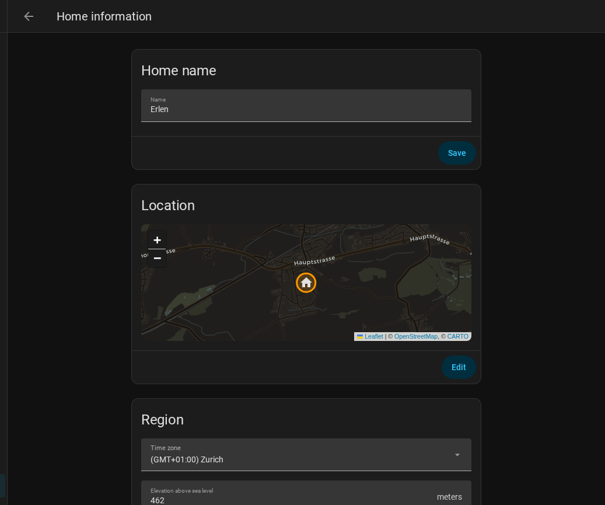

# SEM Setup Guide

Solar Energy Management (SEM) is a Home Assistant integration that reads your
solar, grid, battery, and EV charger data and makes intelligent decisions about
how to distribute energy across your home.

This guide is the detailed companion to the
[Quick Start guide](QUICK_START.md). If you want to be up and running in five
minutes and figure out the details later, start there. Come here when you want
to understand what each setting does and why it exists.

For dashboard customization, see [DASHBOARD_GUIDE.md](DASHBOARD_GUIDE.md).
For multi-inverter and multi-charger setups, see
[MULTI_DEVICE_GUIDE.md](MULTI_DEVICE_GUIDE.md).

---

## Table of Contents

1. [Prerequisites](#1-prerequisites)
2. [Installation via HACS](#2-installation-via-hacs)
3. [Configuration: the Config Flow](#3-configuration-the-config-flow)
4. [Verification](#4-verification)
5. [Fine-tuning via the Options Flow](#5-fine-tuning-via-the-options-flow)
6. [SOC Zone Strategy](#6-soc-zone-strategy)
7. [Load Management](#7-load-management)
8. [Language Support](#8-language-support)
9. [FAQ](#9-faq)

---

## 1. Prerequisites

### Home Assistant version

SEM requires **Home Assistant 2024.1.0 or newer**. Check your version at
**Settings > System > About**.

### HACS

SEM is distributed through HACS (Home Assistant Community Store). If you do
not have HACS installed, follow the official instructions at
<https://hacs.xyz/docs/use/> before continuing.

### The Energy Dashboard — the most important prerequisite

SEM reads all its source sensors from the **HA Energy Dashboard**, not from a
manual sensor list you provide. This design means SEM works with any inverter
brand automatically — it just asks the Energy Dashboard what you have.

Before installing SEM, go to **Settings > Dashboards > Energy** and confirm:

- "Solar panels" section has at least one solar production sensor
- "Grid consumption" and "Grid return" sections have sensors assigned
- *(Optional)* "Home battery storage" has battery in/out sensors


If the Energy Dashboard is blank or partially configured, SEM will detect
fewer sensors and may fail to calculate energy flows correctly. Configure it
first, then install SEM.

> **Why the Energy Dashboard?** HA's Energy Dashboard is already the
> canonical registry of energy sensors in your installation. SEM leverages
> this so you never have to map sensors manually — and so it automatically
> handles the sign conventions of different inverter brands (Huawei,
> Fronius, SolarEdge, etc. all report grid direction differently).

### Supported hardware

**Inverters (all auto-detected):** Huawei SUN2000, SMA, Victron, Sungrow,
Fronius, Enphase, Powerwall, Kostal, SolarEdge, GoodWe, Sonnen, SolaX,
Growatt, and any inverter that exposes watt-level sensors to HA.

**EV chargers:** KEBA P30 (service-based), Easee (service-based), Zaptec
(service-based), Wallbox, go-eCharger, ChargePoint, Heidelberg, OpenWB 2.x,
OCPP-compatible, Ohme, Peblar, V2C Trydan, Alfen Eve, Blue Current, OpenEVSE,
and any charger with a controllable number entity.

**Solar forecasts (optional):** Solcast, Forecast.Solar.

> **Easee note:** Easee's charging power sensor is disabled by default in HA.
> Before installing SEM, go to **Settings > Devices > Easee** and enable the
> power sensor, otherwise SEM cannot read charger power.

> **GoodWe note:** GoodWe inverters work via the HA
> [GoodWe integration](https://www.home-assistant.io/integrations/goodwe).
> Ensure your Energy Dashboard is configured with GoodWe sensors before
> installing SEM. SEM auto-detects GoodWe's sign conventions.

### Checklist

- [ ] HA 2024.1.0 or newer
- [ ] HACS installed
- [ ] Energy Dashboard configured (solar + grid sensors at minimum)
- [ ] *(Optional)* Battery sensors visible in HA
- [ ] *(Optional)* EV charger integration installed and sensors enabled

---

## 2. Installation via HACS


1. Open Home Assistant and click **HACS** in the sidebar.
2. Click **Integrations**, then the three-dot menu (top right), then
   **Custom repositories**.
3. Paste `https://github.com/traktore-org/sem-community` into the URL field,
   set category to **Integration**, and click **Add**.
4. Close the dialog and search for **Solar Energy Management** in the list.
5. Click the result, then **Download** at the bottom right.
6. When the download finishes, go to **Settings > System > Restart** and
   restart Home Assistant. Wait 30-60 seconds for it to come back.

After the restart, SEM is installed. It will not do anything until you add and
configure it in the next step.

### Dashboard frontend cards

The SEM dashboard uses several HACS frontend cards. Install these via
**HACS > Frontend** if they are not already present. The most critical ones
are `card-mod`, `Mushroom`, `apexcharts-card`, `sankey-chart`,
`power-flow-card-plus`, and `bar-card`. See [DASHBOARD_GUIDE.md](DASHBOARD_GUIDE.md)
for the full list and troubleshooting steps when cards show "Custom element
doesn't exist".

---

## 3. Configuration: the Config Flow

Once SEM is installed, add it via **Settings > Devices & Services >
+ Add Integration**, search for **Solar Energy Management**, and select it.

The config flow has four steps. You can always change any setting later via
the **Configure** button on the integration card.


### Step 1: Energy Dashboard detection

SEM scans your Energy Dashboard and lists the sensors it found:

- Solar production sensor(s)
- Grid import and export sensors
- Battery charge and discharge sensors (if present)

If SEM finds your sensors, it shows a confirmation screen. Review the list and
confirm. If something is wrong (for example, the wrong solar sensor was
detected), configure your Energy Dashboard first, then come back.

**Observer mode** is available on this screen. Enable it if you want SEM to
read data and provide the dashboard without sending any commands to your
hardware. Observer mode is useful for:

- Testing SEM before giving it control
- Running a second HA instance that should not interfere with the first
- Households where automation control is not wanted

You can toggle observer mode at any time via
`switch.sem_observer_mode` without reconfiguring.

### Step 2: EV charger (optional)

If you have an EV charger, this step configures how SEM controls it.

| Field | What to set |
|-------|------------|
| Connected sensor | A binary sensor that is `on` when the car is plugged in |
| Charging sensor | A binary sensor that is `on` during active charging |
| Charging power sensor | A power sensor in watts |
| Control type | Service (KEBA, Easee, Zaptec) or number entity (all others) |
| Charger service or entity | The HA service or number entity that sets current |
| Min current | Lowest usable current (typically 6A, ~4140W on 3-phase) |
| Max current | Highest safe current (typically 16A or 32A) |
| Number of phases | 1 or 3 |

**Service-based control** (KEBA, Easee, Zaptec): SEM calls an HA service like
`keba.set_current` to change the charging current. The service and its
parameters are preset per brand.

**Number entity control** (Wallbox, go-eCharger, Heidelberg, etc.): SEM writes
a value to a number entity in HA that represents the current limit. SEM
auto-detects whether the entity expects amps or kilowatts.

If you do not have an EV charger, skip this step. You can add one later via
the **Configure** button on the integration page without reinstalling.

### Step 3: Notifications (optional)

| Option | What it does |
|--------|-------------|
| KEBA display | Shows charging status messages on the KEBA charger's built-in screen |
| Mobile push | Sends alerts to the HA Companion App on your phone |

Push notifications cover: battery nearly full, daily energy summary, EV nearly
full, smart charge recommendation, and forecast-based charge alerts. All
notification text is translated to your language automatically.

### Step 4: Hardware and dashboard settings

This step sets the operational parameters and triggers dashboard generation.

| Setting | Default | Why it exists |
|---------|---------|---------------|
| Grid peak limit (W) | 0 (disabled) | Your utility's peak demand threshold. SEM sheds loads to stay under this. Set to 0 to disable peak management. |
| Update interval (s) | 10 | How often SEM reads sensors and adjusts devices. Lower values are more responsive but use more CPU. Values below 5 are not recommended. |
| Generate dashboard | On | Creates the SEM dashboard in your sidebar. Disable only if you want to build your own dashboard using SEM sensors. |
| Solar forecast integration | None | If you have Solcast or Forecast.Solar, select it here. SEM uses forecasts for smarter night charging and the "best surplus window" sensor. |

Click **Submit** to finish. SEM starts running immediately. If dashboard
generation was enabled, the SEM dashboard appears in your sidebar within a few
seconds.

---

## 4. Verification

After setup, spend two minutes confirming that SEM is reading your sensors
correctly. Problems caught early are much easier to fix.

### Check sensor values

Go to **Developer Tools > States** and search for:


| Sensor | Expected |
|--------|---------|
| `sensor.sem_solar_power` | Watts, >= 0 |
| `sensor.sem_grid_power` | Watts, positive = export |
| `sensor.sem_home_consumption_power` | Watts, >= 0 |
| `sensor.sem_battery_power` | Watts (if battery present) |

If any shows "unavailable", check that the Energy Dashboard has the
corresponding sensor type assigned.

### Check the dashboard

Open the **SEM** dashboard from your sidebar.


The animated system diagram should show flows between solar, grid, battery,
home, and EV (for whichever components you have). A missing component means
its sensors were not detected — check the Energy Dashboard. Cards showing
"Custom element doesn't exist" mean a HACS card is missing — see
[DASHBOARD_GUIDE.md](DASHBOARD_GUIDE.md).

### Run the services check

Go to **Developer Tools > Actions** and search for `solar_energy_management`
to see all available SEM services. If none appear, the integration did not
load — check **Settings > System > Logs** filtered for
`solar_energy_management`.

---

## 5. Fine-tuning via the Options Flow

Once SEM is running, open **Settings > Devices & Services**, find the SEM
card, and click **Configure** to adjust any setting without reinstalling.

### What each setting does

| Setting | Default | Description |
|---------|---------|-------------|
| `update_interval` | 10 s | Polling interval. Lower = more responsive, higher CPU usage. |
| `peak_limit_w` | 0 | Grid peak threshold (watts). SEM sheds loads to stay below this. 0 = disabled. |
| `min_solar_power_w` | 500 | Minimum surplus before solar-driven EV charging starts. |
| `ev_daily_target_kwh` | 10 | Overnight EV charge target. SEM uses cheapest hours to reach it. |
| `battery_priority_soc` | 30% | Zone 1/2 boundary. Below: all solar to battery, EV blocked. |
| `battery_buffer_soc` | 70% | Zone 2/3 boundary. Above: battery may discharge for EV. |
| `battery_auto_start_soc` | 90% | Zone 3/4 boundary. Above: EV starts without solar surplus. |
| `battery_assist_floor_soc` | 60% | Hysteresis floor. Assist stays on until SOC drops here. |
| `battery_assist_max_power` | 4500 W | Max battery discharge power for EV charging. |
| `night_charging_enabled` | On | Enable overnight grid-to-EV charging. |
| `smart_night_charging` | Off | Skip/reduce night charge when tomorrow's solar looks sufficient. |
| `battery_charge_scheduler` | Off | Forecast-aware grid-to-battery charging. Requires forecast integration + compatible inverter. |
| `observer_mode` | Off | Read-only mode — no commands sent to hardware. |

### Switches you can use in automations

| Switch | Purpose |
|--------|---------|
| `switch.sem_night_charging` | Enable/disable overnight EV charging |
| `switch.sem_observer_mode` | Toggle read-only mode |
| `switch.sem_smart_night_charging` | Toggle forecast-aware night charge evaluation |

### Regenerating the dashboard

Run `solar_energy_management.generate_dashboard` via **Developer Tools >
Actions** any time you change hardware or want to rebuild the dashboard. It is
safe to run at any time.

---

## 6. SOC Zone Strategy

When a battery is present, SEM uses a four-zone model to decide how to share
solar energy between the battery and the EV. The zones are defined by three
SOC thresholds you can adjust in the options flow.

```
SOC 100% ─────────────────────────────
         |  Zone 4: FULL ASSIST       |  Battery assist always on
SOC 90%  ─── battery_auto_start_soc ──
         |  Zone 3: DISCHARGE ASSIST  |  Proportional battery assist
SOC 70%  ─── battery_buffer_soc ──────
         |  Zone 2: SURPLUS ONLY      |  EV gets pure solar surplus only
SOC 30%  ─── battery_priority_soc ────
         |  Zone 1: BATTERY PRIORITY  |  All solar to battery, EV blocked
SOC  0%  ─────────────────────────────
```

**Zone 1 — Battery Priority** (SOC below 30%): Battery is low. All solar goes
to the battery; the EV is blocked. Protects battery longevity.

**Zone 2 — Surplus Only** (SOC 30–70%): Battery is healthy. The EV charges
from pure surplus (power that would otherwise be exported). Battery does not
discharge for EV.

**Zone 3 — Discharge Assist** (SOC 70–90%): Battery supplements solar for EV.
Assist ramps from 50% of `battery_assist_max_power` at SOC 70% to 100% at
SOC 90%. Graduated to avoid wasting battery on days solar alone is sufficient.

**Zone 4 — Full Assist** (SOC above 90%): Full battery assist active. EV
starts even without solar surplus — a nearly full battery has little to lose.

**Hysteresis**: Once assist activates, it stays on until SOC drops below
`battery_assist_floor_soc` (default 60%). Prevents rapid cycling.

### When to adjust zone thresholds

- Protect the battery more: raise `battery_priority_soc` (e.g. 30% to 40%)
- Battery degrades quickly: lower `battery_buffer_soc`
- Rarely have solar surplus: lower `battery_auto_start_soc`
- See rapid cycling: raise `battery_assist_floor_soc`

---

## 7. Load Management

SEM has two systems that can control your devices. Understanding how they work
prevents surprises like devices turning off unexpectedly.

### Two systems, two purposes

| System | Purpose | When it acts | How to disable |
|--------|---------|-------------|----------------|
| **Peak protection** | Prevents your 15-minute rolling grid import from exceeding your peak limit | When grid import approaches or exceeds `target_peak_limit` | Raise the peak limit or mark devices as Critical |
| **Surplus allocation** | Turns on devices when solar surplus is available | When solar production exceeds home consumption | Set device mode to OFF or Peak Only |

Peak protection sheds devices to stay under your electricity contract's peak
demand limit. Surplus allocation proactively turns devices on when free solar
power is available, and turns them off when surplus disappears.

### The three control modes

Every managed device has a **Mode** setting that controls what SEM is allowed
to do with it:

| Mode | SEM will turn it ON? | SEM will turn it OFF? | Best for |
|------|---------------------|----------------------|----------|
| **OFF** | Never | Never | Devices you control manually |
| **Peak Only** | Never | Yes, during grid peaks | Devices that should run normally but can be temporarily shed |
| **Surplus** | Yes, when solar surplus available | Yes, when surplus drops or during peaks | Discretionary loads (hot water, pool pump) |

**Default mode is Peak Only** — SEM will never turn a device ON unless you
explicitly set its mode to Surplus.

### Controllable and Critical toggles

Two additional toggles refine how SEM treats each device:

| Toggle | When ON | When OFF |
|--------|---------|----------|
| **Controllable** | SEM can control this device (per its mode) | SEM ignores this device completely |
| **Critical** | Device is never shed, even in emergencies | Device can be shed during peak events |

**Quick decision guide:**

- Device should never be touched by SEM: set **Controllable = OFF**
- Device can be shed temporarily but is important: set **Critical = ON**
- Device is discretionary (hot water, pool pump): leave both defaults

### Priority

Priority controls the order in which devices are activated and shed:

- **Lower number = higher priority** (1 is highest, 10 is lowest)
- During **surplus**: higher-priority devices get power first
- During **peak shedding**: lower-priority devices are shed first (high-priority devices are preserved)

Drag and drop devices on the Control tab to change their priority.

### Dependencies (Requires)

A device can depend on another device. When device B "requires" device A:

- SEM will not activate B unless A is already running
- If A is shed, B is automatically shed too (cascade)
- If A is restored, B becomes eligible for activation again

Use this for physical dependencies, such as a pool heater that requires the
pool pump to be running first.

### Why is my device being turned off?

If a device is unexpectedly turning off, check these in order:

1. **Check the device's Mode** on the Control tab. If it is "Surplus", SEM
   will turn it off whenever solar surplus drops below the device's minimum
   power threshold. Switch to "Peak Only" if you only want peak protection.

2. **Check the load management status** — the sensor `sensor.sem_load_management_status`
   shows NORMAL, WARNING, SHEDDING, or EMERGENCY. If it says SHEDDING, your
   grid import exceeded the peak limit and SEM shed devices to protect it.

3. **Check the peak limit** — compare `sensor.sem_consecutive_peak_15min` with
   your target peak limit. If the peak is close to or above the limit, peak
   shedding is active.

4. **Check dependencies** — if the device depends on another device and that
   parent was shed, the dependent device is shed too.

### How to prevent unwanted shedding

- **Set mode to OFF** — SEM will never touch the device
- **Mark as Critical** — SEM will never shed it, even during emergencies
- **Raise the target peak limit** — reduces how often peak shedding triggers
- **Lower the device's priority** (higher number) — it will be shed last

---

## 8. Language Support

SEM supports 15 languages: English, German, Dutch, French, Spanish, Italian,
Portuguese, Polish, Swedish, Czech, Danish, Finnish, Hungarian, Romanian, and
Norwegian.

Translation works in two layers:

1. **Dashboard labels** are translated at generation time using the server
   language set in **Settings > General**.
2. **Custom card text** (system diagram, title cards, charger status, period
   selector) is translated at runtime per-user, based on the language in each
   user's profile (**profile icon > Language**).

This means users with different language preferences each see the SEM
dashboard in their own language.



To change the server language: update **Settings > General**, then re-run
`solar_energy_management.generate_dashboard`. Custom cards update immediately.

See [DASHBOARD_GUIDE.md](DASHBOARD_GUIDE.md) for the translation architecture
and how to contribute new languages.

---

## 9. FAQ

**Q: Do I need a battery or EV charger to use SEM?**

No to both. SEM works with solar and grid sensors alone. A battery adds SOC
zone control and battery-assisted EV charging. An EV charger adds solar EV
charging and night scheduling. Both are optional and can be added later.

**Q: My sensors show "unavailable" after installing SEM.**

SEM reads source sensors from the Energy Dashboard. If the Energy Dashboard
was not configured before installing SEM, or if your inverter integration is
offline, SEM sensors will also be unavailable. Check that your inverter is
online, verify that **Settings > Dashboards > Energy** has sensors assigned,
and review logs at **Settings > System > Logs** (filter for
`solar_energy_management`).

**Q: Can I change settings after the initial setup?**

Yes. Click **Configure** on the SEM card. Changes take effect within one
coordinator cycle (default 10 seconds).

**Q: SEM sent a command to a device I did not want it to touch.**

Change that device's control mode to `off` via
`solar_energy_management.update_device_config`. In `off` mode SEM monitors
but never activates the device. Use `peak_only` if you want SEM to shed the
device during grid peaks but never turn it on autonomously.

**Q: I have two HA instances. How do I prevent them from conflicting?**

Enable **Observer Mode** on the secondary instance. Both instances can safely
read sensors simultaneously. Toggle via `switch.sem_observer_mode` or the
**Configure** screen — no reinstall needed.

**Q: How does SEM know which direction my grid power sensor reads?**

SEM compares your grid sensor's sign against Energy Dashboard import/export
counters at startup and auto-corrects if needed. Works for all brands
(Fronius/SolarEdge: positive = import; Huawei/SMA: positive = export).

**Q: Will SEM drain my battery to charge the EV?**

Only above 70% SOC (Zone 3/4). Below 70% the EV gets pure surplus only;
below 30% the EV is blocked entirely. See
[SOC Zone Strategy](#6-soc-zone-strategy) for the full logic.

**Q: What is smart night charging and should I enable it?**

Smart night charging evaluates whether tonight's grid charge is necessary. If
tomorrow's solar forecast is strong and the battery is reasonably full, SEM
may skip or reduce the night charge — saving money on grid electricity.
Enable it after SEM has been running for at least a week. It is off by default
because it requires a calibrated forecast integration to work well.

**Q: How long until SEM predictions are accurate?**

- Days 1-2: rough estimates, surplus window recommendations imprecise
- Days 3-7: reasonable hourly predictions, surplus window useful
- After 2 weeks: well-calibrated to weekday and weekend patterns

No configuration needed — the predictor trains itself automatically.

**Q: Why do daily energy values reset at sunrise instead of midnight?**

Overnight EV sessions (22:00–06:00) span midnight. Resetting at sunrise keeps
the entire session in one daily bucket, giving more accurate cost and energy
totals.

---

## Getting Help

Enable debug logging in `configuration.yaml`:

```yaml
logger:
  logs:
    custom_components.solar_energy_management: debug
```

View logs at **Settings > System > Logs** (filter for `solar_energy_management`).

- Common issues: [TROUBLESHOOTING.md](../TROUBLESHOOTING.md)
- Dashboard card problems: [DASHBOARD_GUIDE.md](DASHBOARD_GUIDE.md)
- Multi-inverter / multi-charger: [MULTI_DEVICE_GUIDE.md](MULTI_DEVICE_GUIDE.md)
