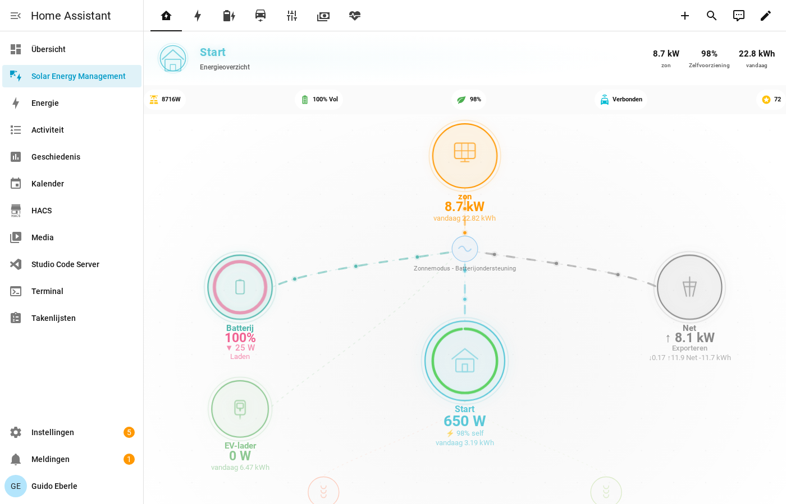
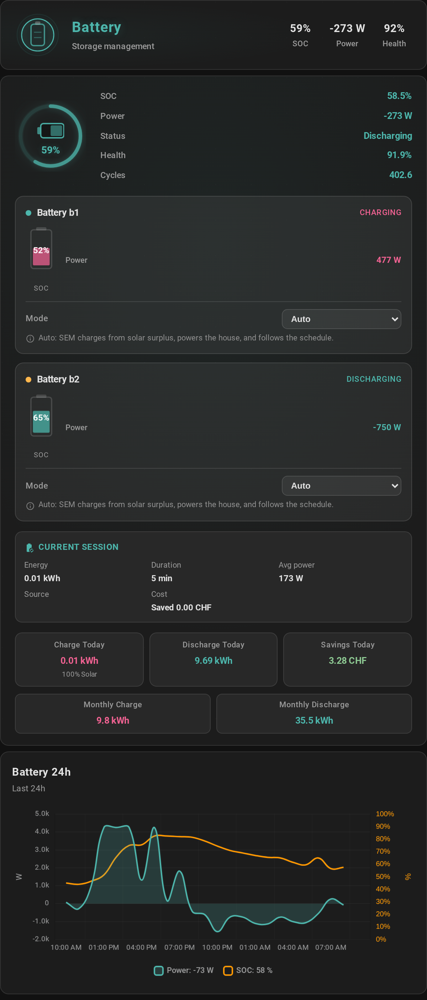
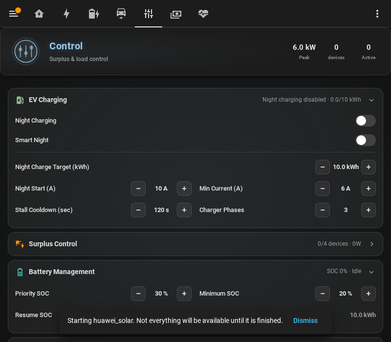
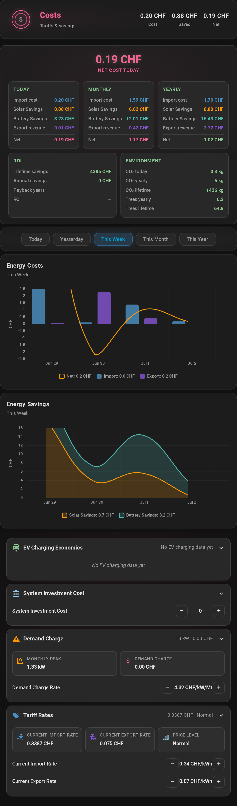

<p align="center">
  
</p>

# User Guide

Complete reference for Solar Energy Management (SEM).



---

## Table of Contents

- [Configuration Options](#configuration-options)
- [Charging Modes](#charging-modes)
- **[EV Charging Logic — full decision reference](EV_CHARGING_LOGIC.md)** ⭐
- [SOC Zone Strategy](#soc-zone-strategy)
- [Night Charging](#night-charging)
- [EV Intelligence](#ev-intelligence)
- [Battery Discharge Protection](#battery-discharge-protection)
- [Surplus Distribution](#surplus-distribution)
- [Peak Load Management](#peak-load-management)
- [Tariff Integration](#tariff-integration)
- [Solar Forecast](#solar-forecast)
- [Observer Mode](#observer-mode)
- [Sensors Reference](#sensors-reference)
- [Daily Energy Reset](#daily-energy-reset)

---

## Configuration Options

All settings are accessible via **Settings** > **Devices & Services** > **Solar Energy Management** > **Configure**.

### EV Charger Settings

| Setting | Description |
|---------|-------------|
| `ev_connected_sensor` | Binary sensor — is the EV plugged in? |
| `ev_charging_sensor` | Binary sensor — is charging active? |
| `ev_charging_power_sensor` | Power sensor (W) — current charging power |
| `ev_charger_service` | HA service to set current (e.g., `keba.set_current`) |
| `ev_charger_service_entity_id` | Entity ID passed to the charger service |
| `ev_current_sensor` | Current sensor (A) — optional, for actual amperage |
| `ev_session_energy_sensor` | Session energy (kWh) — optional |
| `ev_total_energy_sensor` | Cumulative energy (kWh) — optional |
| `ev_phase_switch_entity` | (#804) Optional — the select/number/switch (helper entities too) that changes the wallbox between 1- and 3-phase charging (go-e `psm`, KEBA X-series, openWB). Naming it *plus* turning on **Phase switching** (per charger, off by default in 2.1) enables the **Phase Mode** control; SEM never writes to it unless you set Phase Mode to a fixed 1/3 or Auto. |
| `ev_phase_switch_value_1p` / `_3p` | The values to write for each position, in the entity's own vocabulary. Required for a `select`; a `number` defaults to 1/3 and a `switch` to off/on. |

### What SEM detected (#814)

The dashboard **Configuration tab → Detected hardware** shows every charger SEM
auto-detected, the evidence for each role (which entity and what it is), the
entities it left unmapped, and **near-misses** — integrations whose entities SEM
saw but could not map to any role. A near-miss means your hardware is *almost*
supported: open an issue with the list shown. The same report is in the
diagnostics download (Settings → Devices & Services → SEM → ⋮ → Download
diagnostics). Wrong detections are corrected in place with the pickers in the
charger and sensor-source sections — no reinstall. The full support matrix with
an honest per-brand status is [docs/SUPPORTED_HARDWARE.md](SUPPORTED_HARDWARE.md).

**Names and proposals (#915).** An integration SEM has no row for used to
appear as a bare domain — `eg4_web_monitor`, and you were left to work out what
that was. SEM now carries a roster of the energy integrations the Home
Assistant ecosystem publishes, so the same line reads *"EG4 Web Monitor · 412
installs"*. For a near-miss it goes one step further: many integrations declare,
in their own source, what they call each entity they create, and where those
declared names match your entities SEM lists them as **proposed roles, marked
unconfirmed** — *"this number is probably your discharge-power limit"*.

Nothing on that list is bound. SEM has not verified a proposal and will not act
on one; it is there so you can set it in the pickers above with one glance
instead of hunting through fifty entities, and so you can tell us it was right.
The roster is deliberately not a support claim: it never records a sign
convention (which way your grid meter counts is a fact about *your* system, and
guessing it is the one mistake this project refuses to make), and a brand only
reaches the supported-hardware list after someone confirms it on real hardware.

### Optimization Settings

| Setting | Default | Description |
|---------|---------|-------------|
| `update_interval` | 10s | Control loop frequency (10-300s) |
| `power_delta` | — | Minimum power change to trigger update (50-3000W) |
| `current_delta` | — | Minimum current change threshold (1-10A) |
| `soc_delta` | — | Battery SOC change sensitivity (1-20%) |
| `daily_ev_target` | 10 kWh | **Min** of the charge-target range — the *guaranteed* amount. Night/grid charging tops up to at least this (0-100 kWh). |
| `daily_ev_target_max` | 100 kWh | **Max** of the range — the *solar ceiling*. Surplus charges up to this, then stops. Defaults to full (100 = charge freely from sun); lower it to cap surplus. |
| `ev_target_type` | `kwh` | Per-charger target type: `kwh` or `soc`. Set via the unit selector in the **Charge Target** block on the EV card. `soc` is only offered when a `vehicle_soc_entity` is configured for that charger. (Renamed from `ev_target_mode`; old values are migrated automatically.) |
| `ev_target_soc` | 80% | **Min** SOC of the range (50-100%) — guaranteed via night/grid. When a `vehicle_soc_entity` is configured, SEM calculates remaining need from SOC instead of kWh. |
| `ev_target_soc_max` | 100% | **Max** SOC of the range — solar ceiling. Defaults to 100% (charge to full from sun); lower it (e.g. 80%) to cap solar charging for battery longevity. |
| `ev_battery_capacity_kwh` | 40 kWh | EV battery capacity for SOC→kWh conversion (10-120 kWh). |
| `min_solar_power` | 500W | **Config floor** below which SEM won't even attempt to start the charger. Keep well below the **hardware minimum** of your charger (~4140 W on 3-phase, ~1380 W on 1-phase). Slider range 0–5000 W. |
| `max_grid_import` | — | Maximum grid import power during solar charging (0-2000W) |
| `ev_charging_mode` | `pv` | Charging mode: `pv` (solar only), `minpv` (Min+PV), `off` (hands-off — SEM sends nothing to the charger, #898) |
| `ev_ramp_rate_amps` | 2 | Max current change per 10s cycle during solar charging |

### Battery Settings

| Setting | Default | Description |
|---------|---------|-------------|
| `battery_priority_soc` | 30% | Below: all solar to battery, EV blocked |
| `battery_buffer_soc` | 70% | Above: battery can discharge for EV. This is the single assist floor — below it, battery assist to the EV stops |
| `battery_auto_start_soc` | 90% | Above: start EV even without surplus |
| `battery_assist_max_power` | 4500W | Maximum battery discharge for EV (1000-10000W) |
| `battery_assist_min_surplus` | 1200W | **Solar Gate (v1.7.3)** — battery only assists above this real solar surplus (0-5000W) |
| `battery_capacity_kwh` | — | Total battery capacity (5-100 kWh) |
| `battery_discharge_protection_enabled` | true | Protect battery during night charging |
| `battery_max_discharge_power` | 5000W | Maximum battery discharge rate (500-10000W) |
| `battery_discharge_control_entity` | — | Number entity to control inverter discharge limit |
| `battery_force_discharge_control_entity` | — | **(v1.7.3)** Number entity to control battery force-discharge power (per-battery, all brands) |

### Notification Settings

| Setting | Default | Description |
|---------|---------|-------------|
| `enable_charger_notifications` | true | Show status on charger display (KEBA, Easee, etc.) |
| `enable_mobile_notifications` | false | Send push notifications |
| `mobile_notification_service` | — | Notification service: `notify.mobile_app_*` (HA Companion), `rest_command.*` (webhooks), or any `notify.*` (Matrix, Slack, etc.) |

> **Note:** Android notification channels, groups, and action buttons are only sent to `notify.mobile_app_*` services. Other services receive message + title only.

### Multi-Charger Setup

SEM supports multiple EV chargers with priority-based surplus distribution:

1. Go to **Settings → Devices & Services → Solar Energy Management → Configure**
2. In the **EV Chargers** menu, select **Add another EV charger**
3. Configure sensors for each charger. For current control, use EITHER:
   - **Current Control Entity** (number entity) — for Wallbox, go-eCharger, and chargers with a `number.*` entity
   - **Set-Current Service** — for KEBA (`keba.set_current`), Easee, and service-based chargers
4. Set **Surplus Priority** (1=highest) — highest-priority charger gets power first

Each charger gets its own sensor entities:
- `sensor.sem_charger_{id}_power` — real-time charging power
- `sensor.sem_charger_{id}_session_energy` — current session energy
- `sensor.sem_charger_{id}_session_solar_share` — solar percentage
- `sensor.sem_charger_{id}_taper_trend` — BMS taper detection
- `sensor.sem_charger_{id}_taper_ratio` — taper ratio

To **edit** an existing charger, select it from the charger menu. To **remove**, select "Remove a charger" (primary charger cannot be removed).

### Appliance Dependencies

Devices can require other devices to be active before they turn on. Set this from the **Control** tab on the dashboard:

1. Find the device in the priority list
2. Use the **Requires** dropdown to select a parent device
3. The child indents under the parent automatically
4. To release: set Requires back to **None**

Dependencies work for both surplus and peak modes:
- **Surplus**: child only activates when parent is running and surplus available
- **Peak shedding**: shutting down parent cascades to all children

See [Multi-Device Guide](MULTI_DEVICE_GUIDE.md) for examples.

### Load Management Settings

| Setting | Default | Description |
|---------|---------|-------------|
| `load_management_enabled` | false | Enable peak load management — **off on a fresh install**; SEM never sheds a circuit you did not ask it to defend |
| `peak_limit_unlimited` | false | **No grid limit** — turn peak management off entirely |
| `target_peak_limit` | 5 kW | Maximum grid power SEM stays under (1–80 kW) |
| `warning_peak_level` | 90% of target | Warning threshold — must be **below** the target (1–80 kW) |
| `emergency_peak_level` | 120% of target | Emergency shedding threshold — must be **above** the target (1–80 kW) |

`target_peak_limit` is your **grid connection ceiling**, not a tariff preference —
take it from your supply contract or main breaker. Around 3–5 kW on a
demand-based European tariff; about 38 kW for a 200 A North-American service
(200 A × 240 V × 0.8). Every install starts at the 5 kW default — SEM no
longer asks for a peak limit during setup — and warning/emergency are derived
from whatever you set **at read time** (90% / 120%, recalculated on every
poll), so a 38 kW service is never stuck with the 4.5 kW / 6.0 kW levels that
suit a 5 kW one. All three accept **1–80 kW**, and the options flow rejects an
out-of-order ladder (warning ≥ target, or emergency ≤ target).

Two places to change it after install:
- **Control tab** — the Load Management card's slider is the fast path: drag
  to any value between 1 and 80 kW, or all the way to the top for **Uncapped**
  (the No grid limit opt-out below). Changes apply live, no restart needed.
- **Configuration tab** — the same value as a precise kW number field, for
  when you want an exact figure rather than a drag. Warning and emergency
  aren't separate fields anymore; they live behind an **Advanced** disclosure
  here, since almost nobody needs to touch the derived ratios.

#### No grid limit

Some connections are large enough that no household load can threaten them —
an industrial supply, or a site where the limit is enforced upstream. Turn on
**No grid limit** and SEM stops treating the peak limit as a ceiling at all:
the EV charger sizes its current from surplus alone, load management never
escalates, and the kW fields disappear from the card.

This is **not** the same as leaving *Enable Load Management* off:

| | Sheds loads to defend the limit | Sizes the EV/loads under the limit |
|---|---|---|
| Load management **on** | yes | yes |
| Load management **off** | no | **yes** — the ceiling still stands |
| **No grid limit** on | no | no |

That distinction is deliberate. Turning shedding off means "leave my loads
alone", not "there is no limit" — if it meant both, an install that only
wanted its dishwasher left alone would silently hand the EV the whole house.
Declaring no limit is its own explicit switch, so it is never reached by
accident. Your kW numbers stay in config while it is on and come back
untouched when you turn it off.

### Other Settings

| Setting | Default | Description |
|---------|---------|-------------|
| `observer_mode` | false | Read-only mode — no hardware control |
| `daily_home_consumption_estimate` | 18 kWh | Fallback for first 7 days of month |

Smart night charging is no longer a switch. Since v1.6.3 it is implied by the
Charge mode: the `Solar + cheapest hours` and `Min + Solar` modes run the full
EV-intelligence check (EV SOC, solar forecast, temperature, learned driving
patterns) before committing to an overnight charge.

---

## Multiple heat pumps and climate units (#685)

The **Heat Pump** section configures the primary unit, and since 2.1 the
options flow ends in a **heat-pump menu** where further units can be
added, edited and removed (#685). Every unit — primary or additional —
supports the same three control paths, in any combination:

- **SG-Ready relays** — the standard two-relay table (NORMAL / BOOST /
  FORCE_ON), with NC-wiring inversion per unit.
- **Climate entity** — setpoint boost on surplus for pumps that only
  expose a thermostat (Nibe, Mitsubishi, Daikin …).
- **Service call** (#801) — for pumps whose control surface is a
  *command*, like a Buderus behind EMS-ESP: configure
  `domain.service` (e.g. `ems_esp.send_command`) plus a JSON payload.
  The placeholders `state` (1–4), `relay1` and `relay2` (the SG-Ready
  truth-table booleans, written in braces inside the JSON) are filled
  in per write. An optional read-back entity lets SEM verify after
  every write that the command landed; a mismatch is logged, never
  silently trusted.

Each additional unit carries its own priority, thresholds, sensors and
name, and competes in the surplus distribution as its own device.

**Thermostat-controlled units can alternatively be added as climate
devices** (an Ecobee, a Nest, any thermostat-controlled heat pump or AC)
in the generic device list. Every climate device gets, independently:

- its own priority slot in the one device list,
- its own comfort band (target / offset / limit) with the learned drift
  model — including pre-cool/pre-heat banking through the energy plan,
- its own power sensor. Units with split metering (compressor on one
  circuit, air handler on another) sum their sensors with a
  [template sensor](https://www.home-assistant.io/integrations/template/)
  first and use that as the device's power entity,
- its own thermostat icon in the device list. (Up to #788 every
  service-registered device drew the generic plug, which made a second unit
  that *was* registered and running look like it had never been added.)

Heat-pump units and climate devices can coexist: any number of
menu-configured units plus any number of climate-managed ones.

### How much did SG-Ready actually shift? (#769)

The SG-Ready unit has its own energy row, on the same footing as the EV:

| Sensor | What it answers |
|---|---|
| `sensor.sem_heat_pump_energy_today` | kWh the pump used today |
| `sensor.sem_heat_pump_energy_month` / `_year` / `_total` | the same over longer horizons |
| `sensor.sem_heat_pump_energy_shifted_today` | of today's kWh, **how much SEM caused** |

"Shifted" counts only the energy booked while SEM was asking for more —
SG-Ready in **BOOST** or **FORCE_ON**. Energy the pump took on its own
thermostat (NORMAL) is deliberately excluded, because that is energy that
would have been used anyway. The difference between the two numbers is the
honest answer to "is SG-Ready doing anything for me?"

**Where the figure comes from.** If you gave the heat pump an energy counter
entity, the row is the counter's own delta — a measurement. If it has only a
power sensor, SEM integrates it. With neither, the figure is `rated_power ×
runtime` and is flagged as an **estimate**: it is shown, but never fed back
into SEM's learning (see [SIMULATION.md](SIMULATION.md) and #755). A sensor
that cannot be read is recorded as *blind* — SEM does not record a silent
sensor as a pump drawing zero watts.

**When a counter reboots.** An energy counter that resets to zero — a
firmware update, a re-paired device, a replaced meter — has not un-used its
energy, and when it climbs back to its old reading it has not just used that
much either. SEM books neither. It remembers the reading the counter fell
from and, when it comes back, books only what it gained over that mark: the
genuine consumption across the outage. A jump no window could physically
deliver (no single house load draws 100 kW) is refused outright, recorded as
*blind* rather than as zero, and the meter is trusted again from where it now
stands. The window is measured from the last time the counter's **value**
changed, so a meter that publishes once an hour, a sensor that was
unavailable for half an hour, and a reading picked back up after a Home
Assistant restart all still book their real energy.

**The day rolls at sunrise, not midnight** — the same boundary the pump's
runtime uses — so "today" means the same thing everywhere in SEM.

## Hot Water and Heat Pump (v1.7.3 hardening)

SEM works alongside your existing heating system — it only boosts with solar surplus, it does NOT replace your boiler or heat pump's normal heating schedule. Your existing system continues to handle baseline heating as usual. SEM adds a solar boost layer on top: when surplus solar power is available, SEM heats the water further to store energy that would otherwise be exported.

**v1.7.3 improvements:**
- **Surplus activation actually fires** (beta bug fixed)
- **Boosts on true house surplus**, not just raw solar (correct calculation)
- **Stands down under peak** (respects load management)
- **SG-Ready relay map corrected** for heat pumps

Configure these settings under **Settings > Devices & Services > Solar Energy Management > Configure**.

### Dashboard Sliders

The dashboard exposes exactly two sliders for hot water control:

#### Solar Boost Target (40-80°C)

The temperature SEM heats to during solar surplus periods. When surplus power is available, SEM heats the water up to this target. Once reached, SEM stops heating and releases surplus for other devices (EV, battery, etc.).

If you set the Solar Boost Target to 60°C or above, the Legionella prevention requirement (60°C) is naturally met during sunny days — no separate forced heating cycle is needed on those days.

#### Legionella Target (60-80°C)

The minimum temperature for the Legionella prevention cycle. Range: 60-80°C. The legal minimum is 60°C per DVGW W 551 (Germany), SIA 385/1 (Switzerland), and ÖNORM B 5019 (Austria). When a Legionella cycle triggers, SEM heats to this target regardless of solar availability — grid power is used if necessary.

### Legionella Prevention

SEM tracks when the water last reached the Legionella target temperature. If the configured interval expires without reaching that temperature, SEM forces a heating cycle. The disinfection interval is configurable in the integration options flow (default 72 hours, range 24-168 hours) but is not exposed on the dashboard — it rarely needs changing.

### Important: Legionella cycle cannot be disabled

The Legionella prevention cycle is a safety requirement mandated by building codes. It cannot be turned off. You can adjust the interval and the target temperature (minimum 60°C) in the integration options, but the cycle itself is always active when hot water control is enabled. This protects against dangerous Legionella bacteria growth in stored hot water.

---

## Charging Modes

SEM supports five EV charging modes (v1.7.3), selectable per charger via **`select.sem_charger_<id>_charge_mode`** on the Control tab or the EV card:

> **Need the full picture?** [docs/EV_CHARGING_LOGIC.md](EV_CHARGING_LOGIC.md) is the canonical reference covering all 6 user controls (mode + Overnight grid + Cheapest hours + Smart night + Charge by + Min/Max), their priority cascade, and every interaction scenario including worked examples.

### Solar Only (`solar_only`)

Charges **exclusively from solar surplus** during the day. The EV waits for surplus to appear and pauses when it drops. If an **"At least" floor** is set on the charge target, any shortfall vs the floor is topped up **overnight from grid** by the Charge-by time (#634) — with the floor at 0 the mode never touches the grid, day or night. Best when you have abundant solar and can be flexible about when the car charges.

| Time | Solar | Surplus | EV State |
|---|---|---|---|
| 08:00 | Weak (1 kW) | Below minimum | Paused |
| 12:00 | Strong (8 kW) | 3 kW available | Charging ~1.7 A |
| 17:00 | Weak (500 W) | Insufficient | Paused |
| 22:00 | Night | 0 W | Not charging (night disabled) |

**Daily target is NOT guaranteed.** If solar tomorrow is weak, the car may not reach the Min target. To top up from the grid overnight, either set an **"At least" floor** on this charger (which turns the shortfall into an overnight guarantee even in Solar Only — #634/#679), or switch the charger to **Min + Solar**.

### Min + Solar (`min_plus_solar`) — Default

Charges from the grid plus any solar surplus on top. The EV always starts, even without sun. At night the charge rate is sized to your available peak headroom (peak limit minus expected home consumption and any running loads), so the session finishes early instead of creeping at the minimum — installs without a peak limit keep the minimum-current behaviour. Best for: you need the car ready by a specific time and can accept a grid import.

| Time | Grid + Solar | EV State |
|---|---|---|
| 08:00 | 0 W solar, 4.1 kW grid | Charging at 6 A (grid-only) |
| 12:00 | 3 kW solar surplus | Charging at 8 A (4.1 kW grid + 3 kW solar) |
| 17:00 | 0.5 kW solar | Charging at ~5 A (4 kW grid + 0.5 kW solar) |
| 22:00 (night) | Grid only | Continues — this mode charges overnight by design |

**Daily target is guaranteed.** The Min floor ensures the car charges toward the minimum target at all times, topped up by grid if needed.

### Solar + Cheapest Hours (`solar_plus_cheap`)

**Daytime:** charges from solar surplus (like Solar Only) — **and, on a cheap or negative price hour, tops the Min floor up from grid** just as the night window does (#856). Solar surplus always wins when it offers more; the mode never downgrades a strong sun to the grid rate. Expensive hours pause grid imports entirely.

**Night:** if tariff mode is "Dynamic", defers charging to the cheapest contiguous price window instead of charging immediately. The Min floor is always guaranteed: if waiting for cheap hours would miss the deadline or there's no price data, SEM charges anyway.

**The Min floor is what a cheap hour fills.** With *At least* set to 0 kWh there is nothing to top up, so a cheap hour — day or night — charges nothing from grid; the strategy line says so. Set *At least* to the energy you want secured at the cheapest price.

Best for: you have a dynamic tariff (Tibber, Octopus, Amber) and want to optimize cost. Picking this mode *is* the opt-in — it is the only mode that consults the tariff, and it is hidden from the selector when no dynamic tariff is configured.

### Always Max (`always_max`)

Charges at the charger's maximum current immediately, day or night, regardless of solar or tariff. The entire grid is available to the charger.

Best for: urgent charging (departing soon, road trip, or testing).

### Off (`off`)

EV charging is disabled. SEM continues monitoring but does not send any commands to the charger. Use when you want manual control or a charger is offline.

---

## SOC Zone Strategy



SEM uses a four-zone model to decide how the battery and EV share solar energy. The battery's state of charge (SOC) determines which zone is active:

```
SOC 100% ─────────────────────────────
         │  Zone 4: FULL ASSIST       │  Battery always helps EV
SOC 90%  ─── battery_auto_start_soc ──
         │  Zone 3: DISCHARGE ASSIST  │  Battery gradually helps EV
SOC 70%  ─── battery_buffer_soc ──────
         │  Zone 2: SURPLUS ONLY      │  EV gets solar surplus only
SOC 30%  ─── battery_priority_soc ────
         │  Zone 1: BATTERY PRIORITY  │  All solar → battery, EV waits
SOC  0%  ─────────────────────────────
```

### Zone 1 — Battery Priority (SOC < 30%)

All solar production goes to the battery. The EV is blocked entirely — the battery needs to reach a usable level first.

### Zone 2 — Surplus Only (SOC 30-70%)

The EV receives only pure solar surplus — power that would otherwise be exported. The battery continues charging normally and is never discharged to help the EV. If surplus is below the charger's minimum (~4140W on 3-phase), the EV waits.

### Zone 3 — Discharge Assist (SOC 70-90%)

The battery begins discharging to supplement solar for the EV. The assist power scales linearly: 50% of max at SOC 70%, up to 100% at SOC 90%. Combined with solar surplus, this often pushes the EV above its minimum charging threshold.

### Zone 4 — Full Assist (SOC >= 90%)

Full battery assist (default 4500W). The EV starts charging even without solar surplus — the battery alone can push the EV above its minimum threshold.

### When the battery SOC is unknown

Right after a Home Assistant restart the battery SOC sensor can take a minute or two to report its first value (Huawei: up to ~3 minutes). Until it does, SEM has **no** SOC — and an unknown battery is treated as **neither a source nor a blocker** (2.1, #875): the EV charges on pure solar surplus as in Zone 2, gets no battery assist, and the battery is protected from discharging into the car as if it were below the buffer. The decision reasons on the EV card and in observer mode print the SOC as `unknown` in that window (`Zone 2 (SOC=unknown)`), never as 0 %. Before 2.1 that window was steered as Zone 1 — "battery priority", EV blocked — on a 0 % reading that had never been measured.

The same applies to an install with **no battery SOC sensor at all**: SEM then never enters Zone 1, so a battery-less install in *Min + Solar* charges the car on surplus during the day instead of waiting for a battery that does not exist.

A sensor that goes dark **after** it has reported is different: SEM keeps steering on the last value it read, so a short gap never looks like an empty pack.

### Assist floor

Battery assist to the EV is gated by the **buffer SOC** (default 70%): above it the battery may help charge the EV, below it assist stops. The separate `battery_assist_floor_soc` knob was removed and folded into the buffer.

Since #878 the buffer is the **minimum** assist floor rather than the only one: when forecast-led spending is on and has computed a floor for tonight, the drain stops at whichever of the two is higher — see [How deep the car may drain the battery](#forecast-led-spending-v21). With forecast spending off, the buffer alone decides, exactly as before.

### Per-Battery Modes (Multi-Battery Systems, v1.7.3)

When you have multiple batteries (e.g. Huawei + Growatt, or split Huawei units), SEM v1.7.3 adds per-battery control:

| Mode | SEM Control | When to use |
|------|---|---|
| **Auto** | Normal SOC zone strategy (Zone 1–4) | Default; SEM manages the battery like usual |
| **Self-Consumption** | Discharge to home only, never export to grid | Night use; battery stays reserved for home |
| **Force Charge** | Charge from grid (if tariff is cheap) or solar | Deliberate battery top-up before heavy consumption |
| **Force Discharge** | Discharge at maximum rate | Emergency backup or battery arbitrage |
| **Off** | SEM ignores this battery | Manual control or testing |

**Per-battery control entities:**
- `select.sem_battery_<id>_mode` — set the mode (auto / self_consumption / force_charge / force_discharge / off)
- `number.sem_battery_<id>_reserve_soc` — the SOC this battery will not discharge below

The discharge *rate* is not per-battery: **`number.sem_battery_max_discharge_power`** (default 5000 W) caps it for the whole fleet.

**Zero-config Huawei:** If you have a Huawei inverter, SEM auto-detects the discharge limit entity and uses it to enforce force-discharge at no extra config.

**Other brands:** set `battery_force_discharge_control_entity` in the options flow to a number entity on your inverter (e.g. Growatt's max discharge power, SolaX's force-discharge current).

### Forecast-Led Spending (v2.1)

**In one sentence:** let the car drain the home battery in the evening, but
only down to the level the house still needs to get through the night on its
own — and only when tomorrow's sun is expected to put it back.

That is the whole idea. The rest of this section is how SEM works out "the
level the house still needs", and what it refuses to do when it cannot.

**The problem it replaces.** Your battery's overnight floor used to be a
number you typed once, and it was the same number in June and in December.
Too high and the car charges from the grid at six o'clock while the pack sits
full. Too low and the house buys back at the evening rate what the car took.
Forecast-led spending makes the floor an *answer* instead: SEM works out how
much of the pack tonight can actually be spared, given what your house really
uses overnight and how much tomorrow's sun is expected to put back.

**Where you see it.** The Battery tab shows tonight's computed floor beside
your configured one, the spendable figure in kWh, and which of the three
states it is in (below). The EV card's strategy line names the assist when it
is happening: *"Zone 4: budget=6000W → 10A (solar surplus + capped battery
assist)"*.

The budget is used by two sinks, and they carry their consent differently:

- **The car.** A charger set to **Solar + battery** has already said the pack
  may feed it. Below the solar gate it spends tonight's budget down to the
  computed floor on its own — no extra switch. (Changed 03.09: the master
  switch used to be required here as well, which contradicted the mode.)
- **The grid.** Selling forecast surplus needs the master switch under
  **Configuration → Battery intelligence → Forecast-led spending**, plus the
  *may sell to the grid* permission beside it. It is **off by default**, and
  while it is off every number in that section is still measured and shown —
  nothing is sold.

**How the budget is worked out**

```
spendable = stored now − (what the night needs) − (your configured floor)
            capped at what tomorrow is expected to refill
```

Each term is measured rather than assumed:

| Term | Where it comes from |
|---|---|
| Stored now | measured pack size × SOC, falling back to the nameplate capacity |
| What the night needs | the high-percentile envelope of your own recorded nights, not an average |
| Tomorrow's refill | tomorrow's forecast **after** your house load and any committed EV charge, scaled by how accurate that forecast horizon has actually been |
| Your floor | `battery_reserve_soc` — the computed floor never goes below it |

**Three states, on the Battery tab**

- **Learning** — SEM has not seen enough nights yet (it needs five). It spends
  nothing and shows you how many it has. Every new install starts here.
- **Holding** — there is enough evidence and the answer is genuinely nothing
  spare: a long winter night against a weak forecast.
- **Spending** — there is a budget tonight, with the floor it will land on.

The SOC zones bar draws tonight's computed floor in orange beside your
configured floor, so you can see it move from day to day.

**What the budget may be spent on**

Two switches, and they are deliberately separate rather than one setting:

- **Battery may sell to the grid** — export the budget when the price is high.
- **Battery may charge the car** — use the budget on the EV in the evening.

A single mode could not express *"may sell, may not touch the car"*. Both
default to your current behaviour, so turning forecast spending on does not
silently grant a permission you never gave.

**How deep the car may drain the battery (#878)**

> *"The car should drain the battery to the expected level, so the house
> consumption is still covered by the battery."* — the request this answers.

The permission above answers *whether* the car may have any of the pack. A
second question follows: **how much?**

Without an answer to that, the car empties the battery down to your
configured **buffer SOC** and stops there — the same level in June and in
December, regardless of what tonight actually needs. On a long winter night
that leaves the house buying back at the evening rate what the car took at
six o'clock.

So the drain now stops at whichever floor is **higher**:

```
stop at = max( your buffer SOC , tonight's computed floor )
```

Tonight's computed floor is the same number the Battery tab shows as the
floor for the evening: how much must still be in the pack at dawn for the
house to get through the night on what it has measured itself using. It is
never lower than your buffer — a computed floor below your buffer changes
nothing, because your buffer is a hard floor in its own right.

**Worked example.** A 70 % buffer, assist ceiling 4500 W, and a night whose
measured need computes a floor of **79 %**:

| Battery SOC | Before | Now | Why |
|---|---|---|---|
| 65 % | 0 W | 0 W | below the buffer either way — battery off-limits |
| 72 % | 2475 W | **0 W** | above your buffer, but *below* what tonight needs |
| 75 % | 2812 W | **0 W** | same — the pack is holding the night's own supply |
| 79 % | 3262 W | **0 W** | exactly at the floor: stop, do not dip below |
| 82 % | 3600 W | 2864 W | above the floor, so it assists — but tapers sooner |
| 95 % | 4500 W | 4500 W | plenty spare, full assist as before |

Read the 72–79 % rows as the point of the change: SEM was offering the car
**2.5–3.3 kW** out of a pack that needed that energy for the house a few
hours later.

The taper also now runs from the *computed* floor rather than the buffer —
at 82 % the offer is 2864 W instead of 3600 W, because 82 % is much closer to
79 % than it is to 70 %, and the pack has correspondingly less to spare.

**When this changes nothing at all**

- Your battery is at or above the auto-start SOC (default 90 %) — there is
  plenty spare and the assist runs at full power as before.
- Tonight's computed floor comes out *below* your buffer — a mild night, so
  your buffer is still the binding limit.
- The forecast has not earned trust yet, or there is no forecast. Then no
  floor is computed and the buffer alone decides, exactly as it always has.

That last case is deliberate: **no computed floor means fall back to your
buffer**, never "no floor at all". The master switch does not change this:
the floor is computed and shown whenever the evidence exists, and a
Solar + battery charger honours it whether or not selling is switched on.

**What it looks like on a real evening**

A maintainer's install, 03.09, 15 kWh pack, buffer 75 %, computed floor
78.6 %, assist ceiling 5000 W, car on a KEBA in *Solar + battery*:

| time | what happened |
|---|---|
| 17:51 | Sun fading, pack 90 %. Assist opens: `Zone 4: budget=6000W → 10A`, ~4 kW out of the pack into the car. |
| 18:15 | Surplus falls to 858 W, under the 1000 W solar gate — assist stops, pack 82 %. |
| 18:46 | Below the gate, the forecast budget takes over: assist resumes at 8 A. This is the part the gate alone would never allow. |
| 18:53 | Stop at **81 %**, floor 78.6 %. The pack never crossed it. |

Read the last row carefully: it stopped **2.4 % above** the floor, not on it.
The offer tapers as the pack approaches the floor (half the ceiling at the
floor, full at the auto-start SOC), and this car will not charge below 8 A ≈
3.2 kW. When the tapered offer falls under what the car accepts, the session
ends there. On a car with a lower minimum the drain would reach closer to the
floor. Either way the floor is a floor: it is never crossed.

**What it will not do**

- It will not drain the pack below the higher of your buffer and tonight's
  computed floor — not for the car, not for a grid sale.
- It will not spend at all until it has measured five of your own nights.
- It will not charge the car *from the pack* overnight. Once the night window
  opens, an "At least" top-up is a **grid** top-up by design; the pack's job
  after dark is the house.
- It will not act on a forecast it does not trust yet. Trust is earned per
  horizon and shown on the Battery tab.

**Starting from history instead of waiting a week**

If SEM has been running on your system for months, it has already recorded how
good your forecast is — it just never wrote it down in the form the budget
reads. The action **"Learn forecast accuracy from past history"**
(`solar_energy_management.backfill_forecast_ledger`) reads your own recorder
statistics and settles the ledger in one pass, so forecast-led spending can
start from what your site has actually done. Days SEM recorded live are never
overwritten by the reconstruction.

The battery half has the same shortcut. SEM wants five good nights of evidence
before it will say how much of the pack is safe to spend, and recording
produces one per day. The action **"Learn overnight battery use from past
history"** (`solar_energy_management.backfill_battery_nights`) reconstructs
those nights from your battery's recorded discharge, so the answer arrives at
once rather than a week later.

You do not have to go looking for it. While SEM is still learning, the battery
card offers it directly under the progress it would otherwise ask you to wait
out:


The same action is available as `button.sem_backfill_battery_nights` and as the
service above, and it never runs on its own — rebuilding is always something
you ask for. If your system is missing a sensor the rebuild needs, SEM raises a
**Repair** naming that sensor rather than failing quietly.

Two things worth knowing about reconstructed nights. They are read from a
cumulative energy counter, which keeps counting whether or not SEM was
watching — so unlike live recording they cannot be spoiled by a sensor that
drops out. But that counter reports everything the battery sent out, and
cannot separate what your house used from what went to the car or the grid.
Reconstructed nights are therefore treated as an **upper bound** on household
use, which errs toward holding more back rather than less. Nights SEM measured
live are always kept in preference, because a live night can tell those apart.

**Nights that do not add up are not used**

A battery cannot send out more energy than it discharged. SEM checks that on
every night it records, and a night that fails is kept and shown but not used
for learning. This matters more than it sounds: the overnight-need figure is
built from those nights, and one impossible number inflates what SEM believes
your house needs — which shows up as a budget of zero and a dashboard calmly
reporting that nothing is spare. If you see nights marked this way, something
upstream of SEM is double-counting a flow; the Config tab's sensor sources are
the place to start.

**Checking the setting against your own history**

The amount SEM holds back for the night is a high percentile of what your house
has actually drawn — high on purpose, because running short before dawn is
worse than leaving a little export revenue on the table. The exact percentile
shipped was chosen by replaying 211 real nights and measuring what each
candidate would have cost:

| Percentile | Nights it would spend on | Energy spent | Nights it overshot the floor | Worst overshoot |
|---|---|---|---|---|
| p80 | 97 | 63.6 kWh | 3 | 400 Wh |
| **p85 (shipped)** | 90 | 53.5 kWh | 2 | 120 Wh |
| p90 | 68 | 30.0 kWh | 1 | 50 Wh |
| p95 | 5 | 0.3 kWh | 0 | — |

p95 looks safest and is the worst answer on the list: the feature effectively
stops working while still appearing to be switched on.

You can run the same measurement against your own system:

```
python3 scripts/backtest_budget.py --host root@YOUR_HA --key ~/.ssh/your.key \
    --capacity 15 --floor 20 --need-pctile 0.85
```

It replays your recorded nights, asks the budget what it would have spent on
each, and reports how often that would have left the pack below its floor.

**Why it refuses to spend without evidence**

A forecast that runs high is exactly the case where spending the battery hurts:
you sell tonight, tomorrow underdelivers, and you buy it back at the evening
price. So SEM keeps a per-horizon ledger of what it forecast versus what the day
delivered, and only trusts a horizon after seven settled days. Until then the
budget is zero and the card says so.

It scores that record against its **bad days, not its average one**. A forecast
can be perfectly unbiased over a season and still be wrong by half in either
direction on any given day — and the average hides exactly the days that cost
you money. Measured on the development system: 139 real days, average ratio
1.05 (unbiased), but a tenth of the days delivered under half what was
promised. Planning against the average would have over-committed the battery on
42% of them.

### Example: Sunny Day, Battery at 30%, EV Connected

1. **SOC 30-69%** — Battery charges from solar. EV waits (surplus usually below 4140W minimum)
2. **SOC hits 70%** — Battery assist kicks in (~2250W). Combined with surplus, EV may start charging
3. **SOC hits 90%** — Full 4500W battery assist. EV charges near maximum
4. **SOC drops below 70%** — Battery assist stops (buffer floor). EV falls back to solar-only surplus

### Tuning Tips

- **Conservative setup** — Set `battery_priority_soc` to 70% to ensure the battery is nearly full before the EV gets anything. Good if you have high evening self-consumption.
- **Aggressive EV charging** — Lower `battery_priority_soc` to 20% and `battery_buffer_soc` to 50% to start EV charging earlier.
- **Small battery** — Reduce `battery_assist_max_power` to avoid draining a small battery too quickly.

---

## Solar Gate (Battery Assist Gate)

The **Solar Gate** is a new (v1.7.3) power threshold that protects your home battery from draining into the car when the sun isn't actually shining. It works **in every charging mode** — solar only, min+solar, or always max.

### What it does

The battery **only assists the EV** when there is at least this much **real solar surplus** available. Below the gate, the EV gets grid power or solar alone, never battery power. This prevents the battery from bleeding away overnight, even in `always_max` mode.

| Solar Surplus | Battery Assist | EV Gets From | Typical Scenario |
|---|---|---|---|
| ≥ 1200 W (gate) | Enabled | Solar + battery | Sunny morning, battery can help |
| < 1200 W (below gate) | Disabled — unless the charger is in **Solar + battery** and tonight's forecast budget is positive: then the battery assists down to the computed floor | Grid + solar, or battery to the floor | Overcast day, evening |
| 0 W (night) | Disabled | Grid only (if mode allows) | Night window, no sun |

### Default and configuration

- **Default gate:** 1200 W (safe for most systems — protects battery at dusk/dawn)
- **Setting:** `number.sem_battery_assist_min_surplus` on the Control tab, or in the options flow under **EV Charging & Solar** as **"Solar Gate"**
- **Disabled gate:** Set to **0 W** to allow battery support everywhere, including overnight (the pre-v1.7.3 behavior)

### Example

**Tuesday, 5 PM, cloud cover, battery at 85% SOC:**
- Solar: 600 W (below gate)
- Battery assist: **OFF** (gate = 1200 W > 600 W)
- EV charging: paused (min_plus_solar mode uses 4.1 kW grid minimum, which is above what 600 W solar + 0 W battery provide)

**Tuesday, 11 AM, clear skies, battery at 85% SOC:**
- Solar: 3500 W (above gate)
- Battery assist: **ON** (gate met)
- EV charging: active at ~4 kW (2 kW solar + 2 kW battery assist)

### Distinguishing Solar Gate from "Min solar power"

Do not confuse Solar Gate with **Min solar power** (the config floor below which SEM won't attempt to start the charger). They are orthogonal:

| Setting | Purpose | Effect |
|---|---|---|
| **Min solar power** (500 W default) | Noise floor — prevent starting on transient spikes | If actual surplus < 500 W, charger never starts |
| **Solar Gate** (1200 W default, v1.7.3) | Battery protection threshold | If actual surplus < gate, battery cannot assist (but charger can still run on grid + solar) |

---

## Night Charging

> **See also:** [docs/EV_CHARGING_LOGIC.md](EV_CHARGING_LOGIC.md) — full decision matrix covering night charging, the optional **Charge by HH:MM** deadline, and the optional **Cheapest hours (tariff)** mode, with worked examples for the edge cases (e.g. cheap window shorter than time-to-Min).

> **Night charging is governed by the Charge mode, not by a switch.** The
> `switch.sem_night_charging` and per-charger `…_night_charging` toggles were
> removed in v1.6.3 (#277) — one selector now carries the whole intent. Set it
> per charger with **`select.sem_charger_<id>_charge_mode`**, on the EV tab.
> The same goes for `switch.sem_smart_night_charging`: the intelligence it
> switched on is now implied by the mode (see *Smart night charging* below).

> **Not seeing `Solar + cheapest hours` in the list?** That mode is hidden
> unless a **dynamic tariff** is configured (Configuration tab → Tariff →
> *Dynamic*, with a price entity). Without live prices the mode has no cheap
> hours to find and would quietly behave like `Solar only`, so SEM does not
> offer an option it cannot honour. Configure the tariff and it appears. The
> other four modes are always available.

| Charge mode | Charges overnight from grid? |
|---|---|
| `Min + Solar` **(default)** | Yes — this is the out-of-the-box behaviour |
| `Solar + cheapest hours` | Yes, deferred into the cheapest price window |
| `Always (max)` | Yes, immediately and at full current |
| `Solar only` | **No** — unless you set an "At least" floor on *this* charger (#679) |
| `Off` | No — the charger is not managed at all |

A fresh install defaults to **Min + Solar**, so a new charger *will* top up
overnight. If you want the solar-purist behaviour — never pull from the grid
unasked — pick **Solar only** and leave its "At least" floor at 0. The floor is
what carries the intent: a global default is not an opt-in, so only a floor set
on the charger itself puts a `Solar only` charger into the night lane.

Night charging starts when night mode activates (after sunset + 10 minutes, or
20:30, whichever comes first).

### How it works

1. SEM starts the charger at 10A
2. Each 10s cycle, SEM adjusts current (+-2A ramp, minimum 8A floor) based on peak load management
3. SEM tracks remaining need — either from the vehicle SOC sensor (if configured) or from the daily EV energy counter (kWh fallback)
4. Charging stops when the target is reached (vehicle SOC ≥ `ev_target_soc`, or daily energy ≥ `daily_ev_target`)

### Daily target tracking

The daily EV target uses **sunrise-based reset** — the counter resets at sunrise, not midnight. This means a night charging session from 22:00 to 06:00 stays in a single daily bucket.

### Smart night charging

In the **`Solar + cheapest hours`** and **`Min + Solar`** modes, SEM runs the
full EV Intelligence system before committing to an overnight charge. (This was
the `switch.sem_smart_night_charging` toggle until v1.6.3; it is now implied by
the mode.)

- **SOC-based skip** — if the estimated EV SOC covers tomorrow's predicted consumption (with 30% safety margin), SEM skips the night charge entirely
- **Solar forecast credit** — 30% of tomorrow's forecast is credited, reducing required SOC further
- **Temperature correction** — consumption predictions adjust for seasonal variation (winter = higher consumption)
- **Daily SOC decay** — accounts for ~0.5% overnight parasitic drain
- **Safety net** — maximum 3 consecutive skips to prevent under-charging
- **Fallback** — when EV Intelligence data is insufficient, SEM falls back to forecast-based reduction (weekday: conservative, weekend: aggressive)

### EV Charge Target Type (v1.7.3 — kWh vs Vehicle SOC %)

Each charger can charge to a **daily kWh target** or a **vehicle state-of-charge (SOC) %**. The choice is made in the **Charge Target** section of the EV charger card, with a unit selector (kWh or %) beside the target value.

#### kWh target (default)

Charges to a **daily energy amount**:

- **Min (guaranteed):** e.g. 10 kWh via night/grid top-up
- **Max (solar ceiling):** e.g. 100 kWh from surplus (charge freely)

Best for: you know your typical daily consumption (50 km = ~8 kWh, 100 km = ~16 kWh) and want predictable behavior.

#### Vehicle SOC % target (when vehicle sensor is configured)

Charges to a **state-of-charge percentage**, if your EV integration provides a `vehicle_soc_entity`:

1. In the options flow **EV Charger Management** step, select your charger and set **`vehicle_soc_entity`** (e.g. `sensor.tesla_battery_soc`) and **`ev_battery_capacity_kwh`** (e.g. 75 kWh for a Tesla Model 3).
2. The EV card's **Charge Target** section now offers a **%** unit selector.
3. Set **Min % = 50%** and **Max % = 80%** to keep battery longevity: grid tops up to 50%, solar stops at 80%.

**Advantages:**
- Independent of consumption patterns — SOC is absolute
- Enables battery longevity strategies (e.g. "only charge to 80% from sun")
- Per-charger values — each car can have its own SOC range

SEM calculates remaining need from the SOC gap: `(target_soc - actual_soc) × battery_capacity = kWh remaining`.

#### Slow-polling SOC sensors (energy-accounted ceiling)

Some EV integrations (OnStar-class, cloud-polled) only update `vehicle_soc_entity` every 20–30
minutes. Steering purely on that last reading lets a session overshoot the target by roughly
*sensor lag × charge power* — a 60% target on an 85 kWh pack at 11.5 kW can land at 67% before
the sensor even reports it.

SEM guards against this with an energy-accounted ceiling that sits beside the sensor, not instead
of it:

```
effective_soc = max(sensor, anchor + delivered_since_anchor_kwh × 0.92 ÷ capacity_kwh)
```

- The **anchor** is just the last real sensor value plus a running tally of energy delivered
  since then (0.92 assumed charge efficiency) — a forward projection from real telemetry, not a
  guess.
- A **fresh sensor reading always wins** (`max(...)`) — the sensor is never replaced, only capped
  from below. If the projection overshoots and a later real reading lands under target, SEM
  auto-resumes charging for the difference, paced to the sensor's own update interval so it
  doesn't flap.
- The anchor is **session-scoped only** — never persisted across restarts, and reset the moment
  the car disconnects (per charger, so a second charger's session can never leak into the first
  one's target decision).
- The **0.92 here is fixed and not configurable**, deliberately — including by *Charger
  efficiency* below, which every other estimate does follow. It sets a ceiling, so a lower
  figure would make SEM charge *longer*, and the two mistakes are not equal. Stopping a little
  early costs nothing: the next sensor reading lands under target and charging resumes. Stopping
  late has already put the energy in the pack, and that is the overshoot this whole section
  exists to prevent.
- You'll see a mobile notification on both the early stop and any resume, and a small info line
  under the SOC gauge on the EV card (e.g. "Car: 55% (28 min ago) · est. now ~59%") — the gauge
  itself always shows the raw sensor value.

#### Charger efficiency

**Options → EV Charger → Charger efficiency (%)**, default **92 %**.

Not all the AC energy your meter counts reaches the battery: the car's onboard charger,
the cables and (in cold weather) the pack heater take a cut. SEM converts metered kWh into
pack kWh with this figure wherever it *reports* charge state — the SOC estimate on the EV
card, the virtual SOC below, and the first-session bootstrap.

Leave it at 92 % unless the estimate visibly disagrees with your car:

| Symptom | Try |
|---|---|
| SEM's estimate runs **ahead** of what the car reports | Lower it (e.g. 85 %) |
| SEM's estimate lags **behind** the car | Raise it (e.g. 95 %) |

Real installs land roughly in the 85–95 % band. Single-phase charging at 3.7 kW and cold
starts sit at the low end; a 11 kW three-phase charger on a warm pack sits at the high end.
The dialog only accepts 50–100 % — anything outside that is a typo, not an install.

This is separate from the [Virtual SOC](#virtual-soc) fallback below, which only activates when
you have *no* `vehicle_soc_entity` at all. Here, a real sensor is configured — this just fills the
gap between its polls with measured energy, and defers to it the instant a fresh reading lands.

#### No vehicle SOC sensor?

If you do not have a `vehicle_soc_entity`, SEM falls back to the **virtual SOC** from EV intelligence once it has a confident anchor (detected full charge or BMS taper event). The estimate is a *soft* ceiling:

- **Taper detection** is the hard "battery full" stop (SEM stops charging immediately)
- **Night/grid Min floor** still tops up (e.g. never leaves you stranded)
- Estimate error stays bounded (it's not a silent no-op)

Until the estimate is anchored (first week), % mode uses the **kWh** daily target instead.

**Driving range.** SEM also publishes `sensor.sem_ev_remaining_range`. If your car
integration exposes a real range sensor, set `vehicle_range_entity` to it; otherwise SEM
estimates range from SOC × **battery capacity** ÷ **consumption** (kWh/100km, default 18).
Battery capacity and consumption are **per car** — edit them straight from the EV card
(tap the 🔋 / distance chips under each charger) or in the options flow; the range and
SOC math use that charger's values. `vehicle_range_entity` is set in the options flow.
(*Charger efficiency*, above, is a single system-wide setting, not per car.)

**Charge-target range (Min/Max).** The EV card shows a **dual-handle slider**: the
**Min** handle is the *guaranteed* amount (night/grid tops up to it), the **Max**
handle is the *solar ceiling* (surplus charges up to it, then stops). This replaces
the old "limit surplus" switch — set the Max handle instead of toggling a switch.

| Min / Max | Night charging | Surplus charging |
|-----------|---------------|-----------------|
| Min = target, Max = full *(default)* | Stops at Min | Charges freely to full (today's behaviour) |
| Min 50% / Max 80% | Stops at 50% | Continues to 80%, then stops |
| Min 8 kWh / Max 20 kWh | Stops at 8 kWh | Continues to 20 kWh, then stops |
| Min = Max | Stops at target | Stops at the same target |

The classic longevity case: **Min 50% / Max 80%** — always keep at least 50% (grid-guaranteed,
so you can drive), but only let *solar* push it to 80%, never grid-charging past 50%.
Setting Max below full caps surplus; leaving it at full = charge freely from sun.

All settings are per-charger — different vehicles at different chargers can have different
ranges. *(Upgrade note: the previous `ev_limit_surplus` switch is folded into Max — if you had
it on, your Max is set to your old target automatically.)*

**Charge-by deadline ("be ready by HH:MM").** *(#246)* Each charger has a **Charge By**
time (`time.sem_charger_<id>_target_time`, default 07:00, also editable from the EV card).
When you set it **earlier than the night-window end**, SEM scales the night-charging current
up so the **Min** floor is reached by that time:

`required_amps = remaining_to_Min ÷ hours_left ÷ (phases × 230 V)`, clamped to the charger's
min/max. A tight deadline overrides the gentle ramp **and** the peak limit (you asked for the
car to be ready, so it may pull grid above the peak). If the target physically can't be met in
time (`remaining ÷ max_power > hours_left`), SEM sends a **"can't reach target by HH:MM"**
notification instead of silently missing it.

A deadline at/after the night-window end (the default) changes nothing — night charging stays
gentle and peak-managed exactly as before. Only an explicit earlier deadline forces current.

**Set as default.** *(#246)* Each charger has a **Set Target As Default** button
(`button.sem_charger_<id>_set_default_target`) that copies that charger's current Min/Max and
charge-by time into the global defaults, so newly-added chargers inherit them.

**Tariff-optimized charging.** *(#247)* Set this charger's Charge mode to
**`Solar + cheapest hours`** (`select.sem_charger_<id>_charge_mode`, on the EV card) to make
charging price-aware. It is the only mode that consults the tariff, and it needs a
[dynamic tariff](#tariff-integration) — without one the option is hidden from the selector.
(Until v1.6.3 this was the separate `…_tariff_optimized` switch.)

- **At night**, SEM defers charging to the cheapest contiguous price window instead of starting
  immediately. The state shows **`Tariff mode - Waiting for cheap price`**, and the EV card
  shows the **next cheap window**. The **Min floor is always guaranteed**: if waiting for cheap
  hours would miss the deadline (or there's no price data), SEM charges anyway regardless of price.
- **During the day**, the *Min+PV* grid top-up is **paused during expensive price hours** and
  resumes automatically when the price drops or solar becomes sufficient. Pure solar-surplus
  charging is never paused (it's free), and the "Maximum" mode override is left untouched.

---

## EV Intelligence

SEM learns your EV's charging behavior and driving patterns to make smart decisions about when and how much to charge. It runs automatically in the **`Min + Solar`** and **`Solar + cheapest hours`** Charge modes — there is no separate switch to enable.

### Taper Detection

SEM monitors charging power in a 20-minute rolling buffer. When the car's BMS reduces current near full charge (CC→CV transition), SEM detects the characteristic power staircase (e.g., 6290W → 5580W → 4970W → ... → 0W). This provides the most accurate SOC anchor: 100% confirmed without needing a car API.

SEM discriminates between BMS-initiated power reductions and its own setpoint changes by tracking a settling window after each SEM command.

### Virtual SOC

SEM tracks estimated EV battery level by monitoring:
- Energy added during charging sessions
- Predicted daily consumption (subtracted each day)
- Daily parasitic drain (~0.5% SOC decay overnight)

The virtual SOC calibrates from more accurate sources when available:
1. **Taper detection** — resets to 100% when full charge detected
2. **Vehicle SOC entity** — calibrates from real car SOC if `vehicle_soc_entity` is configured
3. **Session bootstrapping** — first charge session establishes initial estimate

### Daily Consumption Learning

An EWMA predictor (alpha=0.3) learns per-weekday hourly patterns separately:
- "Monday 8 kWh, Wednesday 0 kWh (WFH), Saturday 15 kWh"
- Adapts gradually over 7 days
- Cold-start bootstrap at 3 days minimum data

### Temperature Correction

Consumption predictions adjust for outdoor temperature using Recurrent Auto fleet data (30,000+ vehicles):
- Winter (-5°C): +72% consumption
- Summer (30°C): +9% consumption
- Requires an outdoor temperature sensor (auto-detected from weather entity)

### Battery Health Tracking

SEM compares energy accepted during full-cycle vs partial-charge sessions over months to estimate EV capacity degradation, surfaced through the EV card's intelligence section. (The `sensor.sem_battery_health_score` sensor tracks your **home** battery, not the EV.)

### Multi-Device Aggregation

SEM automatically reads **all sources** from the HA Energy Dashboard, not just the first:
- **Multiple solar inverters** — power and energy are summed
- **Multiple battery units** — power/energy summed, SOC averaged across units
- **Multiple grid tariff entries** — collected separately

Single-device setups are unaffected — this is fully backward compatible. The config flow shows device counts (e.g., "Solar (2 inverters)") when multiple sources are detected.

### Multi-EV Charger Control

SEM supports active control of **multiple EV chargers** (v1.4.0+). Add chargers via **Settings > Devices > Solar Energy Management > Configure > EV Chargers > Add another EV charger**.

**How surplus distribution works across chargers:**
1. Chargers are sorted by priority (configurable per charger, 1=highest)
2. Highest-priority charger gets surplus first, up to its maximum power
3. Remainder cascades to the next charger if it meets the minimum threshold (4140W for 3-phase, 1380W for 1-phase)
4. 60-second hysteresis between reallocations to prevent oscillation
5. When a charger disconnects, its budget flows immediately to the next

**Night charging** distributes the nightly target equally across connected chargers.

**Per-charger features:** Each charger gets its own session tracking, stall detection, enable/disable delays, and taper detection. The primary charger (first configured) drives the EV Intelligence SOC tracking and charge skip decisions.

---

## Battery Discharge Protection

During night charging, the home battery should only power home consumption — not the EV. SEM enforces this by setting the inverter's discharge limit to match real-time home consumption.

- Updated every 10 seconds to track actual home load
- 100W hysteresis to avoid frequent changes
- Full discharge capability restored when night charging ends or EV disconnects
- Requires a Huawei Solar inverter (or compatible) with a `number` entity for discharge limit control

---

## Grid Sign Auto-Detection and Fix (v1.7.3)

SEM automatically detects whether your grid meter reports **positive = import** or **positive = export**. Different inverter brands use opposite conventions:

| Brand | Convention | Example reading |
|-------|---|---|
| Huawei, SMA, Victron, Sungrow | + = export, − = import | Exporting 2000 W shows as `+2000` |
| Fronius, Enphase, Powerwall, Kostal | + = import, − = export | Importing 2000 W shows as `+2000` |

SEM detects this automatically during startup by comparing your grid sensor against the Energy Dashboard import/export counters. On a solar install it first watches solar swings: a ≥ 500 W solar step that the meter answers in the same cycle reveals the convention directly. A cycle in which the meter did not move — the registers were polled seconds apart, or the solar sensor briefly read `unavailable` — is not an observation and casts no vote (2.1, #889); the counter comparison decides instead. In rare cases (P1 meters, CT sensors, or brand-unknown inverters), the auto-detection may guess wrong.

### Symptoms of wrong grid sign

- **Daily Grid Import stays at 0 kWh** while you are clearly drawing from the grid
- **System diagram shows export when you are importing**
- **Costs/savings calculations are inverted**

### Fix grid sign button (v1.7.3)

If your sign is wrong, go to **Control tab → Advanced → Grid Sign** and tap **Fix grid sign** (or **Reset sign detection** to re-run auto-detection). A **`flip_grid_sign` service** is also available via Developer Tools.

The fix persists across restarts — SEM locks the correction so a restart won't revert it.

---

## Device Control Modes

Every device registered in SEM has a **control mode** that determines how SEM is allowed to interact with it. This is the most important setting for each device — it defines the boundary between what SEM controls and what the user controls.

The **Mode** dropdown on a device's Control-tab row offers four options:

| Mode | SEM turns ON? | SEM turns OFF? | Use case |
|------|--------------|----------------|----------|
| **Off** | Never | Never | Monitoring only (coffee machine, lights you don't want managed) |
| **Peak Only** | Never | Yes, during grid peaks | Devices under your control that SEM may shed to protect the grid limit |
| **Solar only** | Yes, on PV surplus | Yes, when surplus drops or during peaks | Discretionary loads on sun alone (pool pump, boiler) |
| **Solar + battery** | Yes, on PV surplus + home-battery assist above the buffer | Same | Loads that should ride through cloud/evening on the battery (#620) |

**Default for all devices: Peak Only** — SEM never proactively turns a device on unless you pick one of the Solar modes.

Internally the two Solar modes share the `surplus` control mode (`control_mode`: `off` / `peak_only` / `surplus`), differentiated by the battery-assist flag — relevant when writing the mode via the service below.

### Changing the mode

Use the `solar_energy_management.update_device_config` service:

```yaml
service: solar_energy_management.update_device_config
data:
  device_id: energy_dashboard_heizband
  property: control_mode
  value: surplus
```

The mode is persisted across restarts.

### EV charging

EV charging is managed separately by the coordinator's dedicated EV control system (not by the surplus controller). The EV charger's control mode setting does not affect EV charging behavior.

---

## Surplus Distribution

SEM distributes solar surplus across devices that are in **`surplus` mode** by priority (1 = highest, 10 = lowest):

1. Read available surplus (solar - home - battery charge)
2. Subtract regulation offset (default 50W export buffer)
3. Iterate **surplus-mode devices** by priority
4. Activate if surplus >= device minimum power
5. Variable-power devices get proportional allocation
6. When surplus drops: LIFO (lowest priority first) deactivation

Devices in `peak_only` or `off` mode are **never activated** by the surplus controller. They can only be shed by peak load management.

**What "monitors only" means for a device you switch yourself** (#779): SEM
*watches* an `off`/`peak_only` device at every mode — if you turn it on, SEM
notices, and its **energy** keeps counting (the house balance wants what the
device drew, whoever started it). Its **daily runtime budget** does not accrue
under `off`, deliberately: that budget is SEM's own solar allowance, and `off`
means SEM isn't managing the device (`peak_only` still accrues). What SEM does
**not** do is record itself as the one who started it. That distinction matters because one
rule acts on it: if you move a device to `off` *while SEM is running it*, SEM
stops it once and hands it back. A load **you** started is never SEM's to stop,
whatever its mode.

### Price-responsive mode

When using dynamic tariffs (Tibber, Nordpool, aWATTar), surplus distribution becomes price-aware: during cheap or negative price periods, SEM adds virtual surplus to encourage activation of **surplus-mode devices**.

---

## Peak Load Management



SEM monitors rolling 15-minute average power and progressively sheds loads to stay under your target peak limit. Only devices in `peak_only` or `surplus` mode can be shed. Devices in `off` mode are never touched. The shed roster is the roster the Load Priorities card shows — Energy Dashboard devices and devices added with `register_surplus_device` alike; a `surplus`-mode device is shed by the surplus controller, a `peak_only` device by load management.

| State | Behavior |
|-------|----------|
| **Normal** | No action — all devices run freely |
| **Warning** | Alert — approaching peak limit |
| **Shedding** | One load per pass, highest priority number first, until the meter is back under the aim |
| **Emergency** | As many loads as the meter's need takes, in one pass — and not one more |

When the peak drops back below the target, SEM restores devices **only if they were ON before shedding**. Devices that were already off are not turned on. A load SEM switched off stays on SEM's restore list until SEM switches it back on; if somebody switches it on by hand in the meantime and it later finishes on its own, SEM lets it be.

### What bounds a shed (2.1, #896)

The states above are read from the **15-minute rolling average**, because that is what a demand tariff bills. Each individual shed, though, is judged against the **live meter** — a switch thrown now cannot move a rolling average for minutes, and judging the next shed against the average is how an earlier version switched off one circuit after another until the house was dark (an EV SEM did not manage was holding the average up). Two rules now hold before any switch is thrown:

1. **The need is what the meter says.** `need = grid import − (target − hysteresis)`. Under the aim, SEM holds — whatever the average still reads. Above it, SEM sheds in priority order until the shed draw covers the need, then stops. Emergency differs from Shedding only in pace: several switches in one pass instead of one, still bounded by the need.
2. **The peak must be SEM's to fix.** Before the first switch, SEM adds up everything it *may* shed — loads it is allowed to control, available, not critical and currently drawing — surplus-mode loads included, because the surplus controller switches those off on the same peak state (they count as SEM's authority, though this shedder never throws their switch); an EV charger's peak is the charger logic's own and never counts here. If the meter minus all of that would **still** sit above the target, shedding the house cannot fix the peak: the load driving it is one SEM does not control. SEM then sheds **nothing** and files a Repair — *The grid peak is driven by a load SEM does not control* — naming the uncontrolled kilowatts. The Repair clears on its own the first pass the peak becomes reachable again.

A shed is never silent: the first shed of an episode raises a persistent notification (*Peak load shedding*) listing what was switched off and the meter reading against the target; it updates with each further shed and is dismissed when the last load is restored. The same episode fires a `solar_energy_management_notification` event (`event: load_shed`) for automations.

The numbers behind each decision are attributes of `sensor.sem_load_management_status` (and in the Diagnose modal's load-management section): `shed_path` (the verdict — `held:under_aim`, `shed:N`, `futile`, `waiting:anti_flicker`, `waiting:surplus_controller` when the only sheddable draw is a surplus-mode load the surplus controller is shedding, `nothing_sheddable`, `observer:withheld:N` when observer mode kept the N switches the plan would have thrown), `shed_need_w`, `shed_sheddable_w`, `uncontrolled_w` and `shed_futile`.

**Critical loads** are the only protection from shedding, and the only one there is: mark the circuit feeding your network gear or the HA host *critical* on the Load Priorities card and SEM never sheds it. (An earlier constants entry `critical_device_protection` promised a second layer; nothing ever read it, and it is gone.)

### The preventive half: the 15-minute slot guard (2.1, #864)

The states above are **reactive** — they act once the rolling average has
already crossed your limit. On a demand tariff that is too late by
definition: you are billed on the average import of each fixed 15-minute
clock slot, so by the time the average crosses the target, the slot that sets
your bill is already the expensive one.

The gap was measured, not theorised. An EV charged at **9.9 kW under a 6.0 kW
target** and the state read `normal` the entire time, because a four-minute
burst moved the rolling average from 1.68 to 2.04 kW — nowhere near the
trigger. Sustain it and the average eventually crosses, and only *then* does
shedding begin, after the damage to the billed peak is recorded.

So SEM now follows the bill's own arithmetic. Each clock slot has a budget
(`target × ¼ h`), a tracker integrates what the slot has already imported **at
the meter**, and the allowance is what the remainder may average so the slot
still lands on target. One allowance per cycle bounds **everything SEM
commands**:

- the **EV offer in every mode**, `Always (max)` included;
- the **battery's cheap-hours grid charging**;
- **cheap-hours load starts** that cannot fit the slot's remaining budget.

Two design choices worth knowing:

- **It never stops a car outright.** The offer floors at the charger's minimum
  current rather than dropping to zero — stopping on a transient is the
  flapping this project spent months removing. The hard stop stays with the
  EMERGENCY state, which runs after this and outranks it.
- **Early-slot bursts stay allowed.** A short spike at the start of a slot is
  genuinely absorbed by the average, so the guard permits it; it tightens only
  as the slot fills.
- **A clamp lands in the same cycle** (#905). The offer-steadiness layer
  ramps current 2 A per cycle and debounces changes — right for the car on
  the way up and for budget wobble. A limit lowering the current (this guard,
  a shed order) is not a preference: it is written immediately, and the ramp
  governs only the way back up afterwards.
- **A blind meter is not a light slot** (#906). When the grid sensor drops
  out mid-slot, the tracker holds the last valid import across the gap
  instead of counting 0 W, and the allowance is capped at the target until
  the meter is readable again. The burst allowance is for slots SEM has
  actually watched.
- **Night verdicts pass through a blind cycle** (#907). By day a cycle that
  cannot see holds the committed current rather than steering on a
  fabricated zero. At night the planner's decision — a deadline floor,
  *target reached* — comes from the charger's own counter and is honoured
  as-is, so a top-up that has delivered its "At least" stops even while the
  inverter is dropping out.

Because the limit lives at the **power meter**, everything downstream answers
to it — this is a layer above the devices, not an EV feature.

**Turning it off** uses the control that already exists: set the Control tab's
**Target Limit** slider to its MAX notch (*No grid limit*). There is no second
toggle. An install with no target peak limit behaves exactly as it did before.

Live values: `peak_slot_allowed_w` (what the rest of the slot may average) and
`peak_slot_used_kwh` (what it has taken so far), both on the load-management
surface.

Off on a fresh install: SEM sheds nothing until you enable it. Enable via **Enable Load Management** on the Configuration tab — the toggle and the target limit sit together in the Load Management section (reach it from the Setup overview's *Load management* chip; the section is not hidden behind *Advanced*). Requires controllable devices with switch entities. For the target/warning/emergency range, the Control-tab slider, and the **No grid limit** opt-out, see [Load Management Settings](#load-management-settings).

---

## Tariff Integration



SEM supports three tariff modes, selectable in **Settings > Devices > Solar Energy Management > Configure > Tariff & Advanced**:

### Static tariffs (default)

Fixed import/export rates with optional HT/NT differentiation. SEM applies HT rates during weekday daytime (07:00-20:00) and NT rates at nights/weekends. Configure the rates in the Tariff & Advanced options step.

### Dynamic tariffs (Tibber / Nordpool / aWATTar / Amber Electric)

Set tariff mode to "Dynamic" in the options flow. SEM auto-detects your provider by scanning for known entity patterns, or you can select the price entity manually. When active:

- Reads **real-time prices** every update cycle (10s)
- Cost calculations use actual spot prices instead of static rates
- `sensor.sem_tariff_price_level` shows "cheap", "normal", "expensive", "very_cheap", "very_expensive"
- `sensor.sem_tariff_next_cheap_start` shows next cheap window
- **Price-responsive surplus**: during cheap/negative price windows, SEM adds virtual surplus to encourage device activation
- Night charging can be scheduled for cheapest hours (mode `solar_plus_cheap`)
- **Price card** (v1.7.3): the `sem-price-card` shows the current price, level, today's min/avg/max, the next cheap window, and an hourly price strip for the next ~24h (bars colored by level, current hour outlined). A **compact chip** lives at the top of the **Home tab** (glance), the **full panel with chart** on the **Costs tab**. **Self-hides on static tariffs** (no live curve to show).
- **`generate_dashboard` reloads live** (v1.5.16+) — adding a charger, changing language, or any other regenerate now reflects immediately on the running dashboard. No HA restart needed; a browser hard-refresh (Ctrl+Shift+R) picks up cached card bundles.
- **Tibber Grid Reward support** (v1.7.3): if the standard Tibber integration's forecast sensor is unavailable, install the HACS *Tibber Grid Reward* integration and set the dynamic tariff entity to its `sensor.current_price` — SEM parses the `today_raw`/`tomorrow_raw` price arrays directly.

#### Supported providers

| Provider | Region | Detection | Intervals | Feed-in |
|----------|--------|-----------|-----------|---------|
| **Tibber** | Nordics, Germany, NL | Auto (`sensor.*electricity_price*`) | 60 min | Static |
| **Nordpool** | Nordics, Baltics | Auto (`sensor.nordpool*`) | 60 min | Static |
| **aWATTar** | Austria, Germany | Auto (`sensor.awattar`) | 60 min | Static |
| **Amber Electric** | Australia | Auto (`sensor.amber_*_general_price`) | 30 min | Dynamic (live feed-in rate) |
| **Octopus Energy** | UK | Auto (`sensor.octopus_energy_*_current_rate`) | 30 min | Dynamic (export rate sensor) |
| **Any other** | Any | Manual (select price entity) | Auto-detected | Static or dynamic |

#### Amber Electric setup (Australia)

SEM auto-detects Amber when the [Amber Electric integration](https://www.home-assistant.io/integrations/amberelectric/) is installed. No manual configuration needed — SEM finds:

- **Price sensor** (`sensor.amber_*_general_price`) — live import price in $/kWh
- **Forecast sensor** (`sensor.amber_*_general_forecast`) — 12-hour price forecast (30-min intervals)
- **Feed-in sensor** (`sensor.amber_*_feed_in_price`) — live feed-in rate (dynamic export revenue)

With Amber forecasts, SEM optimizes EV charging and battery scheduling around the cheapest 30-minute slots, and avoids price spikes.

#### Generic provider support

Any HA integration that exposes a price sensor works with SEM. If the sensor has a `forecasts` attribute containing an array of `{start_time, per_kwh}` or `{start, price}` objects, SEM will use the forecast data for scheduling optimization. Set the price entity manually in the tariff options.

### Calendar tariffs (time-based HT/NT schedule)

Set tariff mode to "Calendar" for custom time-of-use schedules. Define rules like "HT weekdays 07:00-20:00, NT otherwise". Features:
- Swiss utility presets built in: EKZ, BKW, CKW, ewz
- Custom weekly schedule via configurable rules
- HA Schedule helper entity support
- Holiday entity override (binary_sensor)

---

## Solar Forecast

Install [Solcast PV Solar](https://github.com/BJReplay/ha-solcast-solar), [Forecast.Solar](https://www.home-assistant.io/integrations/forecast_solar/) or [Open-Meteo Solar Forecast](https://github.com/rany2/ha-open-meteo-solar-forecast) for forecast-based features:

- `sensor.sem_forecast_today_kwh` — expected total production today (kWh)
- `sensor.sem_forecast_tomorrow_kwh` — expected total production tomorrow (kWh)
- `sensor.sem_forecast_remaining_today_kwh` — expected remaining production today (kWh)
- `sensor.sem_charging_recommendation` — suggested charging strategy
- Forecast-based night target reduction
- Smart battery redirect decisions in the flow calculator

---

## Observer Mode

When running two HA instances against the same hardware (e.g., prod + test), enable Observer Mode on the test instance.

SEM continues to:
- Read all sensors
- Calculate energy, flows, costs
- Update all sensor entities

SEM skips:
- All charger service calls
- Battery discharge limit changes
- Device shedding commands

Enable via **Settings** > **Devices & Services** > **Solar Energy Management** > **Configure** > **Observer Mode**, or via `switch.sem_observer_mode`.

---

## Sensors Reference

### Power Sensors (W)
- `sensor.sem_solar_power` — current solar production
- `sensor.sem_grid_power` — grid **export (positive)** / **import (negative)**. Same convention SEM uses internally and reads from Huawei `power_meter_wirkleistung`. NOT the HA Energy Dashboard convention.
- `sensor.sem_battery_power` — battery **charge (positive)** / **discharge (negative)**. Pass-through from the source inverter sensor.
- `sensor.sem_grid_import_power` — always ≥ 0, derived from `grid_power`
- `sensor.sem_grid_export_power` — always ≥ 0, derived from `grid_power`
- `sensor.sem_ev_power` — current EV charging power
- `sensor.sem_home_consumption_power` — total home power draw (excludes EV). Carries the
  `power_snapshot` attribute: the whole balance set (solar/grid/battery/EV/home/SOC) from one
  coordinator cycle, used by the diagram/flow cards so their books always add up (#699)
- `sensor.sem_inverter_temperature` — inverter temperature (°C, when the inverter exposes it)

### Energy Sensors (kWh)
- `sensor.sem_daily_solar_energy` — today's solar production
- `sensor.sem_daily_grid_import_energy` — today's grid import
- `sensor.sem_daily_grid_export_energy` — today's grid export
- `sensor.sem_daily_ev_energy` — the current *EV day's* charging energy
- `sensor.sem_monthly_*` — monthly equivalents

> **Day boundaries:** solar / grid / home daily counters reset at **midnight**
> (matching HA's Energy Dashboard). The EV counter is different by design:
> its "day" runs **deadline-to-deadline**, rolling over at your charger's
> *Charge by* time (default 07:00) — so an overnight charge lands in one
> bucket instead of being split at midnight. On multi-charger installs the
> fleet total uses the shared deadline while all chargers agree on one; when
> their *Charge by* times differ there is no fleet deadline to roll on, so
> the fleet total resets at **midnight** like every other daily counter,
> while each charger's own counter keeps rolling at its own deadline (#724).
> Moving a *Charge by* time takes effect at the next rollover — the day
> already accumulating keeps its boundary. Moving it *later* therefore
> extends the current EV day once (07:00 → 23:00 at midday means that one
> day runs up to ~40 h and the counter simply doesn't reset at the old
> 07:00); the next day is normal length again. A session still charging at the
> deadline continues into the next EV day; the counter restarting mid-session
> at your Charge-by time is expected. For calendar-day comparisons against
> HA's Energy Dashboard, use the charger's own daily counter instead.

### Flow Sensors (W and kWh)
- `sensor.sem_flow_solar_to_home_power` — solar power used by home
- `sensor.sem_flow_solar_to_ev_power` — solar power to EV
- `sensor.sem_flow_solar_to_battery_power` — solar power to battery
- `sensor.sem_flow_grid_to_ev_power` — grid power to EV
- `sensor.sem_flow_battery_to_home_power` — battery power to home
- `sensor.sem_flow_battery_to_grid_power` — battery power exported to the
  grid (#776) — non-zero only during `Force discharge` or an arbitrage
  sell; if your grid contract prohibits exporting stored energy this
  sensor is your evidence that SEM never does (it must read 0)

### Cost Sensors
- `sensor.sem_daily_costs` — today's grid import cost
- `sensor.sem_daily_export_revenue` — today's feed-in revenue
- `sensor.sem_daily_savings` — today's solar savings
- `sensor.sem_monthly_*` — monthly equivalents

### Where the stored energy came from (#770)

A kWh discharged from the battery is only a saving if it was free when it
went in. SEM charges the battery from the grid on purpose — in the cheap
overnight valley, ahead of a poor forecast — and that energy was **bought**,
not made. Four sensors keep the two apart:

| Sensor | What it answers |
|---|---|
| `sensor.sem_daily_battery_charge_solar` | of today's charging, how much came off the roof |
| `sensor.sem_daily_battery_charge_grid` | …and how much was bought |
| `sensor.sem_daily_battery_grid_cost` | what the bought part cost |
| `sensor.sem_battery_stored_grid_share` | % of what is **in** the battery right now that was bought |

`sensor.sem_daily_savings` now pays only the difference: a kWh bought at
0.30 and discharged against 0.30 saved nothing — it was moved, not made —
while a kWh bought at 0.10 in the valley and displacing 0.30 at breakfast
saves 0.20. Energy that was already stored before SEM started watching has
no known origin and keeps the full credit; it is not penalised for a
measurement SEM never took.

`sensor.sem_autarky_rate` follows the same rule: battery discharge counts as
your own supply only for the solar-charged share. The rest is grid supply
that was merely time-shifted, which is worth money but is not independence.
(`sensor.sem_self_consumption_rate` is unaffected — it measures how much of
your *solar* stayed home, and that answer never depended on the battery's
origin.)

The pool is checked against the battery's measured SOC every cycle, so
integration drift cannot invent stored energy. If the SOC sensor goes
offline, SEM leaves the figures alone rather than reading silence as an
empty battery.

Right after installing (or restarting into) this version, the stored-share
sensor shows **no value** (unavailable) rather than 0 % — SEM has not yet
watched any charge arrive, and no answer is the honest answer until the
first charging cycle fills the pool. It becomes a number on its own from
there.

### True Baseload — the house SEM does not touch (#773)

With every controlled load counting its own kWh (#768), what is left of
`home` after subtracting them is your **baseload**: fridge, standby,
lighting, router — the part of the house SEM cannot shift.

| Sensor | What it answers |
|---|---|
| `sensor.sem_true_baseload_power` | the house's uncontrolled draw, live (W) |
| `sensor.sem_daily_true_baseload_energy` | the same over the day (kWh) |

Two properties make it useful beyond curiosity:

- **It can go negative — on purpose.** A negative baseload means SEM
  subtracted more than the house used: a device counted twice, or a sensor
  with the wrong sign. That is a fault report, not a glitch, which is why
  it is never clamped to zero.
- **It is boring, and SEM checks that it stays boring.** Baseload moves
  with season and occupancy — slowly. A step change means a sensor died, a
  counter reset, or a device's energy is being double-counted, and the
  health check reports it **with a named suspect** (the device — or the
  home row itself — whose own day-over-day change explains the step).

Days where a device's energy had to be estimated (`rated_power` × runtime)
still display, and the drift comparison accepts them as long as the
estimated portion is small (≤ 0.5 kWh for the day) — an estimate that
small cannot change the verdict, and refusing every such day would leave
the check permanently silent in any house with a single meterless device.
Days with a larger estimated share are excluded from the comparison — a
big estimate is never treated as a measurement.

### Performance Sensors (%)
- `sensor.sem_self_consumption_rate` — % of solar used locally
- `sensor.sem_autarky_rate` — % of consumption from solar+battery (grid-charged battery counts as grid, #770)
- `sensor.sem_pv_performance_vs_forecast` — actual yield vs Solcast/Forecast.Solar prediction
- `sensor.sem_pv_daily_specific_yield` — kWh per kWp installed
- `sensor.sem_pv_estimated_annual_degradation` — long-term PV health

### Charging Sensors
- `sensor.sem_charging_state` — current charging state
- `sensor.sem_charging_strategy` — active strategy (solar_only, battery_assist, etc.)
- `sensor.sem_available_power` — power available for EV (W)
- `sensor.sem_calculated_current` — target charging current (A)
- `sensor.sem_session_energy` — current/last session energy (kWh)
- `sensor.sem_session_solar_share` — % of session energy from solar
- `sensor.sem_session_cost` — current/last session cost
- `sensor.sem_session_duration` — session duration (min)

### EV Intelligence Sensors

Fleet-level:
- `sensor.sem_ev_taper_trend` — taper state: "declining", "stable", "rising", "unknown"
- `sensor.sem_ev_power` — total EV charging power across all chargers (W)
- `sensor.sem_ev_remaining_range` — estimated range still to add (km)
- `sensor.sem_ev_charger_count` — number of configured chargers

Per charger (`{id}` = each charger's id):
- `sensor.sem_charger_{id}_taper_trend` — taper state for this charger
- `sensor.sem_charger_{id}_taper_ratio` — current power as % of session peak
- `sensor.sem_charger_{id}_taper_minutes_to_full` — estimated minutes remaining to full charge
- `sensor.sem_charger_{id}_estimated_soc` — virtual SOC estimate (0-100%), no car API needed
- `sensor.sem_charger_{id}_vehicle_soc` — SOC from the car (when a `vehicle_soc_entity` is configured)
- `sensor.sem_charger_{id}_session_energy` / `_session_solar_share` / `_daily_energy` — session + daily energy and solar share

### Forecast Sensors
- `sensor.sem_forecast_today_kwh` — today's forecast (kWh)
- `sensor.sem_forecast_tomorrow_kwh` — tomorrow's forecast (kWh)
- `sensor.sem_forecast_remaining_today_kwh` — remaining today (kWh)
- `sensor.sem_charging_recommendation` — suggested strategy

### Load Management Sensors
- `sensor.sem_peak_margin` — headroom before peak limit (kW)
- `sensor.sem_consecutive_peak_15min` — rolling 15-min average power (kW)
- `sensor.sem_loads_currently_shed` — number of devices currently shed

---

## Charger Compatibility Notes

Not all EV chargers support full SEM control. Here are the key differences:

| Charger | Status | Notes |
|---------|--------|-------|
| **Tesla Wall Connector** | Monitoring-only | No power sensor or current control available in HA. SEM can read voltage/current but cannot control charging. |
| **Myenergi Zappi** | Monitoring-only | Manages solar surplus internally via built-in diversion logic. SEM can monitor but cannot control current — the Zappi handles surplus charging on its own. |
| **KSTAR** | Supported via ha-solarman | No dedicated HA integration. Use [ha-solarman](https://github.com/davidrapan/ha-solarman) with KSTAR YAML profiles. |
| **Easee** | Fully supported | Easee's power sensor is disabled by default in HA. Enable it in **Settings > Devices > Easee** before configuring SEM. |

---

## Daily Energy Reset

SEM resets daily energy counters at **sunrise**, not midnight. This is intentional:

- Night charging sessions (22:00-06:00) stay in a single daily bucket
- Monthly totals derive from sunrise-based dates
- This may not align with utility billing periods that reset at midnight

The sunrise time comes from HA's `sun.sun` entity (fallback: 06:00 if unavailable).
